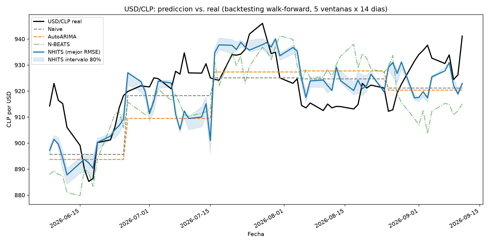
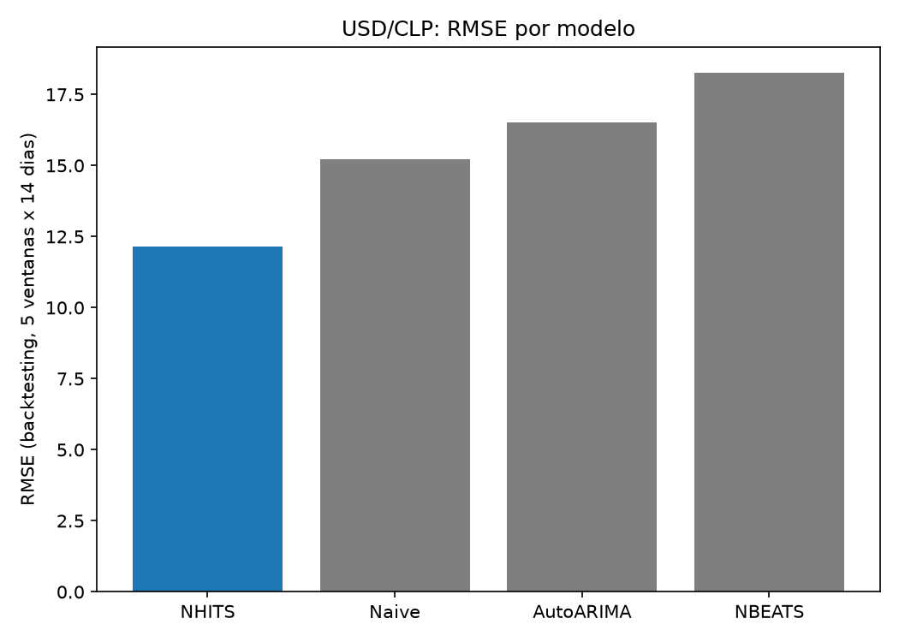
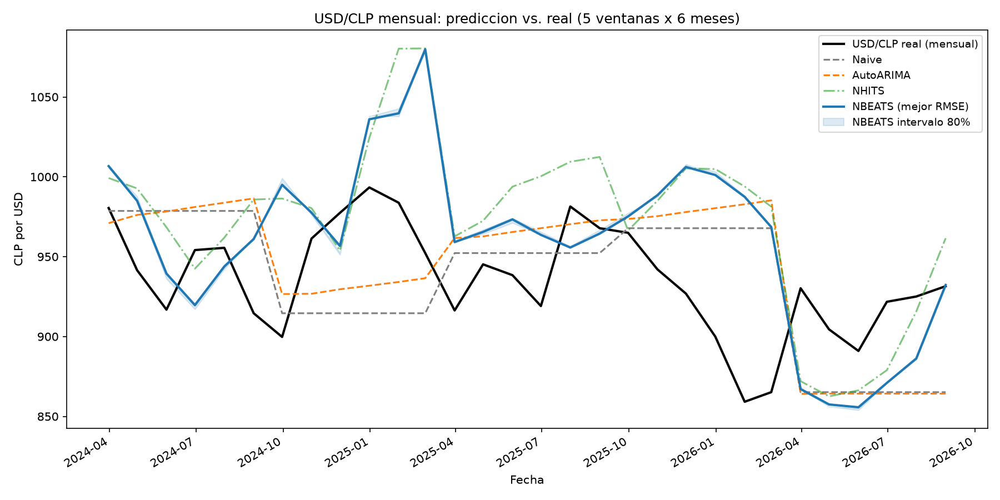
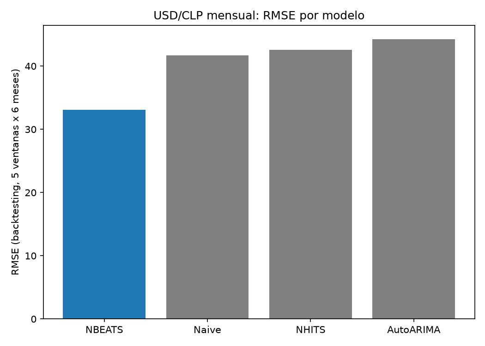
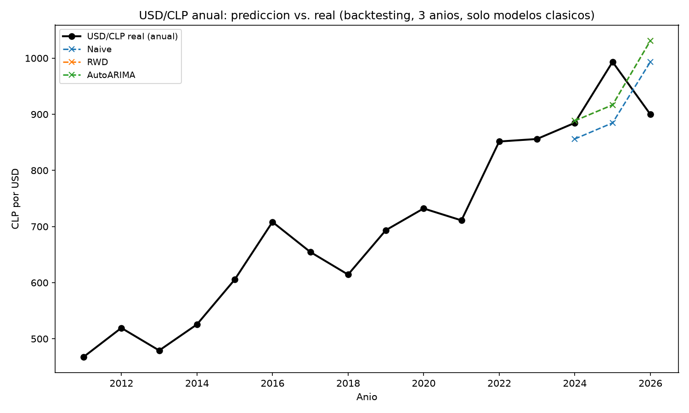
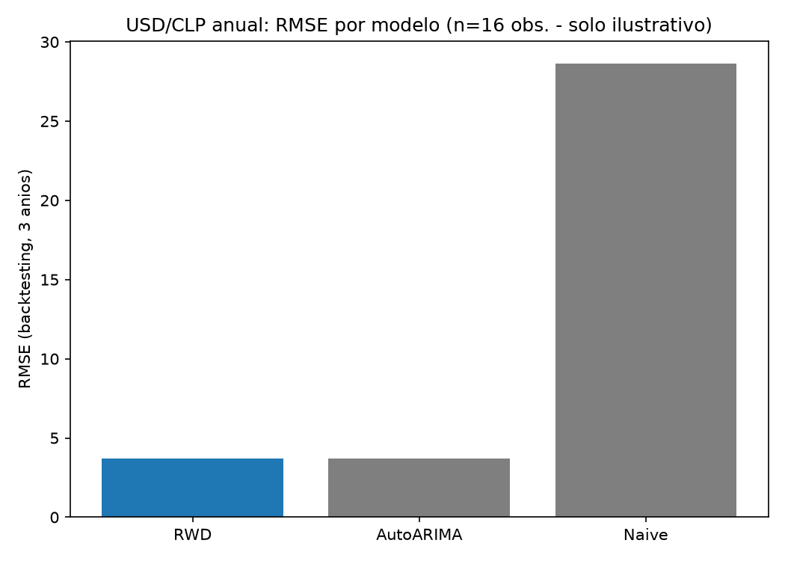
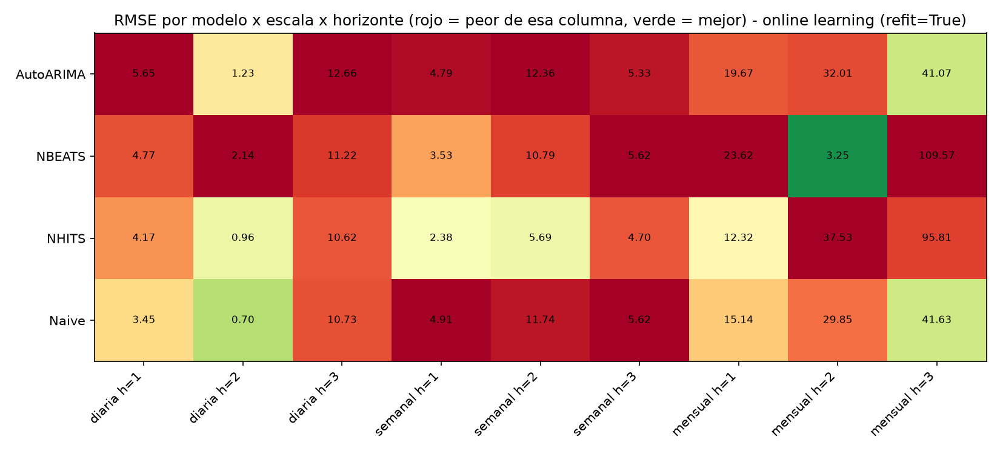

# usdclp-nbeats-arima-forecasting

Compara modelos modernos de forecasting — **N-BEATS** y **N-HiTS** (vía [Nixtla/neuralforecast](https://github.com/Nixtla/neuralforecast), Apache-2.0, usado como dependencia) — contra un baseline clásico (**AutoARIMA** y **Naive**, vía [Nixtla/statsforecast](https://github.com/Nixtla/statsforecast)) pronosticando el tipo de cambio **USD/CLP**.

📄 **[Ver el paper completo](reportes/paper.md)** — resumen, metodología, resultados y discusión de las 4 partes del estudio (diario, mensual, anual, aprendizaje online) en un solo documento. Este README es la referencia práctica (cómo está armado el repo, cómo correrlo); el paper es la narrativa de investigación.

## Pregunta que responde

¿Un modelo moderno de deep learning aporta una mejora real y medible sobre un baseline clásico al pronosticar el tipo de cambio, o la mejora observada es mayormente autocorrelación del precio diario (el valor de hoy predice casi perfecto el de mañana)?

## Metodología

- Backtesting walk-forward (múltiples ventanas de validación, no un solo split train/test).
- Horizonte de pronóstico de varios pasos (no 1 solo paso) — a 1 paso el naive casi siempre "gana" por autocorrelación pura; a varios pasos esa ventaja se diluye.
- Métricas de error en test: RMSE, MAE, MAPE — calculadas para los cuatro modelos (Naive, AutoARIMA, NBEATS, NHITS) sobre las mismas ventanas.
- El mismo análisis se repite a **tres escalas de tiempo** (diaria, mensual, anual) resampleando la misma serie — no son datasets distintos, es la pregunta "¿un modelo moderno mejora al baseline clásico?" respondida en cada horizonte por separado, porque la estructura dominante de la serie cambia con la escala (ver síntesis al final).

## Resultados diarios

Backtesting walk-forward: 5 ventanas no solapadas de 14 días hábiles cada una (70 días hábiles de evaluación fuera de muestra, jun-sep 2026), sobre la serie completa 2010-2026 (~4.346 observaciones).

| Modelo | RMSE | MAE | MAPE | Mejora RMSE vs. mejor baseline |
|---|---|---|---|---|
| **N-HiTS** | **12.14** | **9.60** | **1.05%** | **+20.2%** |
| Naive | 15.21 | 13.31 | 1.46% | — (mejor baseline) |
| AutoARIMA | 16.52 | 14.42 | 1.58% | -8.6% |
| N-BEATS | 18.27 | 14.09 | 1.55% | -20.1% |




**Lectura honesta**: N-HiTS mejora el RMSE ~20% sobre el mejor baseline clásico (Naive) — una mejora real y grande, no un margen cosmético. N-BEATS, en cambio, termina **peor** que el naive (-20%), y de forma consistente: pierde contra N-HiTS en 4 de las 5 ventanas de backtesting, no por un solo tropiezo puntual. Es un resultado que coincide con la motivación original del paper de N-HiTS (Challu et al.) — fue diseñado explícitamente como una versión más robusta que N-BEATS via interpolación jerárquica multi-tasa — y acá se replica esa diferencia en una serie financiera real.

Esto no era el resultado inicial: la primera versión de este pipeline usaba `scaler_type="identity"` (sin normalizar) y `max_steps=300` para entrenar rápido, lo que llevaba a **ambos** modelos de Nixtla a predecir prácticamente una constante por ventana (desviación estándar del pronóstico ~0.3-0.5 contra ~4-12 del dato real) — un forecast visualmente "chato" que no capturaba ninguna dinámica real, aunque el RMSE agregado se viera razonable. Normalizar la entrada (`scaler_type="standard"`) y entrenar más (`max_steps=1500`) resolvió eso para los modelos neuronales: ahora N-HiTS sigue la forma de la curva real (confirmado por desviación estándar del pronóstico en la misma escala que la real, no solo a ojo), y N-BEATS dejó de ser plano pero sigue sin acertar la dirección.

**Naive y AutoARIMA siguen viéndose en escalón — pero por una razón distinta, y verificada, no una suposición:**
- **Naive** es plano por definición: repite el último valor observado para todo el horizonte. No hay forma de que sea otra cosa sin dejar de ser el método naive.
- **AutoARIMA no está limitado por diseño** — en principio podría producir una curva. Pero al inspeccionar el orden que realmente elige en cada una de las 5 ventanas (`AutoARIMA().fit(y).model_['arma']`), siempre selecciona **ARIMA(0,1,1)**: una caminata aleatoria con un término MA(1) sobre la serie diferenciada. Un MA(1) solo tiene memoria de un paso — matemáticamente, su pronóstico multi-paso colapsa a una constante a partir del segundo paso en adelante. No es una limitación de la implementación: es el propio criterio de selección de AIC diciendo que, estadísticamente, USD/CLP no muestra estructura autorregresiva más allá de una caminata aleatoria con un ajuste de un paso. Forzar un orden más complejo "para que se vea menos plano" sería inflar el modelo sin respaldo estadístico — lo contrario del espíritu de este proyecto.

En resumen: de los cuatro modelos, dos (Naive, AutoARIMA) están matemáticamente forzados a ser (casi) planos por lo que son — no por un error de código — y de los dos que sí tienen libertad para curvarse (N-BEATS, N-HiTS), solo uno la usó bien.

## Resultados mensuales

Misma comparación, resampleando a cierre de mes (200 observaciones, 2010-01 a 2026-08), backtesting de 5 ventanas de 6 meses cada una.

| Modelo | RMSE | MAE | MAPE | Mejora RMSE vs. mejor baseline |
|---|---|---|---|---|
| **N-BEATS** | **33.09** | **30.82** | **3.28%** | **+20.7%** |
| Naive | 41.71 | 35.40 | 3.81% | — (mejor baseline) |
| N-HiTS | 42.57 | 35.11 | 3.77% | -2.1% |
| AutoARIMA | 44.26 | 38.77 | 4.16% | -6.1% |




Acá se invierten los papeles: **N-BEATS** es el que gana (+20.7%), no N-HiTS — confirmado que no es casualidad de una ventana (se verificó la varianza del pronóstico dentro de cada ventana, en la misma escala que la real, no un artefacto de predicción plana). Ninguno de los dos modelos de Nixtla es sistemáticamente mejor en todas las escalas; cuál gana depende de la frecuencia. Un detalle honesto que el gráfico deja ver: en la ventana de cutoff 2024-12, ambos modelos de Nixtla sobre-extrapolan una racha alcista reciente y proyectan un salto a ~1.050-1.080 que la serie real nunca llega a tocar (se queda en ~950-990) — un caso real de sobre-reacción a momentum de corto plazo, no oculto en el resultado agregado porque el resto de las ventanas compensa.

## Resultados anuales

Misma comparación, resampleando a cierre de diciembre (16 observaciones completas, 2010-2025; se descarta 2026 por ser un año incompleto), backtesting de 3 años. **A propósito no se incluyen N-BEATS/N-HiTS acá** — con 16 puntos, entrenar una red neuronal no tiene sustento estadístico real (cualquier resultado sería ruido de una corrida, no una señal reproducible); se compara solo contra métodos clásicos diseñados para poca data.

| Modelo | RMSE | MAPE | Mejora RMSE vs. Naive |
|---|---|---|---|
| **AutoARIMA** | **3.72** | **0.42%** | **+87.0%** |
| **RandomWalkWithDrift** | **3.72** | **0.42%** | **+87.0%** |
| Naive | 28.64 | 3.24% | — |




El resultado más limpio de los tres análisis: `AutoARIMA` y `RandomWalkWithDrift` dan **el mismo número exacto**, porque AutoARIMA elige por su cuenta un ARIMA(0,1,0) con drift — que es matemáticamente idéntico a un random walk con tendencia. A escala anual, USD/CLP se comporta como una caminata aleatoria con una depreciación promedio constante, y con solo agregar esa tendencia (nada de deep learning) se le gana al naive plano por 87%. Caveat honesto: ese mismo modelo con drift sobre-extrapola la ventana más reciente (2025→2026), proyectando ~1.030 cuando el real bajó a ~900 — la ganancia agregada de 3 ventanas no significa que el drift sea infalible ventana a ventana, y con n=16 cualquier métrica agregada tiene un margen de error grande.

## Síntesis entre escalas

| Escala | ¿Gana algo al naive? | Qué gana | Por qué |
|---|---|---|---|
| Diaria | Sí, +20% | N-HiTS | Único con libertad real de forma que la aprovechó bien; Naive/AutoARIMA quedan matemáticamente forzados a ser planos (random walk / MA(1) sin memoria) |
| Mensual | Sí, +21% | N-BEATS | Con menos ruido de alta frecuencia, hay más momentum/estructura real para que una red capture — pero el "ganador" entre N-BEATS/N-HiTS cambia según la escala |
| Anual | Sí, +87% | AutoARIMA = RandomWalkWithDrift | A esta escala domina una tendencia determinística (depreciación de largo plazo) más que el ruido — ni hace falta deep learning para capturarla |

La lectura de portfolio no es "el deep learning gana siempre" ni "el baseline clásico gana siempre" — es que **la estructura dominante de una serie financiera cambia con la escala de tiempo**, y el modelo ganador cambia con ella. Eso es más honesto (y más interesante) que un único gráfico con un único ganador.

## Aprendizaje online: horizontes cortos (1-3 pasos) con `refit=True`

Los análisis anteriores entrenan una vez con datos históricos y nunca más se actualizan. Acá se prueba lo contrario — que el modelo se **reentrene en cada ventana a medida que aparecen datos nuevos**, con horizontes bien cortos (1, 2 y 3 pasos), sobre tres escalas (diaria/semanal/mensual). Esto ya está soportado nativo en Nixtla, no hace falta código de online-learning a mano:

- `statsforecast` ya reentrena por ventana **por default** (`refit=True` es el default en su `cross_validation`) — por eso `AutoARIMA` podía elegir un orden distinto en cada ventana en los análisis anteriores.
- `neuralforecast` por default NO lo hace (`refit=False`: entrena una vez, predice todas las ventanas con esos mismos pesos). Activando `refit=True` con `use_init_models=False` (default), cada reentreno **parte de los pesos de la ventana anterior** (warm start) en vez de reiniciar — es, literalmente, la red aprendiendo a medida que llegan datos nuevos.

10 ventanas de backtesting por combinación (3 escalas × 3 horizontes = 9 combos en total).



**Lectura por escala** (rojo = peor de esa columna, verde = mejor — normalizado por columna, no comparable entre columnas):

- **Diaria (h=1,2,3)**: gana el naive en los tres horizontes, con un margen chico en h=3 para N-HiTS (-1%, prácticamente empate). A horizontes de 1-3 días el ruido/autocorrelación domina tan fuerte que ni el online learning le encuentra la vuelta — coherente con todo lo que ya vimos en la sección diaria original.
- **Semanal (h=1,2,3)**: acá el online learning se luce — **N-HiTS gana los tres horizontes**, y en h=1/h=2 por márgenes grandes (-51% y -52% vs. el mejor baseline). Es la escala donde reentrenar con cada dato nuevo aporta más valor real.
- **Mensual (h=1,2,3)**: resultado mixto y el más interesante de investigar. En h=1 y h=2, N-HiTS/N-BEATS mejoran al baseline (N-BEATS en h=2 llega a RMSE=3.25 contra 29.85 del naive, un salto enorme). Pero en **h=3 ambas redes fallan catastróficamente** (RMSE ~95-110 contra ~41 del naive) — y no es un problema de falta de entrenamiento: subir el presupuesto de 100 a 300 pasos por reentreno mejoró mucho h=1/h=2 (sobre todo h=2) pero **no cambió nada en h=3** (verificado corriendo ambos presupuestos, no asumido). Queda como una inestabilidad real y no resuelta de combinar warm-start + horizonte de 3 meses en una serie tan corta (200 obs.) — se documenta como hallazgo, no se esconde ni se fuerza un ajuste para que desaparezca.

**Por qué esto importa para el proyecto en general**: el mensaje no es "el online learning es mejor" ni "es peor" — es que **ayuda mucho en algunos combos (semanal, sobre todo) y puede volverse inestable en otros (mensual h=3) de forma que más cómputo no arregla**. Eso es más honesto que optimizar solo la configuración que se ve mejor y mostrar únicamente esa.

## Extensión: estrategia de trading con Reinforcement Learning

El forecasting de arriba responde si un modelo predice bien el precio. Una extensión separada (dentro del mismo repo, [Issue #1](https://github.com/bastianbm7/usdclp-nbeats-arima-forecasting/issues/1)) responde una pregunta distinta: **¿ese forecast sirve para tomar decisiones de trading que ganen plata con apalancamiento y riesgo real?** Se probó un agente PPO (`gymnasium` + `stable-baselines3`, con [FinRL](https://github.com/AI4Finance-Foundation/FinRL) como ancla metodológica) con gestión de riesgo real (capital de $100, tamaño de posición vía risk sizing, stop-loss con trailing basado en volatilidad GARCH, take-profit en el forecast de N-HiTS).

**Hallazgo, walk-forward de 100 semanas out-of-sample**: ninguna estrategia activa le ganó a mantener la posición sin apalancar (buy-and-hold: -0.9%; umbral simple: -16.0%; PPO: -52.2% con recompensa simplificada). Al reentrenar al agente con la **economía real** (apalancamiento + TP/SL) como recompensa, en vez de una versión simplificada, aprendió a **no operar nunca** — una respuesta racional dado que ninguna de las 7 variables del estado supera |r|=0.11 de correlación con el retorno real siguiente.

**Issue #2 — ¿se puede destrabar al agente?**: se probaron 3 cambios independientes (más exploración vía `ent_coef`, acción continua en vez de discreta, recompensa como exceso sobre buy-and-hold). Más exploración y reward shaping **no cambiaron nada** — el agente converge a la política de no operar de forma idéntica en las tres configuraciones. Acción continua sí lo obliga a operar, pero pierde -16.8% — peor que no operar. El cuello de botella confirmado es la señal, no el agente.

**Radar-baseline — ¿es la política de "no operar" un artefacto del entrenamiento, y hay una variable/técnica barata que ayude?**: se validó con Kelly criterion (sin entrenar ningún agente) si existe edge explotable — la respuesta es no: la fracción "óptima" de Kelly apalanca la deriva histórica de USD/CLP y pierde -51.5% a -52.9% fuera de muestra, peor que no operar. Se probaron además 5 variables nuevas ancladas en papers concretos (diferencial de tasas Chile-EE.UU., retorno/momentum del cobre, momentum clásico de USD/CLP) a frecuencia semanal — ninguna supera el umbral |r|=0.11 de la sección 9.5 — y 2 cambios al agente (momentum en el estado, reward Differential Sharpe Ratio). Momentum sí rompe el atractor de "no operar" (2 operaciones en 100 semanas, -3.1%) pero sigue sin ser rentable; DSR no lo destraba.

**El hallazgo más fuerte apareció al repetir el chequeo de cobre a frecuencia diaria**: `copper_ret_1d` correlaciona -0.256 con el retorno del día siguiente de USD/CLP — más del doble del umbral que nada más superó, con el signo económicamente correcto. A frecuencia semanal (la que usa el agente hoy) ese mismo efecto se diluye a -0.08.

**Validado con evidencia, no solo con el número de correlación**: un escaneo de rezagos descarta que sea un artefacto de alineación de timestamps (el efecto está concentrado en el rezago de un día, no en el mismo día); un backtest walk-forward real da +86.2% de retorno y Sharpe 4.57 en 300 días de test, consistente en las 5 ventanas; y al ampliar a un panel de 13 pares de forex, el efecto **generaliza** — es incluso más fuerte en AUD/CAD/NZD (monedas commodity "puras") que en CLP, y casi nulo en JPY (refugio), exactamente el patrón que predice la teoría de "commodity currencies" (Chen & Rogoff 2003). Pero agrupar los 13 pares en un solo modelo (pooling ingenuo) **empeora** el resultado específico de CLP frente a entrenar solo con su propia historia — la sensibilidad al cobre varía demasiado entre monedas para promediarlas sin más. De 6 variantes independientes probadas sobre el agente semanal (Issue #2 + radar-baseline), ninguna encontró una política rentable a esa frecuencia — la señal diaria del cobre es la pista más sólida para una futura iteración a otra escala.

**[Issue #4](https://github.com/bastianbm7/usdclp-nbeats-arima-forecasting/issues/4) cierra la línea de indicadores técnicos semanales**: SMA/EMA a 5/10/20/50 semanas, Bollinger Bands, CCI y ADX (12 candidatas en total, ninguna probada antes) tampoco superan |r|=0.11 — la más fuerte (`ema_50_rel`, -0.076) queda por debajo de 4 de las 7 features originales. Con esto se agotan las variantes razonables de indicadores derivados del precio semanal; no se entrenó ningún agente nuevo porque el paso condicional de la Tarea (superar el umbral) no aplicó. 📄 **[Ver el detalle completo, con gráficos, en las secciones 9.11-9.16 del paper](reportes/paper.md#911-radar-baseline-validar-la-propuesta-1-de-98-antes-de-construir-nada-septiembre-2026)**.

## Datos

Tipo de cambio USD/CLP, serie diaria descargada con [`yfinance`](https://github.com/ranaroussi/yfinance) (ticker `CLP=X`, fuente: Yahoo Finance). Se guarda una copia cruda en `datos/bases/` para reproducibilidad exacta (no depender de que Yahoo siga sirviendo el mismo histórico).

## Estructura

```
codigos/
├── 01_obtener_datos.py          # descarga USD/CLP vía yfinance, split train/test
├── 02_baseline_arima_naive.py   # statsforecast: AutoARIMA + Naive, backtesting walk-forward (diario)
├── 03_modelo_nbeats_nhits.py    # neuralforecast: NBEATS + NHITS, mismo esquema de backtesting (diario)
├── 04_metricas_comparacion.py   # RMSE/MAE/MAPE por modelo, tabla comparativa (diario)
├── 05_visualizacion.py          # predicción vs. real + intervalos + baseline superpuesto (diario)
├── 06_analisis_mensual.py       # mismo pipeline completo (datos+baseline+NN+métricas+gráficos), resampleado a mensual
├── 07_analisis_anual.py         # mismo pipeline sin NN (no hay data suficiente), resampleado a anual
├── 08_online_learning.py        # refit=True (warm start) x 3 escalas x horizontes 1/2/3 pasos
├── 09_comparacion_modelos_volatilidad.py  # Naive/media movil/GARCH/EGARCH walk-forward, elige el modelo de volatilidad
├── 10_generar_dataset_rl.py     # dataset semanal (forecast N-HiTS + volatilidad GARCH + MACD/RSI/min-max) para el agente
├── 11_entorno_trading_rl.py     # entorno Gym (estado/accion/recompensa con gestion de riesgo real, TP/SL con trailing stop)
├── 12_entrenar_agente_rl.py     # chequeo rapido: un solo split train/test (superado por 14)
├── 13_backtest_estrategia_rl.py # backtest del chequeo rapido de 12 (superado por 14)
├── 14_backtest_walkforward_gestion_riesgo.py  # walk-forward real (5 ventanas), PPO vs buy-and-hold vs umbral simple
├── 15_analisis_features.py      # cuanto se correlaciona cada variable del estado con el retorno futuro real
├── 16_graficos_resultados_rl.py # graficos finales de la extension de RL (lee los CSV ya generados, no recalcula)
├── 17_agente_rl_mejoras.py      # Issue #2: ent_coef, accion continua y reward shaping vs. buy-and-hold, solos y combinados
├── 18_kelly_validacion.py       # radar-baseline Tier 0: Kelly criterion (sin RL) como segundo veredicto sobre si hay edge
├── 19_features_nuevas_validacion.py  # radar-baseline Tier 2: correlacion + Kelly con tasas/cobre/momentum nuevos
├── 20_agente_rl_ronda2.py       # radar-baseline Tier 1: PPO + momentum en el estado / reward Differential Sharpe Ratio
├── 21_features_nuevas_frecuencias.py  # repite el chequeo de correlacion de cobre/tasas a frecuencia diaria y mensual
├── 22_kelly_diario_cobre.py     # valida timestamp (lag-scan) y backtest de rentabilidad del cobre a frecuencia diaria
├── 23_dataset_multi_par_diario.py     # panel de 13 pares FX diarios + generalizacion del efecto cobre + pooled vs. solo CLP
└── 24_features_sma_ema_validacion.py  # Issue #4: correlacion de SMA/EMA/Bollinger/CCI/ADX con el retorno futuro semanal

datos/
├── bases/        # CSV crudo de USD/CLP
└── resultados/   # gráficos finales + tabla de métricas

reportes/
└── paper.md      # informe de investigación completo (resumen, metodología, resultados, discusión)
```

## Limitaciones conocidas

- **Autocorrelación, no "poder predictivo"**: con precio de cierre diario, buena parte de cualquier error bajo es autocorrelación, no señal real capturada por el modelo. Mitigado con baseline siempre presente, backtesting walk-forward y horizonte de varios pasos — pero no eliminado del todo.
- **Nixtla/neuralforecast es una dependencia, no un fork**: se usa la implementación de la librería de N-BEATS/N-HiTS (Apache-2.0), no el código original de los autores (Oreshkin et al. / Challu et al.) — la fidelidad al paper es metodológica, no literal.
- **Nivel 1 de proporcionalidad**: sin tests automatizados ni monitoreo — es una pieza de portfolio personal, no un servicio en producción.
- **Dependencia de Yahoo Finance**: `yfinance` puede cambiar de comportamiento — mitigado guardando una copia cruda del CSV descargado.
- **Backtesting anual con n=16**: 3 ventanas de evaluación sobre 16 observaciones totales es una muestra chica — el resultado (AutoARIMA/RWD >> Naive) es consistente y tiene explicación matemática clara, pero no hay que leerlo con la misma confianza estadística que el diario (4.346 obs.) o el mensual (200 obs.).
- **Online learning mensual a h=3 es inestable**: el `refit=True` con warm start rompe en esa combinación específica (RMSE 2-3x peor que el naive) y subir el presupuesto de entrenamiento no lo arregla — no identificado el mecanismo exacto (hipótesis: optimizer sin estado propio en cada reentreno + horizonte largo relativo a una serie corta), documentado como falla abierta en vez de ocultarlo o forzar un ajuste que la haga desaparecer.

## Paper(s) ancla

- Oreshkin et al., *N-BEATS: Neural basis expansion analysis for interpretable time series forecasting*, ICLR 2020 — [arXiv:1905.10437](https://arxiv.org/abs/1905.10437)
- Challu et al., *N-HiTS: Neural Hierarchical Interpolation for Time Series Forecasting* — [arXiv:2201.12886](https://arxiv.org/abs/2201.12886)
- Liu et al., *FinRL: Deep Reinforcement Learning Framework for Automated Trading*, ancla de la extensión de RL (sección 9 del paper) — [arXiv:2111.09395](https://arxiv.org/abs/2111.09395)
- Moskowitz, Ooi & Pedersen, *Time Series Momentum*, ancla de la feature de momentum (sección 9.11/9.12) — [SSRN:2089463](https://papers.ssrn.com/sol3/papers.cfm?abstract_id=2089463)
- Chen & Rogoff, *Commodity Currencies*, ancla de las features de cobre (sección 9.11) — *Journal of International Economics*, 2003
- Moody & Saffell, *Reinforcement Learning for Trading*, ancla del reward Differential Sharpe Ratio (sección 9.12) — NeurIPS 1998
