# N-BEATS y N-HiTS contra baselines clásicos para el pronóstico de USD/CLP a múltiples escalas temporales

**Repositorio**: [bastianbm7/usdclp-nbeats-arima-forecasting](https://github.com/bastianbm7/usdclp-nbeats-arima-forecasting)
**Fecha**: septiembre de 2026

## Resumen

Este trabajo compara dos arquitecturas de deep learning para pronóstico de series de tiempo — **N-BEATS** (Oreshkin et al., 2020) y **N-HiTS** (Challu et al., 2023) — contra baselines clásicos (Naive, AutoARIMA, Random Walk with Drift) al pronosticar el tipo de cambio **USD/CLP**, usando las implementaciones de código abierto de [Nixtla](https://github.com/Nixtla) (`neuralforecast` y `statsforecast`, Apache-2.0). El estudio se organiza en cuatro partes: (1) un análisis a escala diaria con horizonte de 14 días hábiles, (2) el mismo análisis resampleado a escala mensual, (3) a escala anual, y (4) un experimento adicional de **aprendizaje online** (`refit=True`, warm-start) con horizontes cortos (1-3 pasos) sobre series diaria, semanal y mensual.

El hallazgo central no es "el deep learning gana" ni "el baseline clásico gana", sino que **la estructura dominante de una serie financiera cambia con la escala de tiempo y con el modo de entrenamiento**, y el modelo ganador cambia con ella — incluyendo un caso de inestabilidad real y no resuelta (aprendizaje online a escala mensual con horizonte de 3 pasos) que se documenta en vez de ocultar.

## 1. Pregunta de investigación

¿Un modelo moderno de deep learning aporta una mejora real y medible sobre un baseline estadístico clásico al pronosticar un tipo de cambio, o la mejora observada es mayormente autocorrelación del precio (el valor de hoy predice casi perfecto el de mañana)? Y si la respuesta depende de la escala de tiempo o de si el modelo se reentrena a medida que llegan datos nuevos — ¿de qué depende exactamente?

## 2. Datos

Tipo de cambio USD/CLP, serie diaria descargada con [`yfinance`](https://github.com/ranaroussi/yfinance) (ticker `CLP=X`, fuente: Yahoo Finance), 2010-01-01 a 2026-09-11 (4.346 observaciones en días hábiles). A partir de esa serie diaria se derivan por resampleo (último valor del período) las series semanal (871 obs.), mensual (200-201 obs.) y anual (16-17 obs., el último año siempre se descarta por estar incompleto). Los datos crudos y procesados están en `datos/bases/`.

## 3. Metodología

- **Backtesting walk-forward**: nunca un solo split train/test. Cada resultado surge de múltiples ventanas de evaluación fuera de muestra.
- **Modelos**: `Naive` y `AutoARIMA` (selección automática de orden ARIMA vía AIC) de `statsforecast`; `RandomWalkWithDrift` (solo en el análisis anual); `NBEATS` y `NHITS` de `neuralforecast`, con `loss=MQLoss()` para obtener intervalos de predicción.
- **Métricas**: RMSE, MAE, MAPE, calculadas con `utilsforecast.losses` sobre las mismas ventanas para todos los modelos de una corrida.
- **Dos modos de entrenamiento**:
  - *Estático* (secciones 4.1-4.3): el modelo se entrena una vez sobre el historial y se usa para predecir todas las ventanas de test.
  - *Online* (sección 4.4): el modelo se reentrena en cada ventana a medida que hay datos nuevos disponibles (`refit=True`), partiendo de los pesos de la ventana anterior en vez de reiniciar (`use_init_models=False`, warm start) — mecanismo nativo de `neuralforecast`, no código de online-learning escrito a mano. `statsforecast` ya hace esto por default.
- **Licencias**: tanto `neuralforecast` como `statsforecast` son Apache-2.0, usados como dependencias (`pip install`), no forkeados — la fidelidad a los papers originales de N-BEATS/N-HiTS es metodológica, no literal (no es el código de los autores).

## 4. Resultados

### 4.1 Escala diaria (entrenamiento estático, h=14 días hábiles)

5 ventanas no solapadas de 14 días hábiles (70 días hábiles de evaluación, jun-sep 2026), sobre los 4.346 días hábiles completos.

| Modelo | RMSE | MAE | MAPE | Mejora vs. mejor baseline |
|---|---|---|---|---|
| **N-HiTS** | **12.14** | 9.60 | 1.05% | **+20.2%** |
| Naive | 15.21 | 13.31 | 1.46% | — |
| AutoARIMA | 16.52 | 14.42 | 1.58% | -8.6% |
| N-BEATS | 18.27 | 14.09 | 1.55% | -20.1% |

N-HiTS mejora el RMSE ~20% sobre el mejor baseline, una mejora real y consistente (gana en 4 de las 5 ventanas contra N-BEATS, no por azar). `Naive` y `AutoARIMA` quedan **matemáticamente forzados** a producir forecasts (casi) planos dentro de cada ventana: `Naive` por definición, y `AutoARIMA` porque selecciona consistentemente **ARIMA(0,1,1)** en las 5 ventanas — un MA(1) sobre la serie diferenciada tiene memoria de un solo paso, así que su pronóstico multi-paso colapsa a una constante a partir del segundo paso. Esto se verificó inspeccionando `AutoARIMA().fit(y).model_['arma']` directamente, no se asumió.

La primera versión de este análisis usaba `scaler_type="identity"` (sin normalizar) y `max_steps=300`, lo que llevaba a **ambos** modelos de Nixtla a predecir casi una constante por ventana (desviación estándar del pronóstico ~0.3-0.5 contra ~4-12 del dato real) — un resultado visualmente chato aunque el RMSE agregado pareciera razonable. Normalizar (`scaler_type="standard"`) y entrenar más (`max_steps=1500`) resolvió esto.

### 4.2 Escala mensual (entrenamiento estático, h=6 meses)

Cierre de mes, 200 observaciones, 5 ventanas de 6 meses.

| Modelo | RMSE | MAE | MAPE | Mejora vs. mejor baseline |
|---|---|---|---|---|
| **N-BEATS** | **33.09** | 30.82 | 3.28% | **+20.7%** |
| Naive | 41.71 | 35.40 | 3.81% | — |
| N-HiTS | 42.57 | 35.11 | 3.77% | -2.1% |
| AutoARIMA | 44.26 | 38.77 | 4.16% | -6.1% |

Se invierten los papeles respecto a la escala diaria: gana **N-BEATS**, no N-HiTS — ninguno de los dos modelos de Nixtla es sistemáticamente mejor en todas las escalas. Detalle honesto visible en el gráfico: en la ventana de cutoff 2024-12, ambos modelos de Nixtla sobre-extrapolan una racha alcista reciente y proyectan un salto a ~1.050-1.080 que la serie real nunca toca (se queda en ~950-990) — sobre-reacción a momentum de corto plazo que el resultado agregado diluye pero no oculta.

### 4.3 Escala anual (entrenamiento estático, h=1 año, sin redes neuronales)

Cierre de diciembre, 16 observaciones completas (2010-2025), 3 ventanas de 1 año. **A propósito no se incluyen N-BEATS/N-HiTS**: con 16 puntos, entrenar una red neuronal no tiene sustento estadístico real — cualquier resultado sería ruido de una corrida, no una señal reproducible.

| Modelo | RMSE | MAPE | Mejora vs. Naive |
|---|---|---|---|
| **AutoARIMA** | **3.72** | 0.42% | **+87.0%** |
| **RandomWalkWithDrift** | **3.72** | 0.42% | **+87.0%** |
| Naive | 28.64 | 3.24% | — |

El resultado más limpio de los tres: `AutoARIMA` y `RandomWalkWithDrift` dan **el mismo número exacto**, porque AutoARIMA elige por su cuenta un ARIMA(0,1,0) con drift — matemáticamente idéntico a un random walk con tendencia. A escala anual, USD/CLP se comporta como una caminata aleatoria con una depreciación promedio constante; agregar esa tendencia (sin deep learning) le gana al naive plano por 87%. Caveat: ese mismo modelo sobre-extrapola la ventana más reciente (2025→2026, proyecta ~1.030 cuando el real bajó a ~900) — con n=16 cualquier métrica agregada tiene un margen de error grande.

### 4.4 Aprendizaje online: horizontes cortos (1-3 pasos) con `refit=True`

Se prueba reentrenar en cada ventana a medida que aparecen datos nuevos (warm start), con horizontes de 1, 2 y 3 pasos, sobre tres escalas (diaria/semanal/mensual) — 9 combinaciones, 10 ventanas de backtesting cada una.

| Escala | h | Ganador | RMSE ganador | Mejor baseline | RMSE baseline | Mejora |
|---|---|---|---|---|---|---|
| Diaria | 1 | Naive | 3.45 | — | — | — (nada le gana) |
| Diaria | 2 | Naive | 0.70 | — | — | — (nada le gana) |
| Diaria | 3 | N-HiTS | 10.62 | Naive | 10.73 | +1.0% |
| Semanal | 1 | **N-HiTS** | **2.38** | AutoARIMA | 4.79 | **+50.2%** |
| Semanal | 2 | **N-HiTS** | **5.69** | Naive | 11.74 | **+51.5%** |
| Semanal | 3 | N-HiTS | 4.70 | AutoARIMA | 5.33 | +11.9% |
| Mensual | 1 | N-HiTS | 12.32 | Naive | 15.14 | +18.6% |
| Mensual | 2 | **N-BEATS** | **3.25** | Naive | 29.85 | **+89.1%** |
| Mensual | 3 | — | — | AutoARIMA | 41.07 | **-133% a -167%** (ambas redes fallan) |

**Diaria**: el naive domina los 3 horizontes (con empate técnico de N-HiTS en h=3). A 1-3 días la autocorrelación es tan fuerte que ni el aprendizaje online encuentra ventaja — coherente con la sección 4.1.

**Semanal**: la escala donde el aprendizaje online más aporta. N-HiTS gana los 3 horizontes, con mejoras de +50% y +51% en h=1 y h=2.

**Mensual**: el resultado más interesante. En h=1 y h=2 las redes mejoran mucho al baseline (N-BEATS en h=2 llega a un 89% de mejora). Pero en **h=3 ambas redes fallan catastróficamente** (RMSE de 96-110 contra ~41 del naive) — y se verificó explícitamente que no es un problema de entrenamiento insuficiente: subir el presupuesto de 100 a 300 pasos por reentreno mejoró mucho h=1 y sobre todo h=2, pero **no cambió nada en h=3**. Esta inestabilidad queda documentada como hallazgo abierto, no resuelto — hipótesis de trabajo: la combinación de warm-start (el optimizador de PyTorch Lightning no conserva su estado de Adam entre reentrenos, solo los pesos) con un horizonte relativamente largo sobre una serie corta (200 obs.) puede generar actualizaciones inestables al reiniciar el optimizador sobre pesos ya ajustados.

## 5. Discusión

Cuatro estudios, cuatro respuestas distintas a la misma pregunta:

| Configuración | ¿Le gana algo al naive? | Ganador | Por qué |
|---|---|---|---|
| Diaria, estático, h=14 | Sí, +20% | N-HiTS | Único con libertad real de forma que la aprovechó bien |
| Mensual, estático, h=6 | Sí, +21% | N-BEATS | El "ganador" entre N-BEATS/N-HiTS no es estable entre escalas |
| Anual, estático, h=1 | Sí, +87% | AutoARIMA = RWD | Domina una tendencia determinística de largo plazo, no ruido |
| Diaria/semanal/mensual, online, h=1-3 | Depende mucho | N-HiTS (semanal, sobre todo) | Reentrenar ayuda muchísimo en algunos casos y es inestable en otros |

La lectura de portfolio no es "el deep learning gana siempre" ni "el baseline clásico gana siempre" — es que la estructura dominante de una serie financiera **cambia con la escala de tiempo y con el modo de entrenamiento**, y ni siquiera dar más cómputo garantiza estabilidad (mensual h=3 online). Reportar esto último, en vez de ocultarlo detrás de la configuración que mejor se ve, es la decisión metodológica más importante de todo el trabajo.

## 6. Limitaciones conocidas

- **Autocorrelación, no "poder predictivo"**: con precio de cierre diario, buena parte de cualquier error bajo es autocorrelación, no señal real capturada por el modelo.
- **Nixtla es una dependencia, no un fork**: la fidelidad a los papers originales de N-BEATS/N-HiTS es metodológica, no literal.
- **Nivel 1 de proporcionalidad**: sin tests automatizados ni monitoreo — pieza de portfolio personal, no servicio en producción.
- **Backtesting anual con n=16**: muestra chica; el resultado tiene explicación matemática clara pero no la misma robustez estadística que diario/mensual.
- **Inestabilidad de `mensual h=3` online**: no resuelta; ver sección 4.4.
- **Dependencia de Yahoo Finance**: `yfinance` puede cambiar de comportamiento — mitigado guardando copias crudas de los datos descargados.

## 7. Trabajo futuro

- Investigar la causa raíz de la inestabilidad en `mensual h=3` (ej. inspeccionar la trayectoria de pérdida por reentreno, probar conservando el estado del optimizador entre ventanas).
- Probar `AutoNBEATS`/`AutoNHITS` (búsqueda automática de hiperparámetros vía Ray Tune, ya incluidos en el entorno) en vez de fijar `max_steps`/`scaler_type` a mano.
- Extender el aprendizaje online a horizontes más largos y a la escala anual, si se consigue más historial.
- Replicar el mismo diseño sobre otro par de divisas o un índice bursátil, para ver si la síntesis de la sección 5 se sostiene fuera de USD/CLP.

## 8. Referencias

- Oreshkin, B. N., Carpov, D., Chapados, N., & Bengio, Y. (2020). *N-BEATS: Neural basis expansion analysis for interpretable time series forecasting*. ICLR 2020. [arXiv:1905.10437](https://arxiv.org/abs/1905.10437)
- Challu, C., Olivares, K. G., Oreshkin, B. N., Ramirez, F. G., Canseco, M. M., & Dubrawski, A. (2023). *N-HiTS: Neural Hierarchical Interpolation for Time Series Forecasting*. [arXiv:2201.12886](https://arxiv.org/abs/2201.12886)
- Nixtla. [statsforecast](https://github.com/Nixtla/statsforecast) y [neuralforecast](https://github.com/Nixtla/neuralforecast) (Apache-2.0).

## 9. Extensión: estrategia de trading con Reinforcement Learning (septiembre 2026)

El forecasting de precio (secciones 1-7) responde si un modelo predice bien. Esta extensión responde una pregunta distinta: **¿ese forecast sirve para tomar decisiones de trading que ganen plata, una vez que se cuentan el apalancamiento y el riesgo real?** Es un proyecto separado dentro del mismo repo (Issue [#1](https://github.com/bastianbm7/usdclp-nbeats-arima-forecasting/issues/1)), no una sección más del estudio de forecasting.

### 9.1 Elección de enfoque

Se evaluaron tres opciones para convertir el forecast en una estrategia: (A) una regla fija de umbral sobre la predicción, (B) un framework de backtesting dedicado (backtrader/vectorbt), y (C) un agente de **Reinforcement Learning**. Se eligió la opción C, con **FinRL** (Liu et al., [arXiv:2111.09395](https://arxiv.org/abs/2111.09395); repo [AI4Finance-Foundation/FinRL](https://github.com/AI4Finance-Foundation/FinRL), MIT) como ancla metodológica — no como dependencia completa: FinRL está diseñado para carteras multi-activo, así que se construyó un entorno Gym propio y liviano (`gymnasium` + `stable-baselines3`, algoritmo PPO) para un solo par.

### 9.2 Modelo de volatilidad: comparación antes de elegir

Antes de decidir qué modelo de volatilidad alimentaría al agente, se comparó walk-forward (100 ventanas semanales, reentrenando en cada una) contra dos baselines:

| Modelo | RMSE | Mejora vs. Naive |
|---|---|---|
| **GARCH(1,1)** | **0.00653** | **+37.4%** |
| EGARCH(1,1) | 0.00661 | +36.7% |
| Media móvil (8 semanas) | 0.00885 | +15.2% |
| Naive | 0.01044 | — |

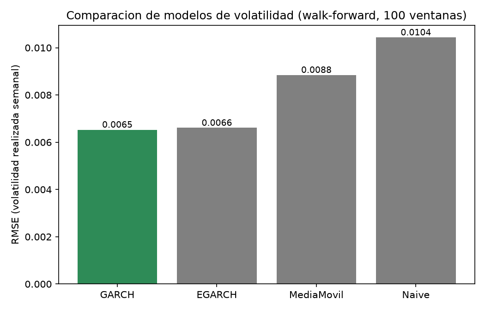

Ganó GARCH(1,1), usado desde acá como el forecast de volatilidad del agente y como base del stop-loss ("volatility scaling", la misma técnica de position-sizing que usan los papers de Wood et al. citados más abajo). En el camino se encontraron y corrigieron **2 ticks corruptos de yfinance** en `usdclp_long.csv` (2016-12-22 y 2014-04-10, precio cayendo a ~5 en vez de ~660/~544 por un día) — invisibles para el forecasting de precio de las secciones 1-7, pero catastróficos para cualquier cálculo de volatilidad (retorno de ese día: ±488%). La corrección vive en `01_obtener_datos.py` (función `limpiar_ticks_erroneos`), así que persiste si se vuelve a descargar la serie.

### 9.3 Diseño del agente

**Estado** (7 variables, todas relativas/acotadas — no precio nivel, porque USD/CLP no es estacionario en 16 años): retorno de la última semana, forecast N-HiTS a 1 y 2 semanas (el de aprendizaje online semanal `refit=True`, el resultado más fuerte de la sección 4.4) como desviación % del precio actual, volatilidad GARCH, MACD y RSI normalizados, y la posición del precio dentro de su rango de 12 semanas.

**Acción**: 3 posiciones discretas (largo/plano/corto). **Gestión de riesgo**: capital simulado de $100, tamaño de posición vía *risk sizing* — arriesgar el 3% del capital vigente por operación, no un monto fijo — con el stop-loss a la distancia de la volatilidad GARCH pronosticada (1 desvío) y el take-profit en el precio objetivo de N-HiTS. El stop-loss es *trailing*: sube seguiendo al precio a favor (largo) sin retroceder nunca, para asegurar ganancias parciales sin esperar el take-profit fijo. TP/SL se verifican día a día contra el precio real dentro de la semana, no solo al cierre. Slippage simulado de 0.05% por cambio de posición; comisión en 0 (decisión explícita para esta v1, no una omisión).

### 9.4 Resultados: walk-forward con gestión de riesgo real

Walk-forward de 5 ventanas × 20 semanas de test cada una (100 semanas out-of-sample, 2024-09 a 2026-08), reentrenando el agente en cada ventana — nunca un solo split, consistente con la metodología del resto del proyecto.

| Estrategia | Retorno total | Sharpe anualizado | Max drawdown | Win rate | Operaciones |
|---|---|---|---|---|---|
| **Buy-and-hold (sin apalancar)** | **-0.9%** | **~0.00** | -15.4% | 47.0% | — |
| Umbral simple (Opción A) | -16.0% | -0.94 | -20.8% | 51.5% | 68 |
| **PPO (RL)** | **0.0%** | — | 0.0% | — | **0** |

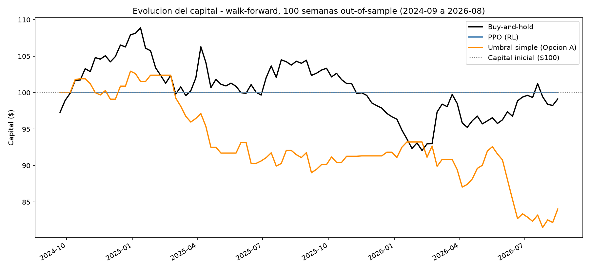
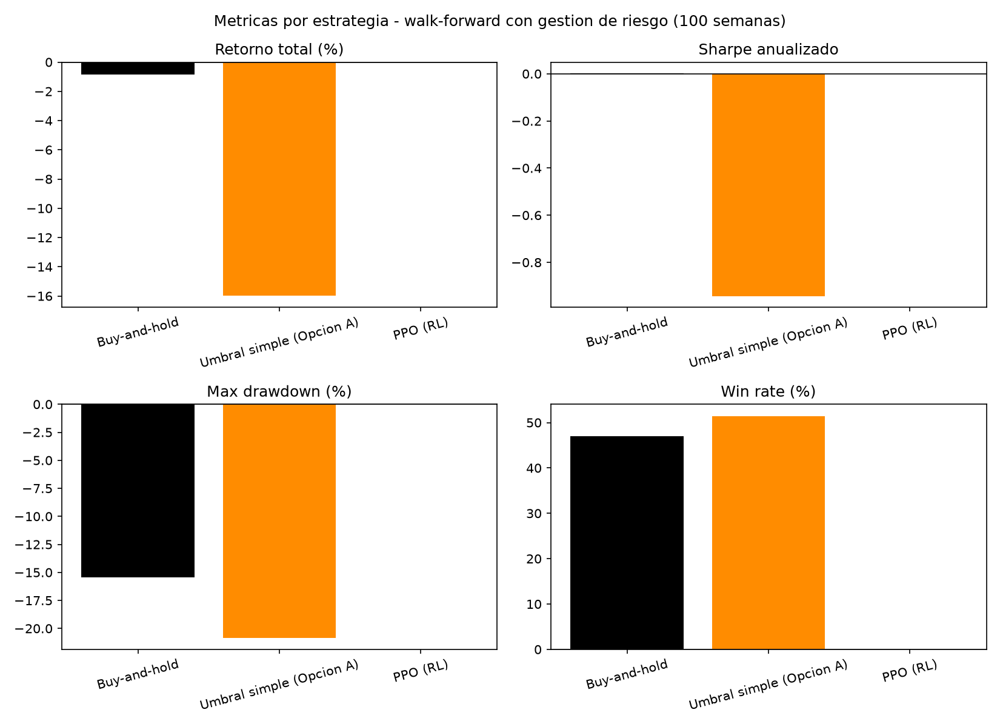
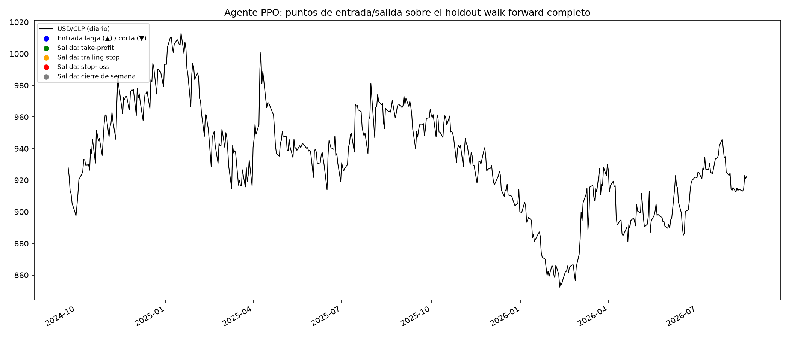

**El hallazgo no es el que se esperaba, y es el más honesto de reportar tal cual**: el agente de RL, entrenado primero con una recompensa simplificada (retorno % sin apalancar), convergió a una política degenerada de "siempre largo" que, evaluada con apalancamiento real, perdía -52.2% — peor que cualquier baseline. Al reentrenar con la **recompensa real** (la misma economía de apalancamiento + TP/SL del backtest, no una versión simplificada), el agente convergió a una política distinta: **no operar nunca**, en las 5 ventanas, con o sin trailing stop. No es una falla del entrenamiento — es la respuesta racional de un agente que sí "siente" el costo del riesgo: ninguna señal disponible le pareció confiable para arriesgar capital.

### 9.5 Por qué: análisis de las variables del estado

Para entender la decisión del agente, se midió la correlación de cada feature del estado con el retorno real de la semana siguiente (348 semanas completas):

| Feature | Correlación | Acierto de dirección |
|---|---|---|
| retorno_1s | -0.109 | 49.1% |
| vol_garch | -0.067 | 51.1% |
| posicion_en_rango | -0.026 | 43.7% |
| nhits_h1_rel | -0.025 | 52.0% |
| rsi_norm | -0.019 | 51.1% |
| nhits_h2_rel | -0.018 | 50.0% |
| macd_rel | -0.005 | 55.2% |

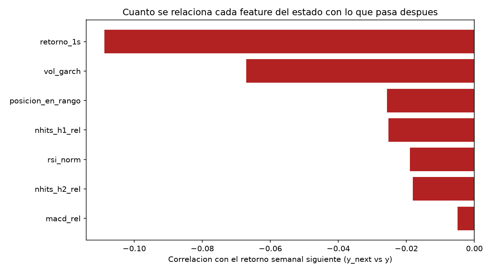

Ninguna variable supera |r|=0.11, y el acierto de dirección de todas ronda el 50% (una moneda) — incluido el forecast de N-HiTS (52.0%), pese a que en la sección 4.4 mostró una mejora real de RMSE en la métrica de *error de forecasting*. Esa es justo la distinción que motivó esta extensión: un modelo puede reducir el error de predicción de forma real y medible (sección 4) sin que eso alcance para anticipar la *dirección* del movimiento con la confiabilidad que una estrategia de trading necesita. El agente de RL no "descartó" una señal fuerte por error — la señal disponible es, de hecho, débil.

### 9.6 Limitaciones de esta extensión

- **Slippage simulado, comisión no**: 0.05% por cambio de posición; una comisión real (aunque sea baja) empeoraría más a las estrategias activas (68-100 operaciones) que al buy-and-hold.
- **Walk-forward de 5 ventanas**: más riguroso que un solo split, pero menos ventanas que las 100 del análisis diario original — cada ventana individual sigue siendo una muestra chica.
- **Un solo activo, un solo agente (PPO)**: no se probó DQN/A2C ni otra arquitectura de red; la conclusión es sobre esta configuración puntual, no sobre "RL para trading" en general.
- **Trailing stop con precios de cierre diario**: aproximación estándar de backtesting sin datos intradía — un trailing stop con datos tick a tick podría comportarse distinto.

### 9.7 Tareas pendientes en el Issue #1

- [ ] Cerrar la Tarea de Notion y el Issue con este hallazgo documentado (no hay más código pendiente de esta fase).
- [ ] Decidir si la Fase 2 (bot en tiempo real / forward-test) sigue en pie — dado el hallazgo de 9.4-9.5, probablemente no se justifica sin antes encontrar una señal con más edge que la de la sección 9.5.

### 9.8 Propuestas a partir de esta conclusión

El hallazgo central (sin edge direccional real, un agente que entiende el riesgo prefiere no operar) abre más preguntas que las que cierra:

1. **Buscar mejor señal antes que mejor agente**: la sección 9.5 sugiere que el cuello de botella es la señal (MACD/RSI/forecast con |r|<0.11), no el algoritmo de decisión. Vale más invertir en features nuevas (ej. variables macro, tasas de interés diferencial USD/CLP, flujos de comercio exterior) que en probar otro agente de RL sobre las mismas 7 variables.
2. **Repetir el diseño en otro activo**: si el mismo agente (recompensa real, mismo stack) encuentra una política no-trivial en otro par o instrumento, ayudaría a distinguir "USD/CLP no tiene edge explotable a esta escala" de "el diseño del agente tiene un problema genérico".
3. **Probar con comisión real distinta de cero**: cuantificar cuánto empeoraría el umbral simple (68 operaciones) con una comisión de, por ejemplo, 0.02-0.05% por operación — barato de correr, cierra un cabo suelto de 9.6.
4. **Considerar la "no-operación" como resultado de portfolio válido**: mostrar honestamente que un agente bien diseñado puede concluir "no juegues" es, en sí mismo, un punto de portfolio interesante — distinto (y más raro de ver) que la mayoría de los proyectos de trading con RL que solo muestran el caso en que "funcionó".

### 9.9 Extensión: resultados del Issue #2 (mejoras al agente)

A partir de la propuesta 1 de la sección 9.8 se probaron 3 cambios técnicos **independientes** sobre el mismo agente/entorno de la sección 9.3-9.4, cada uno evaluado por separado y combinados contra el mismo walk-forward de 5 ventanas × 20 semanas:

1. **Más exploración**: `ent_coef=0.02` en PPO (default de stable-baselines3: 0.0).
2. **Acción continua**: `action_space` de `Discrete(3)` a `Box(-1, 1)`, con el tamaño de la apuesta (notional) escalando proporcional a la magnitud de la acción en vez de solo largo/plano/corto.
3. **Reward shaping**: recompensa como exceso de retorno sobre buy-and-hold sin apalancar, en vez de retorno % crudo.

| Estrategia | Retorno total | Sharpe anualizado | Max drawdown | Win rate | Operaciones |
|---|---|---|---|---|---|
| Buy-and-hold (sin apalancar) | -0.9% | ~0.00 | -15.4% | 47.0% | 100 |
| Umbral simple (Opción A) | -16.0% | -0.94 | -20.8% | 51.5% | 68 |
| **PPO base** (referencia 9.4) | **0.0%** | — | 0.0% | — | **0** |
| **PPO + ent_coef alto** | **0.0%** | — | 0.0% | — | **0** |
| **PPO + exceso sobre buy-and-hold** | **0.0%** | — | 0.0% | — | **0** |
| PPO + acción continua | -16.8% | -1.51 | -20.6% | 31.0% | 100 |
| PPO + las 3 combinadas | -16.8% | -1.36 | -21.0% | 33.0% | 100 |

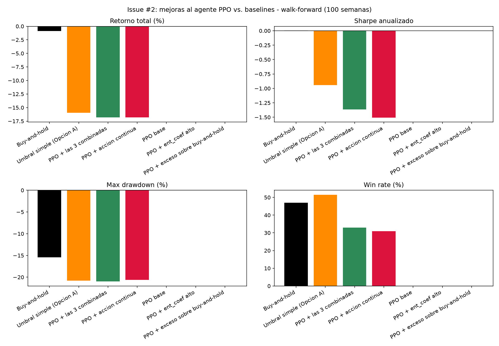
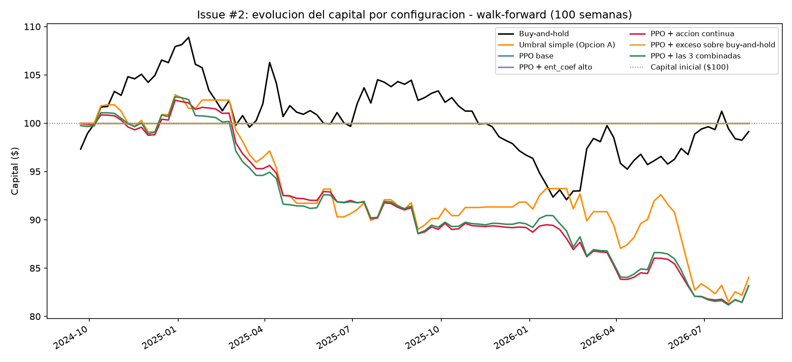

**El resultado es tan honesto de reportar como el de la sección 9.4, y refuerza la misma conclusión en vez de contradecirla.** Más exploración (`ent_coef`) y penalizar la inacción (`exceso_bh`) **no movieron la aguja en absoluto**: con las mismas 5 ventanas y semilla, el agente converge exactamente a la misma política degenerada de no operar nunca (capital final $100.00 en las tres filas, sin diferencia siquiera en el tercer decimal) — la política de "plano" es un atractor lo bastante fuerte en este entorno como para que ni un bonus de entropía 20× más alto que el default ni una recompensa que explícitamente castiga quedarse afuera del mercado lo saquen de ahí en 100.000 pasos de entrenamiento.

Solo la **acción continua** — un cambio estructural, no un hiperparámetro — rompe el atractor y obliga al agente a operar (100 operaciones sobre 100 semanas). Pero operar no ayuda: pierde -16.8%, peor que el umbral simple (-16.0%) y muy por debajo de buy-and-hold (-0.9%), con el Sharpe más negativo de las 7 filas de la tabla. Combinar las 3 mejoras da un resultado prácticamente idéntico a la acción continua sola (-16.8% vs. -16.8%, Sharpe -1.36 vs. -1.51) — evidencia de que `ent_coef` y el reward shaping no aportan nada una vez que el espacio de acción deja de ser el cuello de botella; toda la diferencia la explica forzar al agente a apostar.

**Lectura**: esto no es evidencia de que el diseño del agente esté mal — es evidencia de que el diagnóstico de la sección 9.5 era correcto. Cuando se le impide "no jugar", el agente no encuentra una forma rentable de jugar, porque la señal disponible (|r|<0.11 en las 7 variables del estado) no alcanza para eso. Forzar la acción convierte una abstención racional en una pérdida activa. La propuesta 1 de la sección 9.8 — invertir en mejor señal antes que en mejor agente — queda más respaldada después de este experimento, no menos.

**Limitaciones de este experimento puntual**: un solo valor de `ent_coef` (0.02) y una sola semilla (42, la misma del resto del proyecto) — no se descarta que otro valor de `ent_coef` o promediar sobre varias semillas cambie el resultado del agente base, aunque la acción continua ya muestra que el problema no es exploración insuficiente sino ausencia de señal explotable.

### 9.10 Tareas pendientes en el Issue #2

- [x] Cerrar la Tarea de Notion y el Issue #2 con este hallazgo documentado.
- [x] Evaluar si vale la pena la Tarea "Entrenar agente de RL con datos multi-activo" dado este resultado — ver 9.11/9.12: se priorizó la propuesta 1 de 9.8 (features nuevas / mejor señal) antes que esa Tarea, siguiendo esta misma nota.

### 9.11 Radar-baseline: validar la propuesta 1 de 9.8 antes de construir nada (septiembre 2026)

Antes de invertir en features nuevas, dos preguntas quedaban abiertas: (a) ¿de verdad no hay forma barata de destrabar al agente sin depender de que el PPO converja a "no operar" — podría ser un artefacto del entrenamiento? y (b) ¿qué variables nuevas concretas vale la pena probar? Se investigaron en paralelo (agentes de research, no manual) 18 pares paper+código de estrategias de trading (FX, acciones, ETFs) para responder la segunda pregunta con evidencia en vez de intuición, y se diseñó un experimento independiente del RL para responder la primera.

**Tier 0 — Kelly criterion, sin entrenar ningún agente.** El criterio de Kelly (`f* = μ/σ²`, la fracción de capital que maximiza el crecimiento geométrico esperado) da un segundo veredicto sobre si hay edge explotable, con matemática cerrada en vez de depender de la política que aprenda el PPO. Dos variantes, ambas simuladas con la misma gestión de riesgo real del resto del proyecto (`18_kelly_validacion.py`):

- **Incondicional**: μ y σ² del retorno semanal histórico (ventana de entrenamiento), sin usar ninguna feature.
- **Condicional**: μ predicho por una regresión lineal (OLS, sin look-ahead) sobre las 7 features del estado; σ² = la volatilidad GARCH ya pronosticada para esa semana.

| Estrategia | Retorno total | Sharpe anualizado | Max drawdown | Win rate | Operaciones |
|---|---|---|---|---|---|
| **PPO (RL)** | **0.0%** | — | 0.0% | — | **0** |
| Buy-and-hold | -0.9% | 0.00 | -15.4% | 47.0% | 100 |
| Umbral simple (Opción A) | -16.0% | -0.94 | -20.8% | 51.5% | 68 |
| Kelly incondicional | -51.5% | -3.77 | -52.5% | 29.0% | 100 |
| Kelly condicional (7 features) | -52.9% | -4.12 | -53.6% | 25.0% | 100 |
| Kelly condicional (7 + 5 features nuevas, ver Tier 2) | -53.2% | -4.78 | -52.8% | 25.0% | 100 |

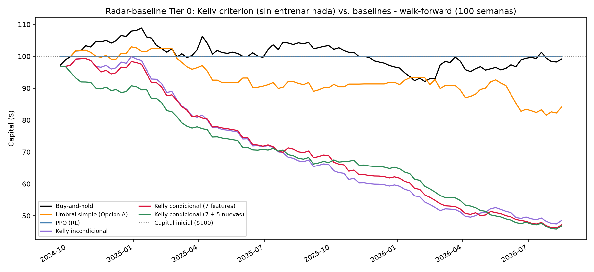
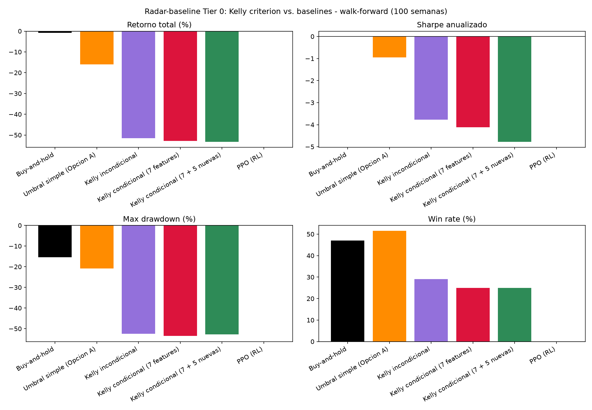

**No salió lo que se esperaba, y es un resultado mejor por eso.** La hipótesis inicial era que `f*` rondaría 0% (confirmando "no hay edge" con un número chico). En cambio, `f*` incondicional da 1.5-2.2× de apalancamiento en las 5 ventanas — porque USD/CLP tiene una deriva histórica semanal pequeña pero no nula (μ≈0.05-0.09% por semana, consistente con la depreciación de largo plazo de la sección 4.3), y Kelly la apalanca. El problema es que esa deriva **no es una señal estable a frecuencia semanal**: apostarle con el tamaño "óptimo" pierde -51.5% fuera de muestra, peor que el umbral simple y muchísimo peor que no operar. La versión condicional (que además usa las 7 features via regresión) pierde todavía más (-52.9%), y el `f*` implícito antes de acotarlo a ±1 llega a pedir hasta 36× de apalancamiento en algunas semanas — la marca de una regresión ajustando ruido, no de una señal real.

Esto responde la pregunta (a) de arriba: la política de "no operar" del PPO no es un artefacto de que el entrenamiento no encontró el camino — es la decisión correcta dado los datos. Un método completamente distinto (sin redes neuronales, sin exploración, sin hiperparámetros) llega a la misma conclusión por otra vía: **cualquier estrategia que apuesta con este set de variables pierde plata; solo abstenerse conserva capital.**

**Tier 2 — candidatas de features nuevas, con anclaje académico.** El radar identificó 5 candidatas concretas de menor fricción de implementación (`19_features_nuevas_validacion.py`): diferencial de tasas Chile-EE.UU. (`rate_diff`, proxy tasa interbancaria 3m vía FRED — ancla: Filippou, Rapach, Taylor & Zhou 2020, carry trade), retorno y momentum del cobre (`copper_ret_1s`, `copper_mom_4s`, vía `yfinance` — ancla: Chen & Rogoff 2003, "Commodity Currencies", específico para CLP), y momentum del propio USD/CLP normalizado por volatilidad a 4 y 12 semanas (`mom_4s`, `mom_12s` — ancla: Moskowitz, Ooi & Pedersen 2012, "Time Series Momentum").

| Feature | Correlación con retorno futuro | Acierto de dirección |
|---|---|---|
| copper_mom_4s | -0.082 | 43.5% |
| copper_ret_1s | -0.050 | 47.3% |
| mom_4s | -0.042 | 50.3% |
| mom_12s | -0.042 | 50.6% |
| rate_diff | 0.033 | 50.3% |

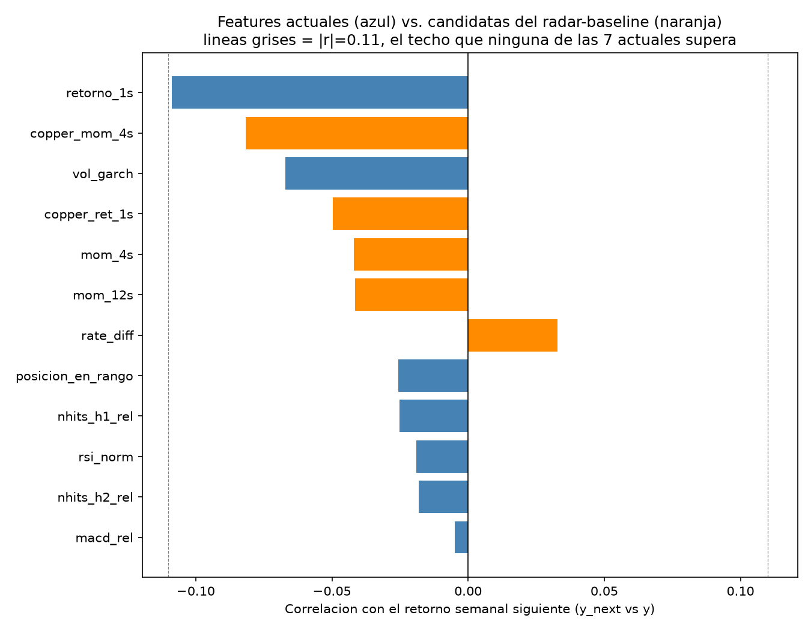

**Ninguna de las 5 supera el umbral |r|=0.11 de la sección 9.5** — ni siquiera se acercan; la más fuerte (`copper_mom_4s`, -0.082) queda por debajo de 4 de las 7 features originales. El signo de `copper_mom_4s` sí es el esperado económicamente (cobre subiendo ⇒ CLP se aprecia ⇒ USD/CLP baja), lo cual descarta un error de signo/unidades, pero la magnitud es demasiado chica para ser útil a esta frecuencia. Agregar las 5 al set de regresión de Kelly condicional no mejora el resultado del Tier 0 (-53.2% vs. -52.9%, ver tabla arriba) — si acaso, ligeramente peor (más parámetros ajustando el mismo ruido).

**Lectura**: la propuesta 1 de la sección 9.8 ("buscar mejor señal") se probó con las candidatas más baratas y mejor ancladas del radar, y a horizonte **semanal** no aparece señal lineal aprovechable en ninguna de ellas — ni en las 7 originales, ni en las 5 nuevas. Esto no cierra la puerta a esas variables en general: el propio radar señaló que el efecto cobre-CLP es sensible a la frecuencia (Ferraro, Rogoff & Rossi 2015 lo encuentran a frecuencia diaria, no mensual) — cabría repetir este mismo chequeo a frecuencia diaria o mensual antes de descartar cobre/tasas por completo. Lo que sí se puede afirmar con este experimento: al ritmo de decisión actual del proyecto (semanal), ni ensanchar el set de variables con estas 5 candidatas ni cambiar el método de sizing (Kelly en vez de RL) revierte la conclusión de 9.5 y 9.9.

**Caveat de datos**: la tasa de Chile usada es un proxy (tasa interbancaria a 3 meses, serie OECD MEI vía FRED), no la TPM oficial del Banco Central de Chile, y tiene rezago de publicación de 2-4 meses — los meses más recientes del dataset quedan con el último valor conocido (forward-fill), no el dato real de esa semana.

### 9.12 Radar-baseline Tier 1: ¿momentum o Differential Sharpe Ratio destraban al agente?

Aunque el Tier 0/2 (9.11) ya sugería que ninguna variable nueva iba a cambiar la conclusión, se completó igual el Tier 1 — mismo criterio que el Issue #2: agotar variantes razonables con evidencia real antes de concluir, no asumir el resultado de antemano. Dos cambios, esta vez sin necesitar datos externos (`20_agente_rl_ronda2.py`, mismo walk-forward de 5 ventanas × 20 semanas):

1. **Momentum en el estado**: agrega `mom_4s`/`mom_12s` (retorno normalizado por volatilidad a 4 y 12 semanas — ancla: Moskowitz, Ooi & Pedersen 2012) a las 7 features existentes.
2. **Differential Sharpe Ratio como recompensa**: reward recursivo de Moody & Saffell (1998) que penaliza la varianza contra el propio historial reciente del agente, en vez de retorno % crudo o exceso sobre buy-and-hold (ya probado en 9.9).

| Estrategia | Retorno total | Sharpe anualizado | Max drawdown | Win rate | Operaciones |
|---|---|---|---|---|---|
| Buy-and-hold | -0.9% | 0.00 | -15.4% | 47.0% | 100 |
| **PPO + momentum** | **-3.1%** | **-0.73** | **-3.1%** | 0.0% | **2** |
| Umbral simple (Opción A) | -16.0% | -0.94 | -20.8% | 51.5% | 68 |
| **PPO base / + DSR reward / + momentum + DSR** | **0.0%** | — | 0.0% | — | **0** |

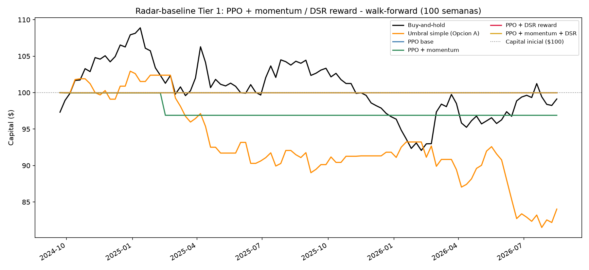
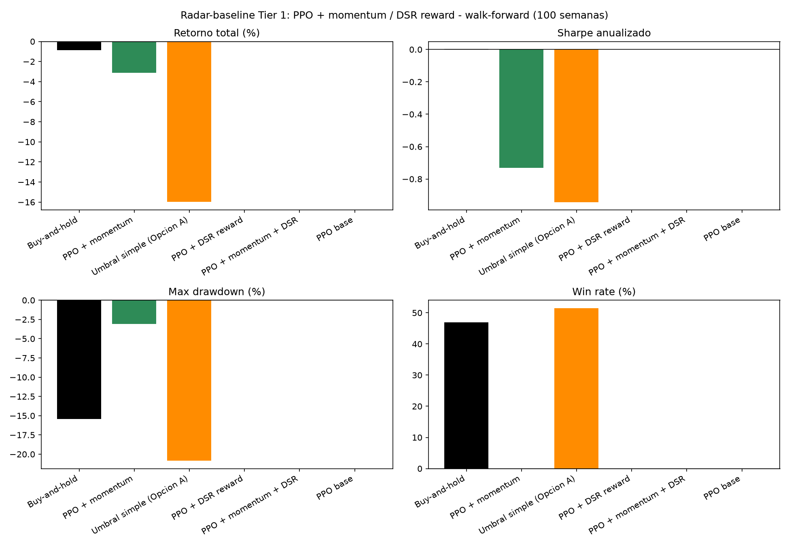

**Momentum es la única de las 6 variantes probadas hasta ahora (3 del Issue #2 + Kelly + 2 de esta ronda) que mueve al agente sin forzarlo estructuralmente** (a diferencia de la acción continua de 9.9, que lo obliga a operar cada semana). Con acción discreta y recompensa cruda, agregar `mom_4s`/`mom_12s` al estado hizo que el agente tomara **2 operaciones** en 100 semanas de test — pocas, pero ya no cero. El resultado de esas 2 operaciones fue negativo (-3.1%, peor que buy-and-hold) pero muchísimo menos negativo que forzar la acción continua (-16.8%) — es un agente que, con una variable más, encontró 2 momentos donde valía la pena arriesgarse según su propio criterio, no una política degenerada. Es un cambio de comportamiento cualitativamente distinto a todo lo probado hasta ahora, aunque el resultado económico siga sin ser positivo.

**El Differential Sharpe Ratio, en cambio, no lo destraba — ni solo ni combinado con momentum.** Ambas configuraciones con `modo_recompensa="dsr"` convergen a 0 operaciones, exactamente como PPO base. Una hipótesis (no verificada, queda para el futuro): el DSR es una señal muy ruidosa al principio del episodio (la varianza del denominador `B_t - A_t²` es inestable en los primeros pasos — ver nota en `11_entorno_trading_rl.py`), lo que podría hacer que el agente aprenda a evitar esa fuente de ruido quedándose plano en vez de aprovechar la señal de varianza real que el DSR busca capturar.

**Lectura acumulada de 9.9 + 9.11 + 9.12**: de 6 variantes independientes probadas sobre el mismo agente/entorno (más exploración, acción continua, exceso sobre buy-and-hold, Kelly, momentum, DSR), solo dos cambiaron el comportamiento del agente (acción continua y momentum) y ambas perdieron plata igual — ninguna encontró una política rentable. La propuesta 1 de la sección 9.8 queda validada con evidencia, no solo con intuición: **el cuello de botella de este proyecto, a la escala y con los datos disponibles hoy, es la señal — no el agente, no el reward, no el espacio de acción.**

### 9.13 Decisiones pendientes (no tomadas en automático)

Este tramo (9.11-9.12) se corrió sin supervisión directa — se priorizaron los ítems de la hoja de ruta con menor costo/reversibilidad (Tier 0-2: sin datos nuevos que conseguir, o datos públicos gratis; cambios acotados al mismo agente/entorno) y se dejaron sin empezar los de mayor alcance, para que la decisión de invertir ahí sea explícita:

- [ ] **Tier 3 — multi-pares FX** (la Tarea original de Notion, ampliada con el hallazgo de X-Trend del radar): entrenar sobre un panel de varios pares en vez de USD/CLP aislado. Cautela documentada en el radar: el único estudio de transfer learning FX directo encontrado dio resultado negativo — no asumir que "más activos" resuelve esto solo, pero tampoco descartarlo sin probarlo, dado que el mecanismo de X-Trend (contexto compartido, no transfer secuencial) es distinto.
- [ ] **Tier 4 — arquitectura cross-attention multi-activo (X-Trend)**: la evidencia más fuerte de mejora en activos con poca historia, pero implica repensar el pipeline completo — solo si Tier 3 no alcanza.
- [ ] Repetir el chequeo de correlación de cobre/tasas (9.11) a frecuencia diaria y mensual — Ferraro, Rogoff & Rossi (2015) encuentran el efecto cobre-FX a diario, no a la frecuencia semanal que se probó acá. Quedó como sugerencia de sesión (chip), no iniciada.
- [ ] Decidir si este trabajo (9.11-9.12) se formaliza como un Issue de GitHub retroactivo o se documenta solo en el paper — no se abrió Issue nuevo porque no había uno para el radar-baseline en sí, a diferencia de los Issues #1/#2.
- [ ] Actualizar/cerrar la Tarea de Notion "Entrenar agente de RL con datos multi-activo" a la luz de este hallazgo (sigue pendiente, sin tocar).

Todo el código está en `codigos/` (scripts `01` a `08` para el forecasting de precio; `09` a `17` para la extensión de trading con RL — ver `README.md` del repositorio para el detalle de cada uno y cómo correrlos), y todos los resultados numéricos y gráficos citados en este documento están versionados en `datos/resultados/`.
