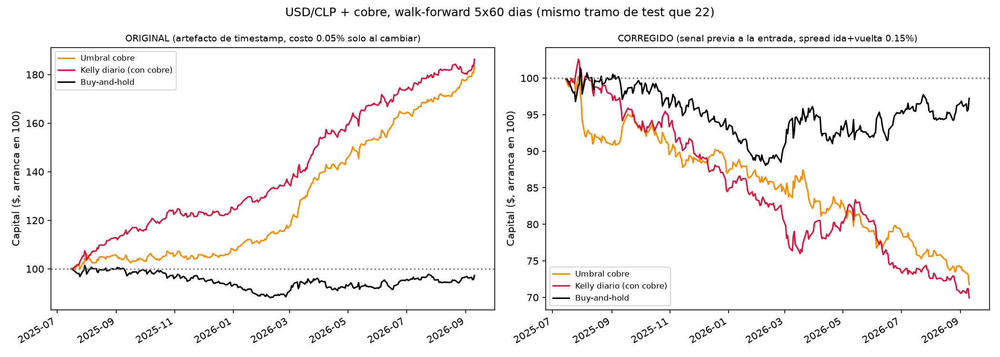
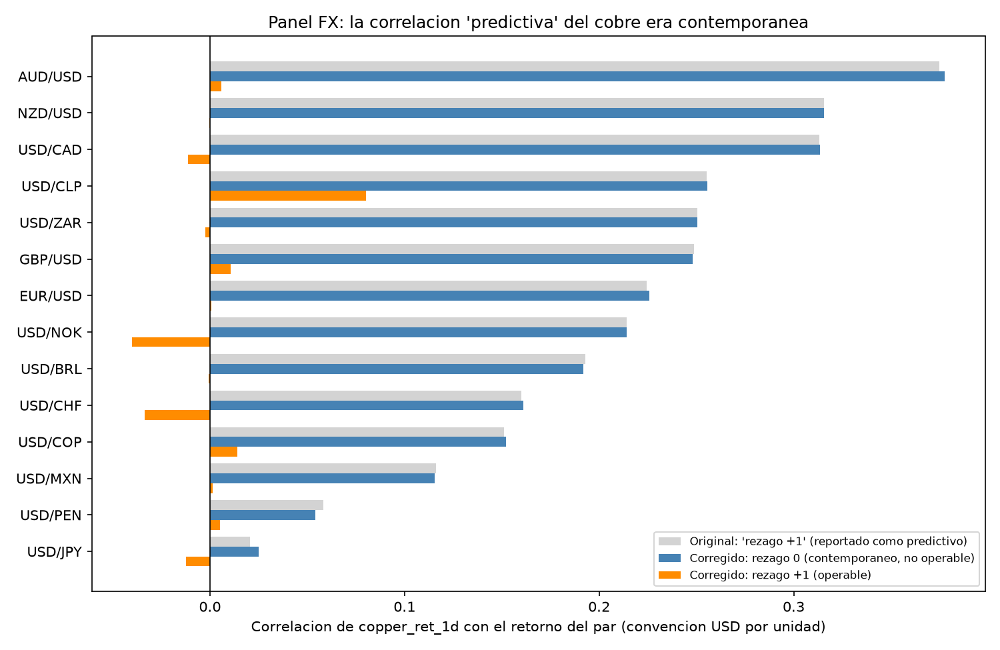
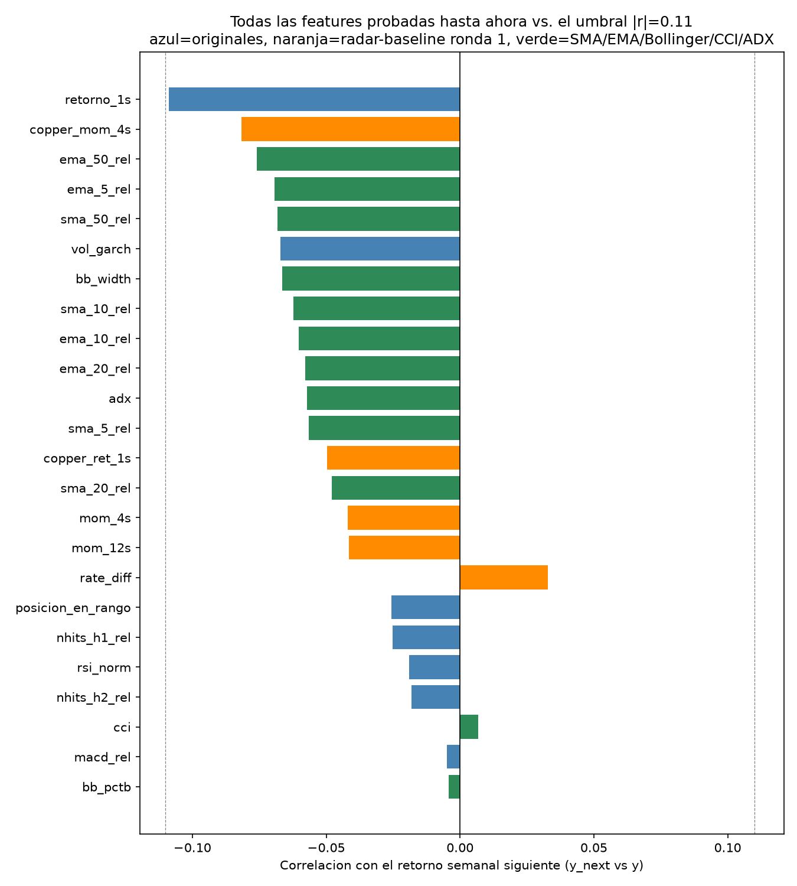
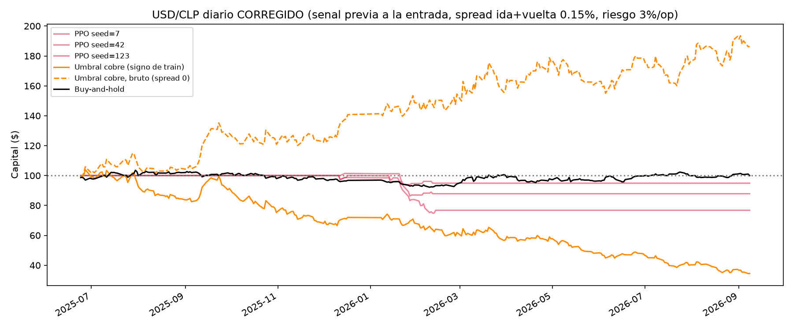
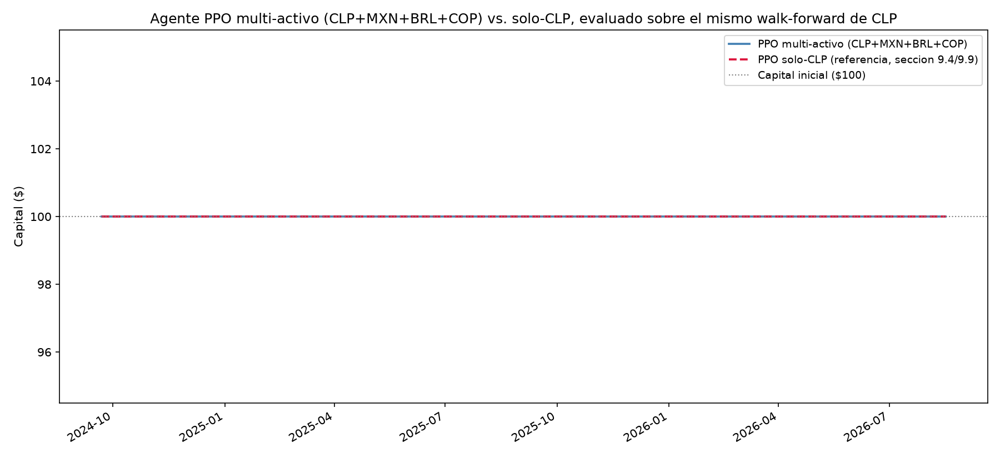
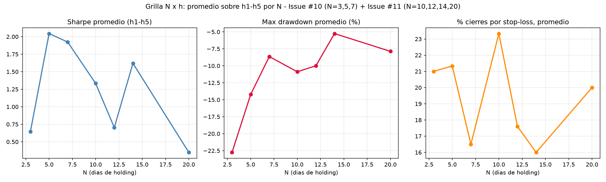
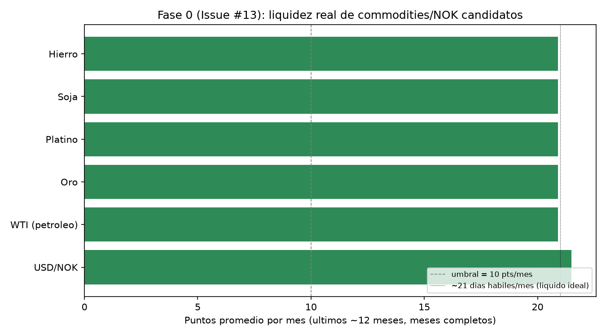
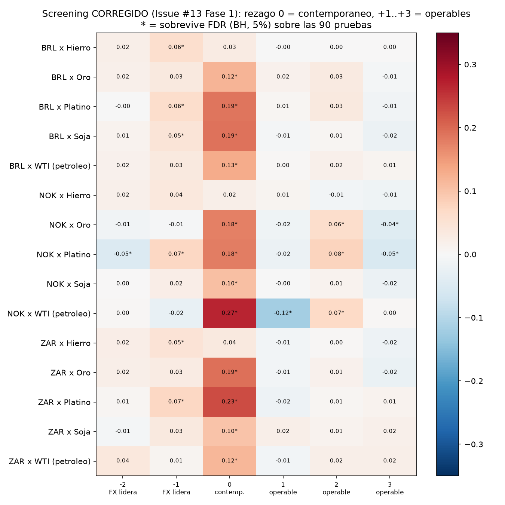

# N-BEATS y N-HiTS contra baselines clásicos para el pronóstico de USD/CLP a múltiples escalas temporales

**Repositorio**: [bastianbm7/usdclp-nbeats-arima-forecasting](https://github.com/bastianbm7/usdclp-nbeats-arima-forecasting)
**Fecha**: septiembre de 2026

## Resumen

Este trabajo compara dos arquitecturas de deep learning para pronóstico de series de tiempo — **N-BEATS** (Oreshkin et al., 2020) y **N-HiTS** (Challu et al., 2023) — contra baselines clásicos (Naive, AutoARIMA, Random Walk with Drift) al pronosticar el tipo de cambio **USD/CLP**, usando las implementaciones de código abierto de [Nixtla](https://github.com/Nixtla) (`neuralforecast` y `statsforecast`, Apache-2.0). El estudio se organiza en cuatro partes: (1) un análisis a escala diaria con horizonte de 14 días hábiles, (2) el mismo análisis resampleado a escala mensual, (3) a escala anual, y (4) un experimento adicional de **aprendizaje online** (`refit=True`, warm-start) con horizontes cortos (1-3 pasos) sobre series diaria, semanal y mensual.

El hallazgo central no es "el deep learning gana" ni "el baseline clásico gana", sino que **la estructura dominante de una serie financiera cambia con la escala de tiempo y con el modo de entrenamiento**, y el modelo ganador cambia con ella — incluyendo un caso de inestabilidad real y no resuelta (aprendizaje online a escala mensual con horizonte de 3 pasos) que se documenta en vez de ocultar.

La sección 9 extiende el trabajo a una pregunta distinta — ¿sirve el forecast para operar con apalancamiento y costos reales? — con un agente de Reinforcement Learning. A frecuencia semanal, ninguna de las variantes probadas encuentra una política rentable (el agente aprende a no operar). Una versión anterior de este documento reportaba que, a frecuencia **diaria**, el retorno del cobre "predecía" el de USD/CLP del día siguiente (r=-0.256) y que estrategias construidas sobre esa señal (reglas simples, Kelly, PPO, Momentum Transformer) alcanzaban Sharpe de 4-5 fuera de muestra, generalizando a otras monedas y commodities. **Esa conclusión era incorrecta** (errata del 2026-09-23, sección 9.35): Yahoo etiqueta las barras diarias FX con el precio de ~20:00 de Nueva York del día *anterior*, mientras el cierre de un futuro de commodity es el settlement de ~13:00 ET del mismo día, así que la "predicción" era la correlación contemporánea mal fechada; además los backtests entraban a un precio anterior a la señal y cobraban solo una fracción del costo de transacción real. Con la alineación temporal corregida — verificada con barras horarias, con el dólar observado del Banco Central de Chile y con una fuente independiente (FRED H.10) —, costos ida+vuelta realistas, selección de parámetros solo con datos pasados e intervalos de confianza, **ninguna estrategia diaria del proyecto tiene un Sharpe neto de costos distinguible de cero o positivo**. La lectura final de la sección 9 es la misma que ya daba la línea semanal: con estas señales y a estas frecuencias, no hay edge explotable, y un agente que siente el costo real aprende a no operar.

## 1. Pregunta de investigación

¿Un modelo moderno de deep learning aporta una mejora real y medible sobre un baseline estadístico clásico al pronosticar un tipo de cambio, o la mejora observada es mayormente autocorrelación del precio (el valor de hoy predice casi perfecto el de mañana)? Y si la respuesta depende de la escala de tiempo o de si el modelo se reentrena a medida que llegan datos nuevos — ¿de qué depende exactamente?

## 2. Datos

Tipo de cambio USD/CLP, serie diaria descargada con [`yfinance`](https://github.com/ranaroussi/yfinance) (ticker `CLP=X`, fuente: Yahoo Finance), 2010-01-01 a 2026-09-11 (4.346 observaciones en días hábiles). A partir de esa serie diaria se derivan por resampleo (último valor del período) las series semanal (871 obs.), mensual (200-201 obs.) y anual (16-17 obs., el último año siempre se descarta por estar incompleto). Los datos crudos y procesados están en `datos/bases/`.

## 3. Metodología

- **Backtesting walk-forward**: nunca un solo split train/test. Cada resultado surge de múltiples ventanas de evaluación fuera de muestra.
- **Modelos**: `Naive` y `AutoARIMA` (selección automática de orden ARIMA vía AIC) de `statsforecast`; `RandomWalkWithDrift` (solo en el análisis anual); `NBEATS` y `NHITS` de `neuralforecast`, con `loss=MQLoss()` para obtener intervalos de predicción.
- **Métricas**: RMSE, MAE, MAPE, calculadas con `utilsforecast.losses` sobre las mismas ventanas para todos los modelos de una corrida.
- **Dos modos de entrenamiento**:
  - *Estático* (secciones 4.1-4.3): el modelo se entrena una vez sobre el historial y se usa para predecir todas las ventanas de test.
  - *Online* (sección 4.4): el modelo se reentrena en cada ventana a medida que hay datos nuevos disponibles (`refit=True`), partiendo de los pesos de la ventana anterior en vez de reiniciar (`use_init_models=False`, warm start) — mecanismo nativo de `neuralforecast`, no código de online-learning escrito a mano. `statsforecast` ya hace esto por default.
- **Licencias**: tanto `neuralforecast` como `statsforecast` son Apache-2.0, usados como dependencias (`pip install`), no forkeados — la fidelidad a los papers originales de N-BEATS/N-HiTS es metodológica, no literal (no es el código de los autores).

## 4. Resultados

### 4.1 Escala diaria (entrenamiento estático, h=14 días hábiles)

5 ventanas no solapadas de 14 días hábiles (70 días hábiles de evaluación, jun-sep 2026), sobre los 4.346 días hábiles completos.

| Modelo | RMSE | MAE | MAPE | Mejora vs. mejor baseline |
|---|---|---|---|---|
| **N-HiTS** | **12.14** | 9.60 | 1.05% | **+20.2%** |
| Naive | 15.21 | 13.31 | 1.46% | — |
| AutoARIMA | 16.52 | 14.42 | 1.58% | -8.6% |
| N-BEATS | 18.27 | 14.09 | 1.55% | -20.1% |

N-HiTS mejora el RMSE ~20% sobre el mejor baseline, una mejora real y consistente (gana en 4 de las 5 ventanas contra N-BEATS, no por azar). `Naive` y `AutoARIMA` quedan **matemáticamente forzados** a producir forecasts (casi) planos dentro de cada ventana: `Naive` por definición, y `AutoARIMA` porque selecciona consistentemente **ARIMA(0,1,1)** en las 5 ventanas — un MA(1) sobre la serie diferenciada tiene memoria de un solo paso, así que su pronóstico multi-paso colapsa a una constante a partir del segundo paso. Esto se verificó inspeccionando `AutoARIMA().fit(y).model_['arma']` directamente, no se asumió.

La primera versión de este análisis usaba `scaler_type="identity"` (sin normalizar) y `max_steps=300`, lo que llevaba a **ambos** modelos de Nixtla a predecir casi una constante por ventana (desviación estándar del pronóstico ~0.3-0.5 contra ~4-12 del dato real) — un resultado visualmente chato aunque el RMSE agregado pareciera razonable. Normalizar (`scaler_type="standard"`) y entrenar más (`max_steps=1500`) resolvió esto.

### 4.2 Escala mensual (entrenamiento estático, h=6 meses)

Cierre de mes, 200 observaciones, 5 ventanas de 6 meses.

| Modelo | RMSE | MAE | MAPE | Mejora vs. mejor baseline |
|---|---|---|---|---|
| **N-BEATS** | **33.09** | 30.82 | 3.28% | **+20.7%** |
| Naive | 41.71 | 35.40 | 3.81% | — |
| N-HiTS | 42.57 | 35.11 | 3.77% | -2.1% |
| AutoARIMA | 44.26 | 38.77 | 4.16% | -6.1% |

Se invierten los papeles respecto a la escala diaria: gana **N-BEATS**, no N-HiTS — ninguno de los dos modelos de Nixtla es sistemáticamente mejor en todas las escalas. Detalle honesto visible en el gráfico: en la ventana de cutoff 2024-12, ambos modelos de Nixtla sobre-extrapolan una racha alcista reciente y proyectan un salto a ~1.050-1.080 que la serie real nunca toca (se queda en ~950-990) — sobre-reacción a momentum de corto plazo que el resultado agregado diluye pero no oculta.

### 4.3 Escala anual (entrenamiento estático, h=1 año, sin redes neuronales)

Cierre de diciembre, 16 observaciones completas (2010-2025), 3 ventanas de 1 año. **A propósito no se incluyen N-BEATS/N-HiTS**: con 16 puntos, entrenar una red neuronal no tiene sustento estadístico real — cualquier resultado sería ruido de una corrida, no una señal reproducible.

| Modelo | RMSE | MAPE | Mejora vs. Naive |
|---|---|---|---|
| **AutoARIMA** | **3.72** | 0.42% | **+87.0%** |
| **RandomWalkWithDrift** | **3.72** | 0.42% | **+87.0%** |
| Naive | 28.64 | 3.24% | — |

El resultado más limpio de los tres: `AutoARIMA` y `RandomWalkWithDrift` dan **el mismo número exacto**, porque AutoARIMA elige por su cuenta un ARIMA(0,1,0) con drift — matemáticamente idéntico a un random walk con tendencia. A escala anual, USD/CLP se comporta como una caminata aleatoria con una depreciación promedio constante; agregar esa tendencia (sin deep learning) le gana al naive plano por 87%. Caveat: ese mismo modelo sobre-extrapola la ventana más reciente (2025→2026, proyecta ~1.030 cuando el real bajó a ~900) — con n=16 cualquier métrica agregada tiene un margen de error grande.

### 4.4 Aprendizaje online: horizontes cortos (1-3 pasos) con `refit=True`

Se prueba reentrenar en cada ventana a medida que aparecen datos nuevos (warm start), con horizontes de 1, 2 y 3 pasos, sobre tres escalas (diaria/semanal/mensual) — 9 combinaciones, 10 ventanas de backtesting cada una.

| Escala | h | Ganador | RMSE ganador | Mejor baseline | RMSE baseline | Mejora |
|---|---|---|---|---|---|---|
| Diaria | 1 | Naive | 3.45 | — | — | — (nada le gana) |
| Diaria | 2 | Naive | 0.70 | — | — | — (nada le gana) |
| Diaria | 3 | N-HiTS | 10.62 | Naive | 10.73 | +1.0% |
| Semanal | 1 | **N-HiTS** | **2.38** | AutoARIMA | 4.79 | **+50.2%** |
| Semanal | 2 | **N-HiTS** | **5.69** | Naive | 11.74 | **+51.5%** |
| Semanal | 3 | N-HiTS | 4.70 | AutoARIMA | 5.33 | +11.9% |
| Mensual | 1 | N-HiTS | 12.32 | Naive | 15.14 | +18.6% |
| Mensual | 2 | **N-BEATS** | **3.25** | Naive | 29.85 | **+89.1%** |
| Mensual | 3 | — | — | AutoARIMA | 41.07 | **-133% a -167%** (ambas redes fallan) |

**Diaria**: el naive domina los 3 horizontes (con empate técnico de N-HiTS en h=3). A 1-3 días la autocorrelación es tan fuerte que ni el aprendizaje online encuentra ventaja — coherente con la sección 4.1.

**Semanal**: la escala donde el aprendizaje online más aporta. N-HiTS gana los 3 horizontes, con mejoras de +50% y +51% en h=1 y h=2.

**Mensual**: el resultado más interesante. En h=1 y h=2 las redes mejoran mucho al baseline (N-BEATS en h=2 llega a un 89% de mejora). Pero en **h=3 ambas redes fallan catastróficamente** (RMSE de 96-110 contra ~41 del naive) — y se verificó explícitamente que no es un problema de entrenamiento insuficiente: subir el presupuesto de 100 a 300 pasos por reentreno mejoró mucho h=1 y sobre todo h=2, pero **no cambió nada en h=3**. Esta inestabilidad queda documentada como hallazgo abierto, no resuelto — hipótesis de trabajo: la combinación de warm-start (el optimizador de PyTorch Lightning no conserva su estado de Adam entre reentrenos, solo los pesos) con un horizonte relativamente largo sobre una serie corta (200 obs.) puede generar actualizaciones inestables al reiniciar el optimizador sobre pesos ya ajustados.

## 5. Discusión

Cuatro estudios, cuatro respuestas distintas a la misma pregunta:

| Configuración | ¿Le gana algo al naive? | Ganador | Por qué |
|---|---|---|---|
| Diaria, estático, h=14 | Sí, +20% | N-HiTS | Único con libertad real de forma que la aprovechó bien |
| Mensual, estático, h=6 | Sí, +21% | N-BEATS | El "ganador" entre N-BEATS/N-HiTS no es estable entre escalas |
| Anual, estático, h=1 | Sí, +87% | AutoARIMA = RWD | Domina una tendencia determinística de largo plazo, no ruido |
| Diaria/semanal/mensual, online, h=1-3 | Depende mucho | N-HiTS (semanal, sobre todo) | Reentrenar ayuda muchísimo en algunos casos y es inestable en otros |

La lectura de portfolio no es "el deep learning gana siempre" ni "el baseline clásico gana siempre" — es que la estructura dominante de una serie financiera **cambia con la escala de tiempo y con el modo de entrenamiento**, y ni siquiera dar más cómputo garantiza estabilidad (mensual h=3 online). Reportar esto último, en vez de ocultarlo detrás de la configuración que mejor se ve, es la decisión metodológica más importante de todo el trabajo.

## 6. Limitaciones conocidas

- **Autocorrelación, no "poder predictivo"**: con precio de cierre diario, buena parte de cualquier error bajo es autocorrelación, no señal real capturada por el modelo.
- **Nixtla es una dependencia, no un fork**: la fidelidad a los papers originales de N-BEATS/N-HiTS es metodológica, no literal.
- **Nivel 1 de proporcionalidad**: sin tests automatizados ni monitoreo — pieza de portfolio personal, no servicio en producción.
- **Backtesting anual con n=16**: muestra chica; el resultado tiene explicación matemática clara pero no la misma robustez estadística que diario/mensual.
- **Inestabilidad de `mensual h=3` online**: no resuelta; ver sección 4.4.
- **Dependencia de Yahoo Finance**: `yfinance` puede cambiar de comportamiento — mitigado guardando copias crudas de los datos descargados.

## 7. Trabajo futuro

- Investigar la causa raíz de la inestabilidad en `mensual h=3` (ej. inspeccionar la trayectoria de pérdida por reentreno, probar conservando el estado del optimizador entre ventanas).
- Probar `AutoNBEATS`/`AutoNHITS` (búsqueda automática de hiperparámetros vía Ray Tune, ya incluidos en el entorno) en vez de fijar `max_steps`/`scaler_type` a mano.
- Extender el aprendizaje online a horizontes más largos y a la escala anual, si se consigue más historial.
- Replicar el mismo diseño sobre otro par de divisas o un índice bursátil, para ver si la síntesis de la sección 5 se sostiene fuera de USD/CLP.

## 8. Referencias

- Oreshkin, B. N., Carpov, D., Chapados, N., & Bengio, Y. (2020). *N-BEATS: Neural basis expansion analysis for interpretable time series forecasting*. ICLR 2020. [arXiv:1905.10437](https://arxiv.org/abs/1905.10437)
- Challu, C., Olivares, K. G., Oreshkin, B. N., Ramirez, F. G., Canseco, M. M., & Dubrawski, A. (2023). *N-HiTS: Neural Hierarchical Interpolation for Time Series Forecasting*. [arXiv:2201.12886](https://arxiv.org/abs/2201.12886)
- Nixtla. [statsforecast](https://github.com/Nixtla/statsforecast) y [neuralforecast](https://github.com/Nixtla/neuralforecast) (Apache-2.0).

## 9. Extensión: estrategia de trading con Reinforcement Learning (septiembre 2026)

> **⚠️ Errata (2026-09-23)**: los resultados de la línea **diaria** de esta extensión (9.13-9.14, 9.17, 9.20, 9.22-9.28, 9.31-9.34) estaban invalidados por un artefacto de timestamps entre las barras diarias FX de Yahoo y los settlements de futuros de commodities (la "predicción" del cobre era la correlación contemporánea), por un bug de costos (spread cobrado una fracción de las veces) y por ejecución a un precio anterior a la señal. Esas secciones se reescribieron con la metodología corregida; la explicación completa, la evidencia y los números originales están en **9.35**. La línea semanal (9.1-9.12, 9.16, 9.18) no está afectada.

El forecasting de precio (secciones 1-7) responde si un modelo predice bien. Esta extensión responde una pregunta distinta: **¿ese forecast sirve para tomar decisiones de trading que ganen plata, una vez que se cuentan el apalancamiento y el riesgo real?** Es un proyecto separado dentro del mismo repo (Issue [#1](https://github.com/bastianbm7/usdclp-nbeats-arima-forecasting/issues/1)), no una sección más del estudio de forecasting.

### 9.1 Elección de enfoque

Se evaluaron tres opciones para convertir el forecast en una estrategia: (A) una regla fija de umbral sobre la predicción, (B) un framework de backtesting dedicado (backtrader/vectorbt), y (C) un agente de **Reinforcement Learning**. Se eligió la opción C, con **FinRL** (Liu et al., [arXiv:2111.09395](https://arxiv.org/abs/2111.09395); repo [AI4Finance-Foundation/FinRL](https://github.com/AI4Finance-Foundation/FinRL), MIT) como ancla metodológica — no como dependencia completa: FinRL está diseñado para carteras multi-activo, así que se construyó un entorno Gym propio y liviano (`gymnasium` + `stable-baselines3`, algoritmo PPO) para un solo par.

### 9.2 Modelo de volatilidad: comparación antes de elegir

Antes de decidir qué modelo de volatilidad alimentaría al agente, se comparó walk-forward (100 ventanas semanales, reentrenando en cada una) contra dos baselines:

| Modelo | RMSE | Mejora vs. Naive |
|---|---|---|
| **GARCH(1,1)** | **0.00653** | **+37.4%** |
| EGARCH(1,1) | 0.00661 | +36.7% |
| Media móvil (8 semanas) | 0.00885 | +15.2% |
| Naive | 0.01044 | — |

Ganó GARCH(1,1), usado desde acá como el forecast de volatilidad del agente y como base del stop-loss ("volatility scaling", la misma técnica de position-sizing que usan los papers de Wood et al. citados más abajo). En el camino se encontraron y corrigieron **2 ticks corruptos de yfinance** en `usdclp_long.csv` (2016-12-22 y 2014-04-10, precio cayendo a ~5 en vez de ~660/~544 por un día) — invisibles para el forecasting de precio de las secciones 1-7, pero catastróficos para cualquier cálculo de volatilidad (retorno de ese día: ±488%). La corrección vive en `01_obtener_datos.py` (función `limpiar_ticks_erroneos`), así que persiste si se vuelve a descargar la serie.

### 9.3 Diseño del agente

**Estado** (7 variables, todas relativas/acotadas — no precio nivel, porque USD/CLP no es estacionario en 16 años): retorno de la última semana, forecast N-HiTS a 1 y 2 semanas (el de aprendizaje online semanal `refit=True`, el resultado más fuerte de la sección 4.4) como desviación % del precio actual, volatilidad GARCH, MACD y RSI normalizados, y la posición del precio dentro de su rango de 12 semanas.

**Acción**: 3 posiciones discretas (largo/plano/corto). **Gestión de riesgo**: capital simulado de $100, tamaño de posición vía *risk sizing* — arriesgar el 3% del capital vigente por operación, no un monto fijo — con el stop-loss a la distancia de la volatilidad GARCH pronosticada (1 desvío) y el take-profit en el precio objetivo de N-HiTS. El stop-loss es *trailing*: sube seguiendo al precio a favor (largo) sin retroceder nunca, para asegurar ganancias parciales sin esperar el take-profit fijo. TP/SL se verifican día a día contra el precio real dentro de la semana, no solo al cierre. Slippage simulado de 0.05% por cambio de posición; comisión en 0 (decisión explícita para esta v1, no una omisión).

### 9.4 Resultados: walk-forward con gestión de riesgo real

Walk-forward de 5 ventanas × 20 semanas de test cada una (100 semanas out-of-sample, 2024-09 a 2026-08), reentrenando el agente en cada ventana — nunca un solo split, consistente con la metodología del resto del proyecto.

| Estrategia | Retorno total | Sharpe anualizado | Max drawdown | Win rate | Operaciones |
|---|---|---|---|---|---|
| **Buy-and-hold (sin apalancar)** | **-0.9%** | **~0.00** | -15.4% | 47.0% | — |
| Umbral simple (Opción A) | -16.0% | -0.94 | -20.8% | 51.5% | 68 |
| **PPO (RL)** | **0.0%** | — | 0.0% | — | **0** |

**El hallazgo no es el que se esperaba, y es el más honesto de reportar tal cual**: el agente de RL, entrenado primero con una recompensa simplificada (retorno % sin apalancar), convergió a una política degenerada de "siempre largo" que, evaluada con apalancamiento real, perdía -52.2% — peor que cualquier baseline. Al reentrenar con la **recompensa real** (la misma economía de apalancamiento + TP/SL del backtest, no una versión simplificada), el agente convergió a una política distinta: **no operar nunca**, en las 5 ventanas, con o sin trailing stop. No es una falla del entrenamiento — es la respuesta racional de un agente que sí "siente" el costo del riesgo: ninguna señal disponible le pareció confiable para arriesgar capital.

### 9.5 Por qué: análisis de las variables del estado

Para entender la decisión del agente, se midió la correlación de cada feature del estado con el retorno real de la semana siguiente (348 semanas completas):

| Feature | Correlación | Acierto de dirección |
|---|---|---|
| retorno_1s | -0.109 | 49.1% |
| vol_garch | -0.067 | 51.1% |
| posicion_en_rango | -0.026 | 43.7% |
| nhits_h1_rel | -0.025 | 52.0% |
| rsi_norm | -0.019 | 51.1% |
| nhits_h2_rel | -0.018 | 50.0% |
| macd_rel | -0.005 | 55.2% |

Ninguna variable supera |r|=0.11, y el acierto de dirección de todas ronda el 50% (una moneda) — incluido el forecast de N-HiTS (52.0%), pese a que en la sección 4.4 mostró una mejora real de RMSE en la métrica de *error de forecasting*. Esa es justo la distinción que motivó esta extensión: un modelo puede reducir el error de predicción de forma real y medible (sección 4) sin que eso alcance para anticipar la *dirección* del movimiento con la confiabilidad que una estrategia de trading necesita. El agente de RL no "descartó" una señal fuerte por error — la señal disponible es, de hecho, débil.

### 9.6 Limitaciones de esta extensión

- **Slippage simulado, comisión no**: 0.05% por cambio de posición; una comisión real (aunque sea baja) empeoraría más a las estrategias activas (68-100 operaciones) que al buy-and-hold.
- **Walk-forward de 5 ventanas**: más riguroso que un solo split, pero menos ventanas que las 100 del análisis diario original — cada ventana individual sigue siendo una muestra chica.
- **Un solo activo, un solo agente (PPO)**: no se probó DQN/A2C ni otra arquitectura de red; la conclusión es sobre esta configuración puntual, no sobre "RL para trading" en general.
- **Trailing stop con precios de cierre diario**: aproximación estándar de backtesting sin datos intradía — un trailing stop con datos tick a tick podría comportarse distinto.

### 9.7 Tareas pendientes en el Issue #1

- [ ] Cerrar la Tarea de Notion y el Issue con este hallazgo documentado (no hay más código pendiente de esta fase).
- [ ] Decidir si la Fase 2 (bot en tiempo real / forward-test) sigue en pie — dado el hallazgo de 9.4-9.5, probablemente no se justifica sin antes encontrar una señal con más edge que la de la sección 9.5.

### 9.8 Propuestas a partir de esta conclusión

El hallazgo central (sin edge direccional real, un agente que entiende el riesgo prefiere no operar) abre más preguntas que las que cierra:

1. **Buscar mejor señal antes que mejor agente**: la sección 9.5 sugiere que el cuello de botella es la señal (MACD/RSI/forecast con |r|<0.11), no el algoritmo de decisión. Vale más invertir en features nuevas (ej. variables macro, tasas de interés diferencial USD/CLP, flujos de comercio exterior) que en probar otro agente de RL sobre las mismas 7 variables.
2. **Repetir el diseño en otro activo**: si el mismo agente (recompensa real, mismo stack) encuentra una política no-trivial en otro par o instrumento, ayudaría a distinguir "USD/CLP no tiene edge explotable a esta escala" de "el diseño del agente tiene un problema genérico".
3. **Probar con comisión real distinta de cero**: cuantificar cuánto empeoraría el umbral simple (68 operaciones) con una comisión de, por ejemplo, 0.02-0.05% por operación — barato de correr, cierra un cabo suelto de 9.6.
4. **Considerar la "no-operación" como resultado de portfolio válido**: mostrar honestamente que un agente bien diseñado puede concluir "no juegues" es, en sí mismo, un punto de portfolio interesante — distinto (y más raro de ver) que la mayoría de los proyectos de trading con RL que solo muestran el caso en que "funcionó".

### 9.9 Extensión: resultados del Issue #2 (mejoras al agente)

A partir de la propuesta 1 de la sección 9.8 se probaron 3 cambios técnicos **independientes** sobre el mismo agente/entorno de la sección 9.3-9.4, cada uno evaluado por separado y combinados contra el mismo walk-forward de 5 ventanas × 20 semanas:

1. **Más exploración**: `ent_coef=0.02` en PPO (default de stable-baselines3: 0.0).
2. **Acción continua**: `action_space` de `Discrete(3)` a `Box(-1, 1)`, con el tamaño de la apuesta (notional) escalando proporcional a la magnitud de la acción en vez de solo largo/plano/corto.
3. **Reward shaping**: recompensa como exceso de retorno sobre buy-and-hold sin apalancar, en vez de retorno % crudo.

| Estrategia | Retorno total | Sharpe anualizado | Max drawdown | Win rate | Operaciones |
|---|---|---|---|---|---|
| Buy-and-hold (sin apalancar) | -0.9% | ~0.00 | -15.4% | 47.0% | 100 |
| Umbral simple (Opción A) | -16.0% | -0.94 | -20.8% | 51.5% | 68 |
| **PPO base** (referencia 9.4) | **0.0%** | — | 0.0% | — | **0** |
| **PPO + ent_coef alto** | **0.0%** | — | 0.0% | — | **0** |
| **PPO + exceso sobre buy-and-hold** | **0.0%** | — | 0.0% | — | **0** |
| PPO + acción continua | -16.8% | -1.51 | -20.6% | 31.0% | 100 |
| PPO + las 3 combinadas | -16.8% | -1.36 | -21.0% | 33.0% | 100 |

**El resultado es tan honesto de reportar como el de la sección 9.4, y refuerza la misma conclusión en vez de contradecirla.** Más exploración (`ent_coef`) y penalizar la inacción (`exceso_bh`) **no movieron la aguja en absoluto**: con las mismas 5 ventanas y semilla, el agente converge exactamente a la misma política degenerada de no operar nunca (capital final $100.00 en las tres filas, sin diferencia siquiera en el tercer decimal) — la política de "plano" es un atractor lo bastante fuerte en este entorno como para que ni un bonus de entropía 20× más alto que el default ni una recompensa que explícitamente castiga quedarse afuera del mercado lo saquen de ahí en 100.000 pasos de entrenamiento.

Solo la **acción continua** — un cambio estructural, no un hiperparámetro — rompe el atractor y obliga al agente a operar (100 operaciones sobre 100 semanas). Pero operar no ayuda: pierde -16.8%, peor que el umbral simple (-16.0%) y muy por debajo de buy-and-hold (-0.9%), con el Sharpe más negativo de las 7 filas de la tabla. Combinar las 3 mejoras da un resultado prácticamente idéntico a la acción continua sola (-16.8% vs. -16.8%, Sharpe -1.36 vs. -1.51) — evidencia de que `ent_coef` y el reward shaping no aportan nada una vez que el espacio de acción deja de ser el cuello de botella; toda la diferencia la explica forzar al agente a apostar.

**Lectura**: esto no es evidencia de que el diseño del agente esté mal — es evidencia de que el diagnóstico de la sección 9.5 era correcto. Cuando se le impide "no jugar", el agente no encuentra una forma rentable de jugar, porque la señal disponible (|r|<0.11 en las 7 variables del estado) no alcanza para eso. Forzar la acción convierte una abstención racional en una pérdida activa. La propuesta 1 de la sección 9.8 — invertir en mejor señal antes que en mejor agente — queda más respaldada después de este experimento, no menos.

**Limitaciones de este experimento puntual**: un solo valor de `ent_coef` (0.02) y una sola semilla (42, la misma del resto del proyecto) — no se descarta que otro valor de `ent_coef` o promediar sobre varias semillas cambie el resultado del agente base, aunque la acción continua ya muestra que el problema no es exploración insuficiente sino ausencia de señal explotable.

### 9.10 Tareas pendientes en el Issue #2

- [x] Cerrar la Tarea de Notion y el Issue #2 con este hallazgo documentado.
- [x] Evaluar si vale la pena la Tarea "Entrenar agente de RL con datos multi-activo" dado este resultado — ver 9.11/9.12: se priorizó la propuesta 1 de 9.8 (features nuevas / mejor señal) antes que esa Tarea, siguiendo esta misma nota.

### 9.11 Radar-baseline: validar la propuesta 1 de 9.8 antes de construir nada (septiembre 2026)

Antes de invertir en features nuevas, dos preguntas quedaban abiertas: (a) ¿de verdad no hay forma barata de destrabar al agente sin depender de que el PPO converja a "no operar" — podría ser un artefacto del entrenamiento? y (b) ¿qué variables nuevas concretas vale la pena probar? Se investigaron en paralelo (agentes de research, no manual) 18 pares paper+código de estrategias de trading (FX, acciones, ETFs) para responder la segunda pregunta con evidencia en vez de intuición, y se diseñó un experimento independiente del RL para responder la primera.

**Tier 0 — Kelly criterion, sin entrenar ningún agente.** El criterio de Kelly (`f* = μ/σ²`, la fracción de capital que maximiza el crecimiento geométrico esperado) da un segundo veredicto sobre si hay edge explotable, con matemática cerrada en vez de depender de la política que aprenda el PPO. Dos variantes, ambas simuladas con la misma gestión de riesgo real del resto del proyecto (`18_kelly_validacion.py`):

- **Incondicional**: μ y σ² del retorno semanal histórico (ventana de entrenamiento), sin usar ninguna feature.
- **Condicional**: μ predicho por una regresión lineal (OLS, sin look-ahead) sobre las 7 features del estado; σ² = la volatilidad GARCH ya pronosticada para esa semana.

| Estrategia | Retorno total | Sharpe anualizado | Max drawdown | Win rate | Operaciones |
|---|---|---|---|---|---|
| **PPO (RL)** | **0.0%** | — | 0.0% | — | **0** |
| Buy-and-hold | -0.9% | 0.00 | -15.4% | 47.0% | 100 |
| Umbral simple (Opción A) | -16.0% | -0.94 | -20.8% | 51.5% | 68 |
| Kelly incondicional | -51.5% | -3.77 | -52.5% | 29.0% | 100 |
| Kelly condicional (7 features) | -52.9% | -4.12 | -53.6% | 25.0% | 100 |
| Kelly condicional (7 + 5 features nuevas, ver Tier 2) | -53.2% | -4.78 | -52.8% | 25.0% | 100 |

**No salió lo que se esperaba, y es un resultado mejor por eso.** La hipótesis inicial era que `f*` rondaría 0% (confirmando "no hay edge" con un número chico). En cambio, `f*` incondicional da 1.5-2.2× de apalancamiento en las 5 ventanas — porque USD/CLP tiene una deriva histórica semanal pequeña pero no nula (μ≈0.05-0.09% por semana, consistente con la depreciación de largo plazo de la sección 4.3), y Kelly la apalanca. El problema es que esa deriva **no es una señal estable a frecuencia semanal**: apostarle con el tamaño "óptimo" pierde -51.5% fuera de muestra, peor que el umbral simple y muchísimo peor que no operar. La versión condicional (que además usa las 7 features via regresión) pierde todavía más (-52.9%), y el `f*` implícito antes de acotarlo a ±1 llega a pedir hasta 36× de apalancamiento en algunas semanas — la marca de una regresión ajustando ruido, no de una señal real.

Esto responde la pregunta (a) de arriba: la política de "no operar" del PPO no es un artefacto de que el entrenamiento no encontró el camino — es la decisión correcta dado los datos. Un método completamente distinto (sin redes neuronales, sin exploración, sin hiperparámetros) llega a la misma conclusión por otra vía: **cualquier estrategia que apuesta con este set de variables pierde plata; solo abstenerse conserva capital.**

**Tier 2 — candidatas de features nuevas, con anclaje académico.** El radar identificó 5 candidatas concretas de menor fricción de implementación (`19_features_nuevas_validacion.py`): diferencial de tasas Chile-EE.UU. (`rate_diff`, proxy tasa interbancaria 3m vía FRED — ancla: Filippou, Rapach, Taylor & Zhou 2020, carry trade), retorno y momentum del cobre (`copper_ret_1s`, `copper_mom_4s`, vía `yfinance` — ancla: Chen & Rogoff 2003, "Commodity Currencies", específico para CLP), y momentum del propio USD/CLP normalizado por volatilidad a 4 y 12 semanas (`mom_4s`, `mom_12s` — ancla: Moskowitz, Ooi & Pedersen 2012, "Time Series Momentum").

| Feature | Correlación con retorno futuro | Acierto de dirección |
|---|---|---|
| copper_mom_4s | -0.082 | 43.5% |
| copper_ret_1s | -0.050 | 47.3% |
| mom_4s | -0.042 | 50.3% |
| mom_12s | -0.042 | 50.6% |
| rate_diff | 0.033 | 50.3% |

**Ninguna de las 5 supera el umbral |r|=0.11 de la sección 9.5** — ni siquiera se acercan; la más fuerte (`copper_mom_4s`, -0.082) queda por debajo de 4 de las 7 features originales. El signo de `copper_mom_4s` sí es el esperado económicamente (cobre subiendo ⇒ CLP se aprecia ⇒ USD/CLP baja), lo cual descarta un error de signo/unidades, pero la magnitud es demasiado chica para ser útil a esta frecuencia. Agregar las 5 al set de regresión de Kelly condicional no mejora el resultado del Tier 0 (-53.2% vs. -52.9%, ver tabla arriba) — si acaso, ligeramente peor (más parámetros ajustando el mismo ruido).

**Lectura**: la propuesta 1 de la sección 9.8 ("buscar mejor señal") se probó con las candidatas más baratas y mejor ancladas del radar, y a horizonte **semanal** no aparece señal lineal aprovechable en ninguna de ellas — ni en las 7 originales, ni en las 5 nuevas. Esto no cierra la puerta a esas variables en general: el propio radar señaló que el efecto cobre-CLP es sensible a la frecuencia (Ferraro, Rogoff & Rossi 2015 lo encuentran a frecuencia diaria, no mensual) — cabría repetir este mismo chequeo a frecuencia diaria o mensual antes de descartar cobre/tasas por completo. Lo que sí se puede afirmar con este experimento: al ritmo de decisión actual del proyecto (semanal), ni ensanchar el set de variables con estas 5 candidatas ni cambiar el método de sizing (Kelly en vez de RL) revierte la conclusión de 9.5 y 9.9.

**Caveat de datos**: la tasa de Chile usada es un proxy (tasa interbancaria a 3 meses, serie OECD MEI vía FRED), no la TPM oficial del Banco Central de Chile, y tiene rezago de publicación de 2-4 meses — los meses más recientes del dataset quedan con el último valor conocido (forward-fill), no el dato real de esa semana.

### 9.12 Radar-baseline Tier 1: ¿momentum o Differential Sharpe Ratio destraban al agente?

Aunque el Tier 0/2 (9.11) ya sugería que ninguna variable nueva iba a cambiar la conclusión, se completó igual el Tier 1 — mismo criterio que el Issue #2: agotar variantes razonables con evidencia real antes de concluir, no asumir el resultado de antemano. Dos cambios, esta vez sin necesitar datos externos (`20_agente_rl_ronda2.py`, mismo walk-forward de 5 ventanas × 20 semanas):

1. **Momentum en el estado**: agrega `mom_4s`/`mom_12s` (retorno normalizado por volatilidad a 4 y 12 semanas — ancla: Moskowitz, Ooi & Pedersen 2012) a las 7 features existentes.
2. **Differential Sharpe Ratio como recompensa**: reward recursivo de Moody & Saffell (1998) que penaliza la varianza contra el propio historial reciente del agente, en vez de retorno % crudo o exceso sobre buy-and-hold (ya probado en 9.9).

| Estrategia | Retorno total | Sharpe anualizado | Max drawdown | Win rate | Operaciones |
|---|---|---|---|---|---|
| Buy-and-hold | -0.9% | 0.00 | -15.4% | 47.0% | 100 |
| **PPO + momentum** | **-3.1%** | **-0.73** | **-3.1%** | 0.0% | **2** |
| Umbral simple (Opción A) | -16.0% | -0.94 | -20.8% | 51.5% | 68 |
| **PPO base / + DSR reward / + momentum + DSR** | **0.0%** | — | 0.0% | — | **0** |

**Momentum es la única de las 6 variantes probadas hasta ahora (3 del Issue #2 + Kelly + 2 de esta ronda) que mueve al agente sin forzarlo estructuralmente** (a diferencia de la acción continua de 9.9, que lo obliga a operar cada semana). Con acción discreta y recompensa cruda, agregar `mom_4s`/`mom_12s` al estado hizo que el agente tomara **2 operaciones** en 100 semanas de test — pocas, pero ya no cero. El resultado de esas 2 operaciones fue negativo (-3.1%, peor que buy-and-hold) pero muchísimo menos negativo que forzar la acción continua (-16.8%) — es un agente que, con una variable más, encontró 2 momentos donde valía la pena arriesgarse según su propio criterio, no una política degenerada. Es un cambio de comportamiento cualitativamente distinto a todo lo probado hasta ahora, aunque el resultado económico siga sin ser positivo.

**El Differential Sharpe Ratio, en cambio, no lo destraba — ni solo ni combinado con momentum.** Ambas configuraciones con `modo_recompensa="dsr"` convergen a 0 operaciones, exactamente como PPO base. Una hipótesis (no verificada, queda para el futuro): el DSR es una señal muy ruidosa al principio del episodio (la varianza del denominador `B_t - A_t²` es inestable en los primeros pasos — ver nota en `11_entorno_trading_rl.py`), lo que podría hacer que el agente aprenda a evitar esa fuente de ruido quedándose plano en vez de aprovechar la señal de varianza real que el DSR busca capturar.

**Lectura acumulada de 9.9 + 9.11 + 9.12**: de 6 variantes independientes probadas sobre el mismo agente/entorno (más exploración, acción continua, exceso sobre buy-and-hold, Kelly, momentum, DSR), solo dos cambiaron el comportamiento del agente (acción continua y momentum) y ambas perdieron plata igual — ninguna encontró una política rentable. La propuesta 1 de la sección 9.8 queda validada con evidencia, no solo con intuición: **el cuello de botella de este proyecto, a la escala y con los datos disponibles hoy, es la señal — no el agente, no el reward, no el espacio de acción.**

### 9.13 Seguimiento: el efecto del cobre a frecuencia diaria — era contemporáneo, no predictivo (corregido 2026-09-23)

> **⚠️ Errata (2026-09-23), leer antes que nada del resto de la sección 9 diaria.** La versión original de esta sección reportaba que `copper_ret_1d` correlacionaba **-0.256 con el retorno del día siguiente** de USD/CLP y lo presentaba como la señal predictiva más fuerte del proyecto. Dos auditorías independientes, y la evidencia que se reproduce en 9.35, muestran que ese número es un **artefacto de timestamps**: Yahoo etiqueta la barra diaria de un par FX con fecha D pero su precio es el de ~00:00 UTC de D (≈20:00 de Nueva York del día D-1), mientras el "cierre" diario de `HG=F` con fecha D es el settlement de ~13:00 ET del día D. El "retorno del día siguiente" de USD/CLP que se usaba (fila D+1) cubre 17 de las 24 horas de la ventana del retorno del cobre de la fila D — es mayormente la **reacción simultánea** al mismo shock, no una predicción. Todo lo construido encima (9.14, 9.17, 9.20-9.28, 9.31-9.34) heredó el problema y se rehízo con la alineación corregida (`codigos/alineacion_temporal.py`) y costos realistas (`codigos/costos_y_estadistica.py`). La errata completa, con las tablas de evidencia y los números originales, está en **9.35**.

La sección 9.11 dejó un cabo suelto: Ferraro, Rogoff & Rossi (2015) encuentran el efecto cobre→CLP a frecuencia **diaria**, y el chequeo de 9.11 se hizo a frecuencia semanal. El chequeo diario original (`21_features_nuevas_frecuencias.py`) fusionaba el cobre con `merge_asof(direction="backward")` por fecha: a la fila de USD/CLP con fecha D le tocaba el settlement de cobre de ese mismo D — que ocurre ~17 horas **después** del precio FX de esa fila. La versión corregida (`59_senal_cobre_clp_corregida.py`) usa una sola regla: el dato de cobre usable en una fila FX es el del último settlement **estrictamente anterior** al timestamp real del precio FX (equivale a reetiquetar la barra FX D a la tarde de D-1 y dejar el commodity en su fecha).

| Feature (diaria, USD/CLP 2010-2026) | Original: corr. con el retorno de la fila siguiente | **Corregido: corr. con el retorno operable** | Corregido: corr. con el retorno contemporáneo |
|---|---|---|---|
| `copper_ret_1d` | -0.256 | **-0.078** | -0.254 |
| `copper_mom_5d` | -0.165 | **-0.041** | -0.163 |
| `copper_mom_20d` | -0.075 | **-0.014** | -0.072 |
| `rate_diff` | 0.004 | 0.004 | 0.004 |

(`datos/resultados/correccion_clp_features_diarias_913.csv`. "Operable" = retorno desde un precio FX posterior al settlement que generó la señal hasta el siguiente precio FX; "contemporáneo" = el retorno FX cuya ventana se solapa con la del cobre. A mensual, `copper_ret_1m` ya estaba bajo el umbral, 0.105, y un desfase de horas no cambia eso.)

**Lectura corregida, dicha sin atenuar**: el -0.256 que motivó toda la línea diaria es, casi completo, la correlación **contemporánea** entre cobre y CLP (que existe y es bien conocida — el peso chileno se mueve con el cobre el mismo día — pero no se puede operar: para cuando se conoce el settlement del cobre, el peso ya se movió). Lo que queda en la dirección operable es -0.078 en toda la muestra (estable entre 2010-2017, -0.068, y 2018-2026, -0.086): estadísticamente distinto de cero con n≈4.200, pero chico, por debajo del umbral |r|=0.11 que el proyecto usó para todo lo demás, y — como muestran 9.14 y 9.35 — insuficiente para pagar el spread de USD/CLP. El caveat que esta misma sección dejó escrito en su versión original ("no se validó el timestamp de cierre de `HG=F` contra el de `CLP=X` ... podría ser información contemporánea filtrándose como si fuera predictiva") era exactamente el problema; la "validación" de 9.14 lo descartó con un argumento invertido (ver 9.14 y 9.35).

### 9.14 Validación del hallazgo diario (corregido 2026-09-23): el timestamp NO estaba limpio, el backtest no es rentable, y el panel repite el mismo artefacto

> **Errata**: esta sección concluía "timestamp limpio, backtest rentable (+86.2%, Sharpe 4.57)". Las dos conclusiones eran incorrectas; se reescribe con la alineación corregida y costos ida+vuelta. Los números originales quedan registrados en 9.35.

Bastián pidió validar el caveat de timestamp de 9.13 aunque resultara válido, probar rentabilidad en un backtest y ampliar a un panel de al menos 10 pares — los tres pasos se rehicieron.

**Validación de timestamp — el argumento original estaba invertido.** La versión original usó un escaneo de rezagos: como la correlación estaba concentrada en el "rezago +1" (-0.254) y casi nula en el 0 (-0.021), concluyó que no había solapamiento de cierres ("si hubiera contaminación, se vería en el rezago 0"). Eso presupone que la fila FX y la fila de cobre con la misma fecha están en el mismo reloj. No lo están: la fila FX con fecha D es el precio de ~20:00 NY de D-1, el cobre con fecha D es el settlement de ~13:00 ET de D. En el reloj real, el retorno FX del "rezago +1" (20:00 NY de D-1 → 20:00 NY de D) es el que más se solapa con la ventana del cobre (13:00 ET de D-1 → 13:00 ET de D): 17 de 24 horas. **La concentración en +1 es exactamente la firma de la contaminación, no la prueba de su ausencia.** La confirmación viene de comparar las mismas dos variables en relojes consistentes (`58_validacion_timestamp.py`, tabla completa en `errata_timestamp_clp_rezagos.csv`):

| Cobre vs. USD/CLP, alineación | Rezago -1 | Rezago 0 | Rezago +1 | Rezago +2 |
|---|---|---|---|---|
| Original del proyecto (Yahoo diario, merge fecha ≤) | -0.050 | -0.021 | **-0.254** | -0.069 |
| **Corregida** (settlement < timestamp FX; 0 = contemporáneo, +1 = operable) | -0.021 | **-0.253** | **-0.069** | -0.032 |
| Dólar observado BCCh reetiquetado al día de transacción (promedio intradía) | -0.026 | **-0.385** | -0.119 | -0.020 |
| Barras horarias Yahoo, cobre y CLP ambos a las 18:00 UTC (730 días) | 0.029 | **-0.437** | 0.018 | 0.004 |
| Barras horarias Yahoo, ambos a las 20:00 UTC (730 días) | 0.036 | **-0.457** | 0.024 | -0.030 |

En cuanto las dos series se miden en el mismo reloj — con barras horarias a la misma hora, o con el dólar observado del Banco Central fechado al día en que ocurrieron las transacciones — la correlación fuerte aparece en el **rezago 0** (-0.39 a -0.46) y el rezago +1 queda en torno a cero. Con la alineación corregida sobre los mismos datos diarios de Yahoo, el -0.25 pasa al rezago 0 (chequeo de cordura de que la corrección es la correcta) y lo operable es -0.069. La misma conclusión se obtiene con una fuente completamente independiente (FRED H.10, tipo de cambio al mediodía de Nueva York) para AUD, CAD, MXN, NOK, ZAR y BRL — ver 9.35.

**Backtest corregido** (`59_senal_cobre_clp_corregida.py`, mismo walk-forward de 5 ventanas × 60 días que el original, 2025-07 a 2026-09). Entrada al precio de la fila (ya con la señal conocida), salida en la fila siguiente; signo de la regla de cobre estimado solo con el train de cada ventana (dio -1 en las 5); precios repetidos de Yahoo (feriados) eliminados; spread ida+vuelta de USD/CLP de 0.15% del notional en cada día con posición; IC95 por bootstrap de bloques.

| Estrategia (300 días de test) | Original (artefacto, 0.05% solo al cambiar) | **Corregido, bruto** | **Corregido, spread 0.15% ida+vuelta** | Corregido, cota inferior (solo al rotar) |
|---|---|---|---|---|
| Umbral cobre | +83.5% / Sharpe 4.45 | +10.9% / 0.78 [-0.78, 2.42] | **-28.2% / -2.25 [-3.74, -0.75]** | -14.4% / -1.02 |
| Kelly diario (con cobre) | +86.3% / 4.58 | +9.5% / 0.69 [-0.87, 2.25] | **-30.1% / -2.43 [-4.10, -0.82]** | -11.7% / -0.80 |
| Kelly diario (sin cobre) | +6.1% / 0.47 | +12.8% / 0.91 [-0.60, 2.47] | -27.3% / -2.17 | -8.2% / -0.54 |
| Buy-and-hold | -2.7% / -0.13 | -2.8% / -0.13 | — | — |

(`correccion_clp_cobre_walkforward_metricas.csv`, sensibilidad completa en `correccion_clp_cobre_sensibilidad_spread.csv`, curvas en `correccion_clp_cobre_curva_capital.png`.)

Bruto, sin costos, la regla del cobre queda en Sharpe 0.78 con un IC95 que incluye holgadamente el cero — y Kelly **sin** cobre rinde lo mismo o más, así que ni siquiera ese resto es atribuible al cobre. El spread ida+vuelta que lleva la regla a retorno medio cero es **0.039%** del notional (antes de la corrección era 0.24%): cualquier spread realista de USD/CLP (0.10-0.20%) la hace perder. Sensibilidad (Umbral cobre, corregido): Sharpe 0.78 con spread 0, 0.38 con 0.02%, -0.23 con 0.05%, -1.24 con 0.10%, -2.25 con 0.15%, -3.26 con 0.20%.

**Sobre el tamaño de la apuesta**: la versión original separó dirección y tamaño (100%/20%/10%/3% del capital) para argumentar que el Sharpe ~4.5 era "la parte confiable". Con costos proporcionales al notional, el Sharpe neto también es invariante al tamaño — escalar no rescata nada: el problema no era el sizing, era la señal.

**Panel de 13 pares + NOK** (`60_panel_fx_corregido.py`, panel reconstruido con la misma receta de 23/55 pero alineado y sin precios repetidos: `datos/bases/panel_fx_diario_alineado.csv`).

| Par | Original "rezago +1" (reportado como predictivo) | **Corregido: rezago 0 (contemporáneo)** | **Corregido: rezago +1 (operable)** |
|---|---|---|---|
| AUD/USD | 0.375 | 0.377 | 0.006 |
| NZD/USD | 0.315 | 0.316 | -0.000 |
| USD/CAD | 0.313 | 0.314 | -0.011 |
| USD/CLP | 0.255 | 0.256 | 0.080 |
| USD/ZAR | 0.251 | 0.251 | -0.002 |
| GBP/USD | 0.249 | 0.248 | 0.011 |
| EUR/USD | 0.224 | 0.226 | 0.001 |
| USD/NOK | 0.214 | 0.214 | -0.040 |
| USD/BRL | 0.193 | 0.192 | -0.000 |
| USD/CHF | 0.160 | 0.161 | -0.033 |
| USD/COP | 0.151 | 0.152 | 0.014 |
| USD/MXN | 0.116 | 0.116 | 0.001 |
| USD/PEN | 0.058 | 0.054 | 0.005 |
| USD/JPY | 0.021 | 0.025 | -0.012 |

(Convención del panel: USD por unidad de moneda extranjera, por eso el signo es positivo. `correccion_panel_fx_correlacion_cobre_por_par.csv`.)

El ordenamiento "Chen & Rogoff" que la versión original celebraba (AUD/NZD/CAD arriba, JPY abajo) **sigue siendo cierto — para la correlación contemporánea**: las monedas commodity se mueven con el cobre el mismo día, que es lo que predice la teoría. Pero la columna operable es prácticamente cero en los 14 pares; USD/CLP es la única con un resto visible (0.08). La regla "umbral cobre" con signo de train y spread por par pierde en los 14 pares (Sharpe neto de -0.01 en EUR/USD a -4.98 en USD/COP; bruto, todos con IC95 que incluye el cero salvo USD/PEN, significativamente negativo) — `correccion_panel_fx_backtest_por_par.csv`.

**Un segundo artefacto de datos, encontrado al revisar los números sospechosos del panel**: la variante "Kelly diario (con cobre)" da resultados positivos en varios pares emergentes (bruto: USD/BRL Sharpe 2.04, USD/COP 1.98, y **USD/PEN +1377% / Sharpe 10.8**, el mismo tipo de número absurdo que el "+860% de PEN" de la versión original). No viene del cobre: viene de `retorno_1d` en la regresión. Los precios diarios de Yahoo de pares poco líquidos tienen una autocorrelación de primer orden **negativa y espuria** — ruido en el precio que se revierte al día siguiente: PEN=X -0.44, COP=X -0.30, ZAR=X -0.23, CLP=X -0.18, BRL=X -0.15, contra ~0 en los pares líquidos (EUR, JPY, CAD: -0.03 a 0.01) y ~0 en las series de FRED de esas mismas monedas (BRL 0.01, ZAR 0.01, MXN 0.03). Una regla que "compra la caída de ayer" gana sobre esos precios porque los precios mismos son ruidosos, no porque se pueda operar a ellos. No se considera evidencia de edge, y a propósito no se exploró más (sería una configuración nueva elegida mirando el test). Es también lo que infla la validación histórica de Kelly en 2015-2016 (ver 9.17).

**¿Ayuda el panel pooled?** Con la alineación corregida (Kelly, 5 reentrenos, test de CLP): solo-CLP bruto +11.1% / Sharpe 0.79, neto -28.5% / -2.27; pooled (14 pares) bruto +18.9% / 1.26, neto -23.4% / -1.79; ambos con IC95 bruto que incluye el cero y posición saturada en ±1 el ~96% de los días (`correccion_panel_fx_pooled_vs_single.csv`). La conclusión original ("el pooling ingenuo empeora a CLP porque promedia sensibilidades al cobre distintas") ya no tiene sustento: no hay una sensibilidad operable al cobre que promediar, y la diferencia entre ambas variantes no es distinguible del ruido.

### 9.15 Decisiones pendientes (no tomadas en automático)

> **Nota (2026-09-23)**: esta lista es el registro histórico de las decisiones de ese momento. Las premisas que la motivaban (timestamp limpio, Sharpe ~4.5 "confiable a cualquier escala") quedaron invalidadas — ver 9.13, 9.14 y la errata en 9.35. Los ítems marcados como hechos se hicieron, pero sus conclusiones fueron reemplazadas.

Este tramo (9.11-9.14) mezcló trabajo sin supervisión directa (9.11-9.13, priorizando lo de menor costo/reversibilidad) con pasos pedidos explícitamente por Bastián después (9.14: validar el timestamp, probar rentabilidad, ampliar a un panel de 10+ pares). Lo que queda es de mayor alcance — construir algo nuevo, no solo investigar — y se deja explícito para que la decisión de invertir ahí sea de Bastián:

- [x] Repetir el chequeo de correlación de cobre/tasas a frecuencia diaria y mensual (9.13) — hecho: `copper_ret_1d` supera el umbral por más del doble a diario, se diluye a semanal/mensual.
- [x] Validar el timestamp de cierre de `HG=F` vs. `CLP=X` (9.14) — el escaneo de rezagos no muestra contaminación por solapamiento (efecto concentrado en el rezago +1, no en el 0).
- [x] Probar rentabilidad en un backtest real (9.14) — +86.2% / Sharpe 4.57 en 300 días de test, consistente en las 5 ventanas, no explicado por una sola operación. **Corregido después**: ese +86.2% asume apostar el 100% del capital casi todos los días (97% de saturación de apalancamiento) — a un tamaño de riesgo realista (3%, como el agente semanal) el retorno de 14 meses baja a +1.9%. El Sharpe (~4.5) sí es confiable a cualquier escala; el retorno en dólares no lo es sin fijar antes una regla de sizing sensata.
- [x] Ampliar el dataset a un panel de forex de 10+ pares (9.14) — 13 pares en `datos/bases/panel_fx_diario.csv`. El efecto generaliza (más fuerte incluso en AUD/CAD/NZD que en CLP), pero pooling ingenuo del panel completo **empeora** el resultado específico de CLP frente a entrenar solo con su propia historia (mismo caveat de apalancamiento aplica a los dos números, la comparación relativa entre ambos sigue siendo válida).
- [ ] **Antes de cualquier otra cosa**: definir una regla de sizing real (no Kelly sin acotar) para todos los resultados de 9.14 — el candidato más simple es reusar directamente `RIESGO_MAX_PCT` del agente semanal (arriesgar un % fijo del capital por el tamaño del stop, no el `f*` crudo de la regresión). Sin esto, ningún número de retorno de esta sección (CLP, el panel de 13 pares, pooled vs. solo-CLP) es comparable a los backtests del resto del proyecto (14, 17, 20), que sí usan risk sizing acotado.
- [ ] **La pregunta grande que sigue abierta**: ¿vale la pena una versión diaria del agente/pipeline (no solo un backtest de Kelly) que use `copper_ret_1d` como feature? Es un cambio de escala real — regenerar el dataset a diario, rediseñar el TP/SL (a diario no hay datos intradía para el trailing stop actual, se simplificaría a cierre-a-cierre como en 9.14), redefinir walk-forward — del tamaño del Issue #1 original. La evidencia de 9.14 lo respalda (el Sharpe estable ~4.5 sobrevive a la corrección de sizing), pero el periodo de test (14 meses recientes) no cubre múltiples regímenes de cobre — valdría la pena, antes de comprometerse, correr el mismo backtest de 22 sobre ventanas históricas más antiguas (ej. 2015-2018, 2019-2021) para ver si el Sharpe se sostiene fuera del tramo alcista reciente.
- [ ] Si se decide ir a diario: el panel de 13 pares ya construido (9.14) sirve como insumo directo para una versión "contexto compartido" real (estilo X-Trend) en vez de pooling ingenuo — encoder de tendencia entrenado sobre el panel, no una regresión OLS que promedia todo por igual.
- [ ] Decidir si este trabajo (9.11-9.14) se formaliza como un Issue de GitHub retroactivo o se documenta solo en el paper — no se abrió Issue nuevo porque no había uno para el radar-baseline en sí, a diferencia de los Issues #1/#2.
- [ ] Actualizar/cerrar la Tarea de Notion "Entrenar agente de RL con datos multi-activo" a la luz de este hallazgo (sigue pendiente, sin tocar) — el resultado de 9.14 sugiere que la versión "pooling simple" de esa Tarea probablemente no ayudaría; si se retoma, hacerlo con un mecanismo más parecido a X-Trend.
- [x] Sesión cerrada acá (2026-09-15) a pedido de Bastián. Se creó una Tarea nueva en Notion, "Reconstruir pipeline de trading RL a frecuencia diaria (USD/CLP + cobre)" (Estado=Por hacer, Prioridad=Media, proyecto vinculado), para retomar la reconstrucción completa en un chat nuevo — con todo el contexto técnico resumido ahí mismo, apuntando a esta sección del paper.

### 9.16 Cierre de la línea "buscar mejor señal" semanal: SMA/EMA/Bollinger/CCI/ADX tampoco superan el umbral (Issue #4)

Última extensión de la propuesta 1 de 9.8 (Tarea de Notion "Probar medias móviles..."), después de que MACD, RSI, momentum (9.11) y tasas/cobre semanal (9.11) ya hubieran fallado. Se probaron 12 indicadores técnicos adicionales, ninguno usado antes en este proyecto: SMA y EMA relativas al precio a 5/10/20/50 semanas, ancho de banda y `%B` de Bollinger (20 semanas, 2 desv. estándar), y CCI/ADX (20 y 14 semanas respectivamente) — estos dos últimos señalados en la ronda 1 del radar-baseline (vía FinRL/Qlib Alpha158) como indicadores nunca probados acá. CCI y ADX necesitan High/Low, que `01_obtener_datos.py` descarta (solo guarda Close); se descargó un OHLC semanal separado (`datos/bases/usdclp_ohlc_semanal.csv`, cache propio) en vez de tocar el pipeline principal.

**Resultado**: ninguna de las 12 supera |r|=0.11. La más fuerte es `ema_50_rel` con -0.076 — menos de la mitad del umbral, y más débil que 4 de las 7 features originales y que `copper_mom_4s` (-0.082) de la ronda anterior. `cci` y `bb_pctb` quedan prácticamente en cero (0.007 y -0.004). Confirma la expectativa honesta de la propia Tarea: son transformaciones del mismo precio que ya había fallado en sus otras formas (MACD, RSI, momentum), y suavizar más (SMA/EMA/Bollinger) no agrega información nueva, solo la retrasa.

Con esto se agotan las 12 candidatas de indicadores técnicos derivados del precio semanal de USD/CLP identificadas hasta ahora (7 originales + 5 de la ronda radar-baseline + estas 12 no se solapan, aunque MACD/RSI ya estaban en las 7 originales). Ninguna superó el umbral. Dado el paso 2 condicional de la Tarea ("si alguna supera 0.11, agregarla al PPO") no aplicó, no se entrenó ningún agente nuevo — se cierra la línea sin gasto de cómputo, mismo criterio de "barato antes de caro" que las secciones anteriores. La pista con mayor evidencia real sigue siendo la de 9.13/9.14 (cobre a frecuencia diaria, fuera del alcance semanal de esta línea).

### 9.17 Issue #5: reconstrucción completa del agente de RL a frecuencia diaria (resultados corregidos 2026-09-23)

> **Errata**: la versión original reportaba que el agente PPO diario encontraba "la primera política rentable del proyecto" (+397.1%, Sharpe 3.88) y que la regla simple del cobre rendía aún más (+532.3%, Sharpe 4.39), con una validación histórica de Sharpe 2.07-5.42 en cuatro períodos. Los tres resultados heredaban el artefacto de timestamp y el bug de costos (9.35). Se rehízo todo con los datasets realineados (63), el entorno con spread ida+vuelta en cada operación y 3 semillas de PPO. La arquitectura del pipeline (dataset NHITS walk-forward con refit cada 5 días, entorno `27` separado del semanal, risk sizing de 3% del capital, TP/SL de un paso) se mantiene y su descripción sigue siendo válida; lo que cambia son los números y la conclusión.

La sección 9.15 dejó abierta la pregunta de si valía la pena reconstruir el pipeline completo a frecuencia diaria para explotar `copper_ret_1d`. El Issue [#5](https://github.com/bastianbm7/usdclp-nbeats-arima-forecasting/issues/5) pidió validar primero en períodos históricos.

**Paso 1 — validación histórica, corregida** (`59_senal_cobre_clp_corregida.py`; mismo método de 22/25 — Kelly condicional vía OLS y umbral simple de cobre, walk-forward 5 × 60 días, truncando el dataset a distintas fechas de corte — pero con la señal conocida antes de la entrada, el signo de la regla estimado solo con el train de cada ventana, y spread ida+vuelta de 0.15%):

| Período de test | Original: Kelly con cobre (Sharpe) | Corregido: Umbral cobre, bruto [IC95] | **Corregido: Umbral cobre, neto** | Corregido: Kelly con cobre, bruto | **Corregido: Kelly con cobre, neto** |
|---|---|---|---|---|---|
| 2015-11 a 2016-12 | 5.42 | 0.99 [-0.80, 2.72] | **-1.06** | 5.48 [3.43, 7.39] | **3.35** [1.17, 5.33] |
| 2017-11 a 2018-12 | 3.25 | 0.80 [-1.13, 2.66] | **-1.99** | 1.22 [-0.28, 2.74] | **-1.51** |
| 2020-11 a 2021-12 | 2.07 | 2.54 [0.41, 4.57] | **-0.27** [-2.60, 1.93] | 0.91 [-1.00, 2.74] | **-1.90** |
| 2025-07 a 2026-09 | 4.57 | 0.78 [-0.78, 2.42] | **-2.25** | 0.69 [-0.87, 2.25] | **-2.43** |

(`correccion_clp_cobre_validacion_historica.csv`.)

Con costos, la regla del cobre pierde en los cuatro períodos. Hay dos positivos que hay que mirar con el mismo estándar de sospecha que se aplicaba a los negativos:
- **Umbral cobre bruto 2020-2021** (Sharpe 2.54, IC95 que excluye el cero): es el período donde el resto de correlación operable de USD/CLP con el cobre es más alto (-0.11 en 2020-2022). Es 1 de 12 celdas brutas de la tabla, sin corrección por pruebas múltiples, y con el spread supuesto queda en -0.27.
- **Kelly 2015-2016** (bruto 5.48, neto 3.35): no viene del cobre. Kelly **sin** cobre en ese mismo período da bruto 3.60 / neto 1.53, y la correlación del cobre en esa ventana es chica. Lo que explota la regresión es `retorno_1d`: en 2015-2016 el retorno diario de `CLP=X` en Yahoo tiene autocorrelación de primer orden de -0.26 (-0.18 en toda la muestra), ruido de cotización que se revierte al día siguiente (9.35.6) y que una serie operable no tiene. No se toma como evidencia de edge.

La conclusión original ("la señal se sostiene fuera del régimen reciente, respalda avanzar al paso 2") no se sostiene: con la alineación correcta no había una señal del cobre que validar.

**Paso 2 — reconstrucción completa, reentrenada sobre datos alineados.** El dataset NHITS de 26 se **realineó** en vez de regenerarse (`63_realinear_datasets_rl_diarios.py`, justificación en 9.35.1: NHITS, GARCH y los indicadores técnicos solo usan la serie FX hasta el precio de la fila; solo las columnas de cobre estaban mal alineadas). El chequeo de cordura sobre el propio dataset (1.454 días, 2020-12 a 2026-09): la correlación de `copper_ret_1d` con el retorno que se operaba pasa de -0.237 (original) a -0.103 (operable corregido), y la contemporánea queda en -0.219. El entorno `27` cobra ahora el spread ida+vuelta (0.15%) sobre el notional en cada operación, también durante el entrenamiento, así que el agente aprende con la economía real. PPO se reentrena en cada ventana (5 × 60 días, 100k timesteps) con 3 semillas (`64_entrenar_ppo_diario_corregido.py`, lote A); los baselines usan solo información de train: signo de la regla del cobre estimado en train (dio -1 en las 5 ventanas) y umbral de "Umbral simple" = mediana de |forecast| del train (la versión original usaba la mediana de todo el dataset, test incluido). Métricas en `65_resumen_rl_diario_corregido.py`.

| Estrategia (300 días, 2025-06 a 2026-09) | Original | **Corregido, neto (spread 0.15%)** [IC95] | Corregido, bruto [IC95] | Operaciones | Apalancamiento mediano |
|---|---|---|---|---|---|
| PPO (RL diario), 3 semillas | +397.1% / Sharpe 3.88 | **-5% a -23% / Sharpe -0.90, -1.61, -2.14** (media -1.55) | Sharpe 0.10, -0.53, -0.83 | 8, 13, 24 | 4.6x |
| Umbral cobre | +532.3% / 4.39 | **-65.5% / -2.37** [-4.07, -0.73] | +1.66 [0.12, 3.23] | 290 | 3.8x |
| Umbral cobre, salida al cierre (sin TP/SL) | — | -70.0% / -1.99 [-3.43, -0.54] | +1.12 [-0.33, 2.62] | 290 | 3.8x |
| Umbral simple (forecast NHITS) | +22.9% / 0.83 | -30.5% / -1.11 [-3.46, 1.12] | +1.35 [-0.84, 3.39] | 133 | 3.5x |
| Buy-and-hold (sin apalancar) | -1.2% / -0.02 | -0.0% / 0.06 [-1.35, 1.40] | — | — | 1x |
| *Control: dirección al azar, mismo simulador (300 sorteos)* | — | — | *media +0.50 (p5 -0.99, p95 +2.11)* | 300 | 3.8x |

(`correccion_rl_metricas_todas.csv`, sensibilidad a spread en `correccion_rl_sensibilidad_spread.csv`.)

**Lectura corregida**:
1. **El agente PPO, entrenado con los costos reales, aprende a casi no operar** (8 a 24 operaciones en 300 días según la semilla, contra 299 en la versión original) — el mismo atractor de "no operar" que el agente semanal (9.4, 9.9) y por la misma razón: no hay señal que pague el costo. Las pocas operaciones que hace pierden (Sharpe neto -0.9 a -2.1; bruto entre -0.8 y +0.1). La coincidencia de dirección con la regla del cobre, que en la versión original era 72.3%, deja de tener sentido con tan pocas operaciones (54-88%).
2. **La regla del cobre pierde dos tercios del capital con costos**: con un apalancamiento de 3.8x, un spread de 0.15% por operación equivale a ~0.57% del capital por día. Su spread de breakeven es 0.06% del notional.
3. **Un sesgo del simulador que la versión original no medía** (auditoría `stops.py`): el TP/SL de un paso solo dispara si el **cierre** cruza el nivel. Un stop que el precio tocó durante el día y del que volvió no se ejecuta (optimista); un TP tocado que se devolvió no se cobra (pesimista). El neto es un sesgo a favor: con dirección **al azar**, el mismo simulador da Sharpe bruto medio de +0.50 en CLP (+0.40 en AUD, +0.25 en CAD), contra ~0.0 si se sale siempre al cierre. Parte de los Sharpe brutos positivos de esta sección y de 9.20-9.28 es ese sesgo, no señal.

**Limitaciones que siguen, dichas sin atenuar**: el forecast NHITS sigue teniendo hasta 4 días de antigüedad dentro de cada bloque (trade-off de cómputo documentado en 26); un único período de test de 300 días; 3 semillas (no 5) por cómputo; y el TP/SL con precios de cierre, descrito arriba, sigue siendo una aproximación sesgada a favor que no se corrigió (no hay datos intradía de CLP de calidad suficiente para hacerlo) — por eso cada tabla trae la variante sin TP/SL o el control al azar.

### 9.18 Issue #6: ¿el atractor de "no operar nunca" es especifico de USD/CLP o generico? (multi-activo FX)

La seccion 9.8 (propuesta 2) y el Issue #6 dejaban abierta una pregunta que ninguna de las 6 variantes de 9.9/9.11/9.12 podia responder por si sola: ¿"USD/CLP no tiene edge explotable a esta escala" es un hallazgo especifico de este par, o un problema generico de entrenar con ~250-330 semanas de un unico activo? Se entrena el mismo agente PPO (misma economia real de apalancamiento + TP/SL de 9.3) sobre varios pares de FX a la vez, en vez de solo CLP.

**Diseno elegido**: politica UNICA (compartida) entrenada sobre episodios de distintos pares — no una red separada por activo. Implementacion por **composicion**, no reescritura: `30_entorno_trading_rl_multiactivo.py` define `MultiFXTradingEnv`, un wrapper de `gymnasium.Env` que mantiene una instancia de `USDCLPTradingEnv` (11, sin modificar — el Issue #5 hermano lo tocaba en paralelo para frecuencia diaria) por cada par, y en cada `reset()` elige cual esta "activa" para ese episodio completo; el estado que ve la red es el de esa sub-instancia **concatenado con un one-hot del par activo**. La economia de riesgo real (apalancamiento via risk sizing, trailing stop, take-profit, slippage) es exactamente la misma que ya entrena/evalua al agente solo-CLP, no una segunda implementacion que podria divergir.

El one-hot es la decision de diseno deliberada frente al hallazgo de la seccion 9.14: ahi, un pooling ciego (una regresion OLS sobre 13 pares sin poder condicionar por moneda) diluyo la calibracion especifica de CLP porque la sensibilidad al cobre variaba demasiado entre monedas (0.02 a 0.37) para promediarla sin mas. Una red PPO que recibe el one-hot del par activo si puede aprender una politica condicional — comportarse distinto segun la moneda — sin dejar de compartir la mayoria de los pesos entre pares. Es el mecanismo mas barato disponible en este stack (gymnasium + stable-baselines3, sin arquitectura nueva) que se acerca al espiritu de "aprender a ponderar que monedas importan" sin llegar a una arquitectura cross-attention completa (X-Trend, fuera de alcance de este Issue).

**Pares elegidos**: USD/MXN, USD/BRL, USD/COP (candidatos sugeridos en el propio Issue #6 por similitud de dinamica cambiaria LatAm con USD/CLP). Para cada uno se genero (`29_dataset_volatilidad_multipar.py`, reusando 01/09/10 via importlib) el mismo dataset semanal walk-forward que usa CLP (forecast N-HiTS de 350 ventanas + volatilidad GARCH + MACD/RSI/min-max) y se repitio la comparacion de modelos de volatilidad de la seccion 9.2 — **no se asumio que GARCH(1,1) ganara igual que en CLP**:

| Par | Ganador | Mejora vs. Naive | GARCH vs. Naive |
|---|---|---|---|
| USD/MXN | **GARCH** | +36.5% | +36.5% (gana) |
| USD/BRL | **GARCH** | +40.9% | +40.9% (gana) |
| USD/COP | **MediaMovil** | +16.5% | +6.8% (pierde contra MediaMovil y EGARCH) |

GARCH(1,1) repite como ganador en MXN y BRL, consistente con CLP (seccion 9.2) — pero **en COP pierde contra la media movil simple** (16.5% vs. 6.8% de mejora sobre naive), e incluso queda por debajo de EGARCH (7.7%). Se mantuvo GARCH como feature de volatilidad del agente en los 4 pares de todas formas, por consistencia arquitectonica del estado compartido (cambiar el modelo de volatilidad por par complicaria la comparabilidad del one-hot sin un beneficio claro) — pero el resultado de COP queda documentado como limitacion explicita, no oculto: si se retoma esta linea, vale la pena probar COP con su propio modelo ganador (media movil) en vez de forzar GARCH.

**Walk-forward final** (mismo esquema de 5 ventanas × 20 semanas que 9.4/9.9/9.11/9.12, presupuesto de entrenamiento de 100k timesteps por ventana **igual** al agente solo-CLP — no 4× mas, ver nota de diseno en `31_backtest_walkforward_multiactivo.py`: la pregunta que responde este experimento es si diversificar el MISMO computo entre 4 pares ayuda, no si dar mas computo ayuda):

| Estrategia | Retorno total | Sharpe anualizado | Max drawdown | Operaciones |
|---|---|---|---|---|
| Buy-and-hold | -0.9% | 0.00 | -15.4% | 100 |
| Umbral simple (Opcion A) | -16.0% | -0.94 | -20.8% | 68 |
| **PPO multi-activo (CLP+MXN+BRL+COP)** | **0.0%** | — | 0.0% | **0** |
| **PPO solo-CLP (referencia, 9.4/9.9)** | **0.0%** | — | 0.0% | **0** |

**El resultado es identico al de la seccion 9.4, hasta el centavo, en las 5 ventanas.** El agente multi-activo converge exactamente a la misma politica degenerada de "no operar nunca" que el agente solo-CLP — capital final $100.00 sin diferencia ni en el tercer decimal, mismo patron ya visto en el Issue #2 (`ent_coef` alto y `exceso_bh` tampoco movieron la aguja, seccion 9.9). Entrenar sobre 4 pares a la vez, con una politica que ademas puede condicionar su comportamiento por moneda via el one-hot, no cambio absolutamente nada.

**Diagnostico adicional, mas alla de lo que pedia estrictamente el Issue**: en vez de asumir que la respuesta es "no, no ayuda" solo porque CLP sigue en $100.00, se evaluo la MISMA politica entrenada tambien sobre el tramo out-of-sample propio de MXN, BRL y COP (misma fecha de corte que CLP en cada ventana, sin look-ahead) — 20 evaluaciones independientes en total (4 pares × 5 ventanas):

| Par | Operaciones totales (5 ventanas) |
|---|---|
| USD/CLP | 0 |
| USD/MXN | 0 |
| USD/BRL | 0 |
| USD/COP | 0 |

**0 operaciones en las 20/20 evaluaciones.** Esto responde directamente la pregunta que motivo el Issue #6: el atractor de "no operar nunca" **no es un artefacto especifico de USD/CLP** — la misma politica, entrenada con mas diversidad de regimenes de mercado (4 monedas en vez de 1) y con capacidad explicita de condicionar su comportamiento por moneda, tampoco encuentra una razon para operar en USD/MXN, USD/BRL ni USD/COP. Es evidencia consistente con el diagnostico acumulado de las secciones 9.5/9.9/9.11/9.12: el cuello de botella es la falta de señal explotable con estas features a frecuencia semanal, no un problema de "pocos datos de un solo activo" ni del diseno del agente — mas datos de mas monedas, sin mas señal real detras, no le dan al agente ninguna palanca nueva para encontrar una politica rentable.

*(Nota 2026-09-23: el resultado semanal de esta sección no está afectado por la errata de 9.35, pero la comparación de este párrafo con 9.14 usa números de 9.14 que quedaron invalidados — con la alineación corregida, pooled y solo-CLP son indistinguibles del ruido y ambos pierden con costos; ver 9.14. La lección de fondo, "más datos de otras monedas no crea una señal que no existe", queda reforzada.)*

**¿Confirma o contradice el hallazgo de pooling de la seccion 9.14?** Ni una cosa ni la otra de forma directa — lo matiza. La seccion 9.14 encontro que un pooling **ciego** (OLS sin poder condicionar por moneda) empeoraba el resultado especifico de CLP (+67.9% pooled vs. +83.0% solo-CLP) porque promediaba coeficientes de monedas con sensibilidad al cobre muy distinta. Aca, el diseno evito deliberadamente ese mecanismo (one-hot condicionante en vez de pooling ciego) — y el resultado para CLP fue **identico**, no peor, al entrenamiento solo-CLP. Es decir: cuando se evita el mecanismo especifico que perjudico a CLP en 9.14 (el promedio ciego), sumar datos de otras monedas deja de ser perjudicial — pero tampoco es util, porque no hay señal real que extraer de ninguna de las 4 series a esta frecuencia. Las dos secciones son consistentes con la misma leccion de fondo: **"mas datos de otras monedas" no es una mejora automatica ni un perjuicio automatico — depende de si hay señal real detras, y en ninguno de los dos experimentos (9.14 a diario con cobre, 9.18 a semanal con las 7 features originales) el pooling por si solo genero una señal que no existia antes.**

**Limitaciones de este experimento**: presupuesto de entrenamiento igual al agente solo-CLP (no 4×) fue una decision de diseno explicita (ver arriba), pero significa que el agente multi-activo vio en promedio ~25k pasos "de CLP" por ventana contra 100k del agente solo-CLP — no se descarta que un presupuesto 4× mayor (400k timesteps/ventana) cambie el resultado, aunque dado que ambos convergen al mismo punto fijo exacto con presupuestos muy distintos de exposicion a CLP especificamente, es poco probable. Una sola arquitectura (MLP de stable-baselines3, sin capas compartidas explicitas ni embeddings aprendidos del par-id mas alla del one-hot) y una sola semilla (42, consistente con el resto del proyecto). El muestreo de pares durante el entrenamiento es uniforme (25% cada uno) — no se probo un muestreo ponderado por volumen/liquidez ni curriculum learning.

### 9.19 Tareas pendientes en el Issue #6

- [x] Rediseñar el entorno para multi-activo (`30_entorno_trading_rl_multiactivo.py`, por composicion sobre `11`, sin tocarlo).
- [x] Generar el dataset walk-forward semanal para USD/MXN, USD/BRL, USD/COP (`29_dataset_volatilidad_multipar.py`).
- [x] Repetir la comparacion de modelos de volatilidad para cada par nuevo — GARCH gana en MXN/BRL, MediaMovil gana en COP.
- [x] Entrenar y evaluar el agente multi-activo en walk-forward, comparado contra el agente solo-CLP — resultado identico ($100.00, 0 operaciones), y el diagnostico por par confirma que el atractor es generico, no especifico de CLP.
- [ ] Decidir si vale la pena un experimento con presupuesto de entrenamiento 4× (400k timesteps/ventana) para descartar del todo que sea un problema de exposicion insuficiente a CLP, dado lo poco probable que cambie algo segun el patron de esta seccion.
- [ ] Cerrar la Tarea de Notion "Entrenar agente de RL con datos multi-activo" con este hallazgo documentado.

### 9.20 Issue #9: ¿operar varios días reduce la divergencia del agente con la señal del cobre? (holding fijo de N días — resultados corregidos 2026-09-23)

> **Errata**: la versión original concluía que alargar el holding alejaba al PPO de la señal del cobre (razón Sharpe PPO/cobre 0.88 → 0.51 para N=1 → 5), con Sharpe de 1.1 a 4.4 en todas las variantes. Esos niveles heredaban el artefacto de timestamp y el bug de costos (9.35); la pregunta misma ("acercarse a la señal del cobre") quedó sin objeto porque esa señal no es operable. Se reentrenó con datos alineados, costos ida+vuelta y 3 semillas.

El Issue [#9](https://github.com/bastianbm7/usdclp-nbeats-arima-forecasting/issues/9) partió de una limitación de diseño de `27_entorno_trading_rl_diario.py`: cada posición se resuelve contra el cierre siguiente, así que el trailing stop real del agente semanal nunca tiene un segundo precio para moverse. **Enfoque (Propuesta A, sin cambios)**: holding fijo de N días en bloques no solapados, reutilizando el trailing stop del agente semanal combinado con la corrección de take-profit inválido del agente diario (`ejecutar_operacion_multidia()` en `32_entorno_trading_rl_diario_multidia.py`; el bug que encontró el smoke-test original — reusar `ejecutar_operacion()` de 11 sin esa corrección — sigue corregido). El entorno `32` cobra ahora el spread ida+vuelta sobre el notional en cada decisión (cada bloque de N días es una operación completa).

**Walk-forward corregido** (`64_entrenar_ppo_diario_corregido.py` lote B + `65_resumen_rl_diario_corregido.py`; dataset realineado de 63, 5 ventanas × 60 filas diarias, 100k timesteps, semillas 42/7/123; N=1 es el agente de 9.17; Sharpe anualizado con `sqrt(252/N)`):

| Holding | Original: PPO / Umbral cobre (Sharpe) | **Corregido: PPO neto, 3 semillas** (Sharpe) | Operaciones PPO | Corregido: Umbral cobre neto [IC95] / bruto | *Control: dirección al azar, bruto (media; p5-p95)* |
|---|---|---|---|---|---|
| 1 día (300 decisiones) | 3.88 / 4.39 | **-0.90, -1.61, -2.14** | 8-24 | -2.37 [-4.07, -0.73] / 1.66 | *0.50 (-0.99; 2.11)* |
| 2 días (150) | 2.87 / 3.31 | **0.01, -1.40, 1.28** | 2-7 | -0.53 [-2.06, 0.79] / 1.62 | *1.23 (-0.22; 2.59)* |
| 3 días (100) | 1.13 / 1.59 | **-0.33, -1.16, -0.59** | 87-92 | 0.73 [-1.73, 2.58] / 2.11 | *1.12 (-0.37; 2.38)* |
| 5 días (60) | 1.31 / 2.59 | **0.74, 0.87, 0.74** [-1.06, 2.31] | 58-60 | -0.40 [-3.28, 1.60] / 0.69 | *0.81 (-0.57; 1.99)* |

(Tabla completa con retornos, drawdown, IC95 por semilla y coincidencia de dirección en `correccion_rl_metricas_todas.csv`.)

**Lectura corregida**:
1. **El simulador multi-día tiene un sesgo a favor aún mayor que el de un paso**: con dirección elegida **al azar**, el mismo mecanismo de trailing stop + TP evaluado con precios de cierre da Sharpe bruto medio de 0.8 a 1.2. Ningún Sharpe bruto de esta tabla (PPO 1.7-1.8 en N=5, Umbral cobre 0.7-2.1) sale de la banda p5-p95 del azar. Los Sharpe positivos de la versión original en N≥2 tenían, además del artefacto de timestamp, este piso inflado.
2. **Neto de costos, ninguna configuración es distinguible de cero**. El caso con mejor número, PPO con N=5 (Sharpe neto 0.74-0.87 en las tres semillas, +24% a +29% en 60 decisiones), tiene IC95 [-1.06, 2.31], un bruto (1.70-1.81) dentro de la banda del control al azar (p95 = 1.99), y dos de las tres semillas convergieron a exactamente la misma política. Con 4 valores de N × 3 semillas, un máximo de ese tamaño es lo esperable por azar (E[máx. Sharpe] bajo H0 para 12 configuraciones con 60 decisiones ≈ 1.5).
3. **La hipótesis original del Issue queda sin objeto**: la "coincidencia de dirección con el cobre" que se medía (72.6% → 61.7%) comparaba al agente con una señal que no es operable. Con los datos corregidos, el agente de N=1-2 casi no opera (2-24 operaciones en 300 días) y en N=3-5 coincide con la regla del cobre 53-70% de las veces, sin que ninguna de las dos gane.

**Limitaciones**: el trailing stop/TP con precios de cierre sigue siendo una aproximación sesgada a favor (el control al azar la cuantifica pero no la corrige); tamaño de muestra decreciente con N (60 decisiones en N=5); un único período de test.

### 9.21 Tareas pendientes en el Issue #9

> Nota (2026-09-23): registro histórico; los resultados que respondían estas tareas se rehicieron en 9.20 corregida (ver 9.35).

- [x] Implementar el entorno de holding fijo de N días, reusando el trailing stop del agente semanal con la corrección de take-profit del agente diario (`32_entorno_trading_rl_diario_multidia.py`).
- [x] Verificar por smoke-test que `dias_holding=1` reproduce exactamente el resultado de 9.17 antes de gastar cómputo de entrenamiento.
- [x] Correr el walk-forward para N ∈ {1, 2, 3, 5} y medir retorno/Sharpe/coincidencia de dirección con el cobre en cada uno (`33_backtest_walkforward_diario_multidia.py`).
- [x] Responder la pregunta del Issue: alargar el holding aumenta la divergencia con el cobre, no la reduce — la Propuesta A no mejora sobre el agente de 1 día.
- [ ] Decidir si vale la pena probar la Propuesta B (acción "hold" explícita, duración adaptativa) pese a que la Propuesta A no dio señal de mejora — es una pregunta distinta (duración adaptativa vs. fija), no descartada por este resultado, pero sí sin evidencia que la respalde todavía.
- [ ] Cerrar la Tarea de Notion "Explorar posiciones de mas de un dia en el agente RL diario" con este hallazgo documentado.

### 9.22 Chequeo rápido: precios de la semana calendario anterior como feature (descartado)

Idea de Bastián, fuera de Issue: ¿el cierre/apertura/mínimo/máximo de la semana calendario anterior le dan al agente diario información de "tendencia semanal" que las features actuales (basadas en ventanas de días, no semanas) no capturan? Se validó con el mismo método de correlación de 19/21/24, sin tocar el agente (`34_features_semanales_validacion.py`).

En la muestra completa (2010-2026), dos de las seis features propuestas superan el umbral |r|=0.11 (`sem_ant_cierre_rel`=0.141, `sem_ant_min_rel`=0.121) — el primer caso en todo el proyecto donde una feature derivada *puramente* del propio precio de USD/CLP lo logra. Pero un chequeo de estabilidad por mitades de la muestra (mismo criterio que "verificar antes de reportar") lo desinfla: `sem_ant_cierre_rel` pasa de r=0.204 (2010-2018) a r=0.088 (2018-2026) — el efecto se debilita a menos de la mitad, y en el tramo más reciente (el que más importa para operar hoy) ya no supera el umbral. En contraste, `copper_ret_1d` es estable entre mitades (-0.259 vs. -0.254 en la versión original; **corrección 2026-09-23**: ese contraste usaba la correlación contaminada por el artefacto de timestamp de 9.35 — con la alineación corregida, la correlación operable del cobre es -0.068 en 2010-2017 y -0.086 en 2018-2026, estable pero chica y bajo el umbral, `correccion_clp_features_diarias_913.csv`; las features de la semana anterior dependen solo del precio de USD/CLP y no están afectadas por el artefacto, así que la conclusión de esta sección — descartarlas — no cambia). Las dos features candidatas están además correlacionadas entre sí en 0.75 — no son señales independientes. **Conclusión: parece un efecto de régimen que se está apagando, no una señal explotable como la del cobre — no se agregó al estado del agente.**

### 9.23 Take-profit adaptativo: ¿elegir entre h1/h2/h3 según consistencia del forecast mejora sobre h1 fijo? (resultados corregidos 2026-09-23)

> **Errata**: la versión original reportaba Umbral cobre +266.1% / Sharpe 3.73, PPO con TP=h1 +90.1% / 2.13 y PPO con TP adaptativo +88.7% / 2.04, y un desglose en el que las operaciones "consistentes hasta h3" concentraban +$100.90. Los niveles heredaban el artefacto de timestamp y el bug de costos (9.35). Se reentrenó con el dataset h3 realineado, costos y 3 semillas.

Idea de Bastián (sin cambios): en vez de un take-profit fijo en `nhits_h1`, usar el horizonte más lejano (h1/h2/h3) en que el forecast de NHITS se mantiene en la misma dirección y con distancia creciente (`36_entorno_trading_rl_diario_tp_adaptativo.py`, holding fijo de 3 días; el entorno cobra ahora spread ida+vuelta en cada operación). La nota metodológica original sigue vigente: NHITS no tiene semilla fija en `35`, así que resultados de datasets NHITS distintos no son comparables entre sí; por eso esta sección compara todo sobre el mismo dataset (`dataset_entrenamiento_rl_diario_h3_alineado.csv`).

**Resultado corregido** (`64` lote C, 5 × 60 días, holding=3, mismo dataset para todo):

| Estrategia | Original (Sharpe) | **Corregido, neto: 3 semillas** | Corregido, bruto | Operaciones |
|---|---|---|---|---|
| Umbral cobre (signo de train) | 3.73 | **-0.89** [-2.63, 0.64] (-30.7%) | 0.67 | 95 |
| PPO, TP = h1 fijo | 2.13 | **-1.67, -0.81, -0.65** (-25% a -47%) | 0.00, 0.78, 0.94 | 100 |
| PPO, TP adaptativo (h1/h2/h3) | 2.04 | **-1.78, -0.75, -0.28** (-14% a -49%) | -0.11, 0.89, 1.34 | 100 |
| *Control: dirección al azar (bruto)* | — | — | *1.30 (p5 -0.23; p95 2.56)* | 100 |

**Desglose por horizonte elegido** (suma de retornos por operación, % del capital, neto de costos, PPO TP adaptativo; `correccion_rl_tpadapt_desglose_horizonte.csv`):

| Horizonte elegido | n | Semilla 42 | Semilla 7 | Semilla 123 |
|---|---|---|---|---|
| h1 (se estancó) | 52 | -31.9% | -44.1% | -6.9% |
| h2 (consistente hasta h2) | 24 | -18.9% | -23.9% | -13.6% |
| h3 (consistente hasta h3) | 24 | +24.3% | +6.3% | +10.6% |

**Lectura corregida**: el TP adaptativo sigue sin mejorar sobre h1 fijo — ambos pierden con costos y sus brutos están dentro de la banda del control al azar. El patrón del desglose sí se repite en dirección (el grupo "consistente hasta h3" es el único con suma positiva en las tres semillas, h2 negativo en las tres), pero con 24 operaciones por grupo, sin IC, y con un simulador cuyo piso al azar es positivo, no alcanza para leerlo como señal: es un corte a posteriori de un resultado agregado negativo. La conclusión original ("dos efectos de signo contrario que se cancelan, no ausencia de señal") no se sostiene con estos datos: lo que hay es un agregado negativo con un subgrupo menos negativo.

Días reales de holding: el mecanismo multi-día sigue funcionando como se describió (la mayoría de las salidas por TP/SL ocurre después del día 1); eso no depende del timestamp.

### 9.24 Issue #10: barrido de take-profit fijo por horizonte × ventana de holding (subconjunto rehecho 2026-09-23)

> **Errata**: la versión original corrió 15 combinaciones (h1-h5 × N=3,5,7) y concluyó que "h2 es sistemáticamente el peor horizonte" y que N=7/h4 era el mejor resultado individual (Sharpe 2.73). Heredaba el artefacto de timestamp y el bug de costos (9.35), usaba una sola semilla y comparaba 15 configuraciones sobre los mismos 300 días sin IC. **No se rehízo la grilla completa** (35 combinaciones con 9.26, ~15 min de PPO cada una, más semillas): se rehízo un subconjunto representativo de 12 combinaciones — N ∈ {3, 5, 7, 14} × h ∈ {1, 2, 4}, una semilla (42) — elegido para cubrir exactamente las afirmaciones de 9.24/9.26 (h2 vs. sus vecinos, la "zona buena" N=5-7, el "mejor" N=7/h4 y la "segunda zona buena" N=14). Las combinaciones h3/h5 y N=10/12/20 no se rehicieron.

Mismo diseño (`32` con `horizonte_tp` configurable, dataset con h1-h5 de 39, ahora realineado por 63; entorno con spread ida+vuelta). `64` lote D + `65`.

| N | h | Original: Sharpe | **Corregido: PPO neto** [IC95] | Corregido: PPO bruto | Corregido: Umbral cobre neto / bruto | *Azar, bruto (media)* | Decisiones |
|---|---|---|---|---|---|---|---|
| 3 | h1 | 0.57 | **0.31** [-0.93, 1.38] | 1.70 | 0.70 / 2.27 | *0.98* | 100 |
| 3 | h2 | 0.06 | **-0.03** [-1.55, 1.28] | 1.56 | 0.97 / 2.52 | *1.15* | 100 |
| 3 | h4 | 0.90 | **-0.18** [-1.65, 1.11] | 1.51 | 0.78 / 2.33 | *1.08* | 100 |
| 5 | h1 | 2.13 | **-1.66** [-4.58, 0.70] | -0.20 | 0.16 / 1.36 | *1.03* | 60 |
| 5 | h2 | 1.83 | **-1.00** [-3.46, 0.89] | 0.27 | -0.27 / 1.14 | *1.05* | 60 |
| 5 | h4 | 2.21 | **-1.35** [-4.56, 0.84] | -0.02 | 0.21 / 1.39 | *1.03* | 60 |
| 7 | h1 | 1.96 | **-0.18** [-2.39, 1.84] | 0.87 | 0.93 / 2.18 | *0.46* | 40 |
| 7 | h2 | 1.27 | **-0.11** [-1.51, 1.23] | 1.05 | 0.39 / 1.65 | *0.02* | 40 |
| 7 | h4 | **2.73** | **-0.29** [-2.01, 1.16] | 0.87 | 0.51 / 1.74 | *0.10* | 40 |
| 14 | h1 | 1.96 | **0.84** [-0.69, 2.06] | 1.53 | 0.68 / 1.49 | *0.63* | 20 |
| 14 | h2 | 1.12 | **0.64** [-0.88, 1.71] | 1.32 | 0.38 / 1.18 | *0.34* | 20 |
| 14 | h4 | 1.77 | **0.49** [-1.32, 1.69] | 1.17 | 0.29 / 1.11 | *0.25* | 20 |

(Original de `grilla_nh_metricas.csv`/`grilla_nh_largo_metricas.csv`; corregido en `correccion_rl_metricas_todas.csv`, archivos por corrida en `datos/resultados/correccion_rl/`.)

**Lectura corregida**:
- **"h2 es sistemáticamente el peor horizonte" no se replica**: en ninguna de las 4 filas h2 es el peor neto — en N=5 es incluso el mejor de la fila (-1.00 contra -1.66 y -1.35), y en N=3, N=7 y N=14 el peor es h4. Las diferencias entre h dentro de una fila son mucho menores que los IC95 (anchos de 2-5 puntos de Sharpe).
- **Ninguna de las 12 combinaciones tiene un Sharpe neto distinguible de cero**; los 12 IC95 cruzan el cero. El "mejor individual" N=7/h4 pasa de 2.73 a -0.29.
- Los Sharpe brutos positivos (PPO y sobre todo la regla del cobre, 1.1-2.5) hay que leerlos contra el control al azar del mismo simulador (0.0-1.2) y contra lo esperable como máximo de 12 configuraciones sin señal (≈1.5): el sesgo del trailing stop/TP con precios de cierre (9.17, 9.20) explica buena parte, y el resto no sobrevive al spread.

### 9.25 Tareas pendientes en el Issue #10

> Nota (2026-09-23): registro histórico; el patrón "h2 es malo" que se daba por confirmado se reevaluó en 9.24 corregida (ver 9.35).

- [x] Regenerar el dataset diario con horizonte NHITS extendido a h5 (`39_generar_dataset_rl_diario_h5.py`).
- [x] Generalizar el entorno multi-día para aceptar un horizonte de take-profit configurable (`32_entorno_trading_rl_diario_multidia.py`, parámetro `horizonte_tp`).
- [x] Correr las 15 combinaciones N×h y reportar retorno/Sharpe/razón de cierre/días reales de holding por combinación (`40_backtest_walkforward_diario_grilla_nh.py`).
- [x] Confirmar si el patrón "h2 es malo" del desglose de 9.23 se replica con un diseño controlado — sí, en las tres ventanas de holding probadas.
- [x] Cerrar la Tarea de Notion "Barrer take-profit fijo por horizonte..." con este hallazgo documentado.

### 9.26 Issue #11: ¿el patrón de N=7 (menos stop-loss, menos drawdown) se sostiene con ventanas más largas? (subconjunto rehecho 2026-09-23)

> **Errata**: la versión original extendió la grilla a N ∈ {10, 12, 14, 20} y describió "dos zonas buenas" (N=5-7 por Sharpe, ~1.9-2.0; N=14 por drawdown y % de stop-loss) separadas por un bache en N=10-12. Heredaba el artefacto de timestamp, el bug de costos y la falta de IC (9.35). **Solo se rehízo N=14** (con h1/h2/h4, dentro del subconjunto de 9.24); N=10, 12 y 20 no se rehicieron por cómputo — con los resultados corregidos de 9.24 no hay una "zona buena" que delimitar.

Resultado corregido (tabla completa en 9.24): N=14 da Sharpe neto 0.49-0.84 en los tres horizontes, con drawdown máximo de -7% a -10% — el mejor perfil de riesgo del subconjunto, igual que en la versión original — pero sobre **20 decisiones** en total, con IC95 de [-1.32, 1.69] a [-0.69, 2.06]. N=5 y N=7, la "zona buena" original, quedan en Sharpe neto -1.7 a -0.1. Es decir: el patrón original no se sostiene, y el único bloque con números positivos es el de menor muestra, que es exactamente donde más se espera un máximo por azar entre 12 configuraciones (≈1.6 para 20 decisiones). La limitación que la propia versión original declaraba ("con 15-30 decisiones no se puede distinguir 'N=14 es mejor' de 'N=14 tuvo una racha favorable'") es la lectura correcta.

### 9.27 Tareas pendientes en el Issue #11

> Nota (2026-09-23): registro histórico; ver 9.26 corregida y 9.35.

- [x] Correr la grilla extendida (N=10,12,14,20 × h1-h5, 20 combinaciones) reusando el dataset y el entorno ya generalizados del Issue #10.
- [x] Responder si el patrón de bajo stop-loss/drawdown de N=7 se sostiene al alargar más — no de forma monótona; aparece una segunda zona buena en N=14 mismo con un bache en N=10-12 y un colapso en N=20.
- [ ] Decidir si vale la pena correr otro periodo de test (no solo el tramo final del dataset) para separar señal real de ruido de muestra chica en N=10 a N=20, antes de usar este patrón para una decisión de diseño.
- [x] Cerrar la Tarea de Notion "Extender la grilla N x h del Issue #10..." con este hallazgo documentado.

### 9.28 Issue #12: ¿la señal del cobre generaliza a otras monedas commodity? (AUD, CAD, NZD — resultados corregidos 2026-09-23)

> **Errata**: la versión original reportaba que AUD y NZD "replican o superan" a CLP (Umbral cobre +692.0% / Sharpe 4.92 en AUD, +397.7% / 3.84 en NZD) y que CAD era más débil (+33.1% / 0.86). Heredaba el artefacto de timestamp y el bug de costos (9.35); con apalancamientos de 5.4-9.6x el costo omitido era todavía más decisivo que en CLP. Se reentrenó todo con los datasets realineados, spread por par y 3 semillas.

Contexto (sin cambios): Bastián pidió probar la señal del cobre en otras monedas commodity (radar-baseline con anclas en Chen & Rogoff 2003 y Ferraro, Rogoff & Rossi 2015; ver el Issue [#12](https://github.com/bastianbm7/usdclp-nbeats-arima-forecasting/issues/12)). Datasets con el mismo patrón que 26 (scripts `45`/`46`/`47`, serie de precio tomada del panel de 23 en convención "USD por unidad de moneda extranjera"), ahora realineados por `63` (el chequeo sobre esos datasets: correlación operable del cobre -0.003 en AUD, -0.021 en CAD, 0.006 en NZD; la contemporánea, 0.41 / 0.31 / 0.36). El bug de signo que la versión original encontró y corrigió (la regla del cobre escrita para USD/CLP crudo daba la dirección invertida en el panel normalizado) desaparece como problema: el signo de la regla ahora se estima con el train de cada ventana. Spread ida+vuelta supuesto: AUD 0.02%, NZD 0.03%, CAD 0.02%.

**Backtest corregido** (`64` lote A + `65`, mismo esquema que 9.17: 5 × 60 días, 2025-06 a 2026-09):

| Moneda | Estrategia | Original | **Corregido, neto** [IC95] | Corregido, bruto [IC95] | Apalancamiento mediano |
|---|---|---|---|---|---|
| AUD/USD | Umbral cobre | +692.0% / 4.92 | **+47.9% / 1.11** [-0.78, 2.90] | 1.90 [0.01, 3.69] | 5.9x |
| AUD/USD | PPO, 3 semillas | +380.0% / 3.90 | **-17% a -30% / -0.39, -0.78, -0.42** | 0.22, -0.11, 0.22 | 5.7-6.0x |
| NZD/USD | Umbral cobre | +397.7% / 3.84 | **-29.0% / -0.58** [-2.33, 1.03] | 0.45 [-1.25, 2.02] | 5.4x |
| NZD/USD | PPO, 3 semillas | +201.2% / 2.67 | **-20% a +11% / -0.21, 0.44, -0.37** | 0.78, 1.36, 0.75 | 5.3-5.4x |
| USD/CAD | Umbral cobre | +33.1% / 0.86 | **-3.8% / 0.07** [-1.93, 1.88] | 1.45 [-0.52, 3.26] | 9.6x |
| USD/CAD | PPO, 3 semillas | -4.2% / 0.06 | **-15% a -26% / -0.45, -0.91, -1.21** | 0.67, 0.19, -0.37 | 9.3-9.9x |
| *(ref.) USD/CLP, 9.17* | Umbral cobre | +532.3% / 4.39 | *-65.5% / -2.37* | *1.66* | 3.8x |
| *Control al azar, bruto (media; p95)* | | | | *AUD 0.40 (1.92); NZD 0.54 (1.98); CAD 0.25 (1.76)* | |

(Buy-and-hold sin apalancar en el mismo tramo: AUD +9.3% / 0.95, NZD -3.1% / -0.27, CAD +0.1% / 0.04. Sensibilidad a spread en `correccion_rl_sensibilidad_spread.csv`.)

**Lectura corregida**:
1. **La "generalización" era la de la correlación contemporánea**, que en efecto es más fuerte en AUD/NZD/CAD que en CLP (9.14) — pero no es operable, y en estos tres datasets la correlación operable es cero.
2. **El único número neto positivo, Umbral cobre en AUD (Sharpe 1.11), no es evidencia de edge**: IC95 [-0.78, 2.90]; su bruto (1.90) está en el borde de la banda del control al azar del mismo simulador (p95 = 1.92); saliendo siempre al cierre (sin TP/SL) el bruto cae a 1.39, igual al p95 del azar en esa variante (1.37); la correlación operable del cobre en ese dataset es -0.003; su spread de breakeven es 0.048% del notional (con 0.05% ya pierde: Sharpe -0.07); y es 1 de 12 filas moneda × estrategia. Lo más probable es la combinación del sesgo del simulador con un tramo en que AUD subió (buy-and-hold Sharpe 0.95) y la regla, con signo +1, quedó más tiempo comprada en AUD.
3. **El PPO pierde en las tres monedas con costos** (9 de 9 semillas × moneda con Sharpe neto entre -1.21 y 0.44, todas con IC95 que incluye el cero o negativo).
4. El caveat original se mantiene y ahora pesa a favor de la conclusión negativa: las cuatro monedas comparten el mismo tramo de test, no son cuatro pruebas independientes.

**Apalancamiento** (verificación original, sigue siendo válida como descripción del risk sizing): notional = 3% del capital / vol GARCH; mediano 3.8x en CLP, 5.4-5.9x en AUD/NZD, 9.6x en CAD (104-108 días con >10x en la versión original). Con costos proporcionales al notional, ese apalancamiento es precisamente lo que convierte un spread "chico" en una pérdida grande: en CAD, un spread de 0.05% ya lleva la regla del cobre a Sharpe -2.0.

### 9.29 Tarea pospuesta: acción "mantener" al vencer la ventana de holding

La otra Tarea que Bastián pidió investigar en paralelo — agregar una acción explícita de "mantener" en el punto de vencimiento de la ventana de holding (agente diario multidía, Issue #9), que preserve el take-profit/stop-loss original en vez de resetearlo — se investigó con la misma skill `radar-baseline` pero **Bastián decidió posponerla** a favor de esta extensión multi-moneda (mayor potencial de rentabilidad), a retomar cuando la extensión esté en un punto estable. Queda documentado el baseline encontrado para cuando se retome: no existe un par paper+repo que implemente el patrón exacto (confirmado por 3 búsquedas independientes) — la combinación más cercana ancla en el framework de "options" de Sutton, Precup & Singh (1999), con `sb3-contrib` (`MaskablePPO`/`ActionMasker`) para el masking de la acción y el patrón "ratchet" de `tensortrade-org/tensortrade`/`jesse-ai/jesse` para preservar TP/SL sin recalcularlo. Hallazgo crítico de implementación: `32_entorno_trading_rl_diario_multidia.py` hoy precomputa el desenlace de cada bloque de N días de forma vectorizada e independiente de la acción del agente — una acción de "mantener" rompe ese supuesto y exige pasar a simulación secuencial día-a-día, un refactor de motor más grande de lo que "agregar una acción" sugiere a primera vista.
### 9.30 Issue #13: commodities nuevos (petróleo, oro, platino, soja, hierro) + NOK/ZAR/BRL — Fase 0, verificación de liquidez

[Issue #13](https://github.com/bastianbm7/usdclp-nbeats-arima-forecasting/issues/13) extiende la línea de 9.13-9.14 (el efecto `copper_ret_1d`) a otros commodities y monedas commodity nuevas: WTI (`CL=F`), oro (`GC=F`), platino (`PL=F`), soja (`ZS=F`), hierro (`TIO=F`) y NOK (`USDNOK=X`) — más BRL y ZAR, que ya estaban en el panel de 13 pares de 9.14 pero nunca se habían cruzado contra un commodity propio (solo contra cobre). Antes de gastar cómputo en screening o backtest, Fase 0 (`51_verificar_liquidez_commodities_nok.py`) verifica que estos tickers de yfinance sean de verdad líquidos — mismo criterio que ya descartó litio (`LTH=F`) en investigación previa por tener ~1 dato/mes en vez de los ~21 días hábiles esperados.

**Resultado: los 6 candidatos sobreviven Fase 0 sin excepción**, todos con ~21 puntos/mes (rango 19.0-21.5), indistinguible de un future/par FX líquido normal:

| Ticker | Nombre | Puntos/mes promedio (12m) | Mínimo mensual | Sobrevive |
|---|---|---|---|---|
| USDNOK=X | USD/NOK | 21.5 | 20 | Sí |
| CL=F | WTI | 20.9 | 19 | Sí |
| GC=F | Oro | 20.9 | 19 | Sí |
| PL=F | Platino | 20.9 | 19 | Sí |
| ZS=F | Soja | 20.9 | 19 | Sí |
| TIO=F | Hierro | 20.9 | 19 | Sí |

También se re-verificó BRL=X y ZAR=X (ya en `datos/bases/panel_fx_diario.csv` desde 9.14, ya limpiados ahí con `limpiar_ticks_erroneos`) por si quedó algún tick corrupto residual: 0 en ambos, sobre 4.325 observaciones cada uno.

**Hallazgo real encontrado al aplicar la limpieza de ticks a commodities (no a FX)**: `limpiar_ticks_erroneos()` (`01_obtener_datos.py`) marcó el **2020-04-20 de WTI (`CL=F`) como "tick corrupto"** y estaba a punto de interpolarlo — el valor de yfinance para ese día es **-37.63**. Antes de aceptar la corrección se verificó el dato crudo directamente: no es un error de yfinance, es el **colapso real e histórico del WTI a precio negativo** durante la crisis de almacenamiento de la pandemia (documentado públicamente, único evento de precio negativo en la historia del petróleo). La función original asume implícitamente que un precio nunca es negativo — cierto para todos los pares FX del proyecto hasta ahora, falso para petróleo. Se corrigió con una guarda adicional (`y > 0`) en una versión local de la función (`limpiar_ticks_erroneos_commodity`, en `51_verificar_liquidez_commodities_nok.py`) que preserva exactamente el mismo comportamiento para FX (el bug de ticks corruptos de yfinance siempre produce un valor chico pero *positivo*, nunca negativo) sin borrar un evento de mercado genuino. Se documenta como el tipo de "número sospechoso" que este proyecto verifica antes de aceptar, no después.

Con Fase 0 completa, las Fases 1-3 de Issue #13 usan los 6 candidatos sin descartar ninguno — a diferencia de litio, ningún ticker resultó demasiado ilíquido para justificar el filtro.

### 9.31 Issue #13 Fase 1: screening de correlación NOK/ZAR/BRL × 5 commodities, con corrección FDR y SPA sobre el universo (corregido 2026-09-23)

> **Errata**: la versión original reportaba 11 de 90 combinaciones sobreviviendo FDR "concentradas en el rezago +1 (predictivo)" (NOK×WTI 0.275, ZAR×Platino 0.228, ...) y un SPA de Hansen con p=0.0 sobre los 10 sobrevivientes. Con la alineación corregida esas correlaciones resultan ser **contemporáneas**, y el SPA estaba mal planteado (solo sobre los sobrevivientes del mismo screening). Números originales en 9.35.

Mismo diseño que el original — 3 monedas (NOK, ZAR, BRL) × 5 commodities (WTI, oro, platino, soja, hierro) × 6 rezagos (-2..+3) = 90 pruebas, Benjamini-Hochberg FDR al 5% sobre las 90 juntas, umbral |r|≥0.11 — pero con el retorno del commodity de cada fila FX tomado del último settlement **anterior** al precio FX (`61_screening_spa_universo_corregido.py`). En este marco el rezago 0 es el contemporáneo (no operable) y los rezagos +1..+3 son operables. Datos de monedas del panel alineado de 60.

| Rezago | Qué es | Corr. media (15 pares) | Máx. \|r\| | Sobreviven FDR | Sobreviven FDR y \|r\|≥0.11 |
|---|---|---|---|---|---|
| -2 | la moneda lidera | 0.007 | 0.049 | 1 | 0 |
| -1 | la moneda lidera | 0.035 | 0.074 | 6 | 0 |
| **0** | **contemporáneo** | **0.138** | **0.266** | **12** | **10** |
| +1 | operable | -0.010 | 0.120 | 1 | 1 |
| +2 | operable | 0.024 | 0.077 | 3 | 0 |
| +3 | operable | -0.010 | 0.054 | 2 | 0 |

Los 10 "hallazgos" de la versión original reaparecen, con prácticamente los mismos valores (NOK×WTI 0.266, ZAR×Platino 0.228, ZAR×Oro 0.194, BRL×Soja 0.189, ...), **en el rezago 0**: son la correlación del mismo día. El ordenamiento económico que se destacaba (cada moneda correlaciona más con su exportación dominante) es real, pero contemporáneo. En los rezagos operables sobrevive una sola combinación: **NOK×WTI en +1 con r = -0.120 — de signo contrario al económico** (reversión tras el día contemporáneo, no continuación), el mismo "-0.135 en rezago +2" que la versión original había dejado como hallazgo secundario (tabla completa en `correccion_fase1_screening_completo.csv`).

**SPA sobre el universo completo, no sobre los sobrevivientes.** 53 aplicó el test de Hansen solo a las 10 estrategias que ya habían ganado un screening de 90 pruebas en la misma muestra — eso no corrige el data-snooping de la búsqueda, lo hereda. Aquí el universo es todo lo que se exploró como estrategia operable: 15 pares × 3 rezagos operables (+1, +2, +3) × 2 signos = **90 estrategias** (incluir ambos signos evita que el signo elegido mirando toda la muestra entre gratis), posición = signo × signo(retorno del commodity), benchmark = no operar, bootstrap estacionario de 5.000 réplicas:

| Universo (90 estrategias, T=4.106 días) | p-valor SPA (lower / consistent / upper) | Estrategias mejores que no operar | Sharpe máximo del universo | E[Sharpe máximo] bajo H0 (90 pruebas) |
|---|---|---|---|---|
| Bruto (spread 0) | 0.39 / 0.54 / 0.55 | 0 | 0.59 (BRL×Platino, +2) | 0.62 |
| Neto (spread ida+vuelta por moneda) | 0.73 / 1.00 / 1.00 | 0 | -0.57 | 0.62 |

(`correccion_fase1_spa_universo.csv`.) **No se rechaza que ninguna de las 90 estrategias le gane a no operar, ni siquiera sin costos**: el mejor Sharpe bruto del universo (0.59) está por debajo de lo que se esperaría como máximo de 90 estrategias sin ninguna señal (0.62, Bailey & López de Prado 2014). Los 10 sobrevivientes originales, ejecutados de forma operable con su signo original, dan Sharpe bruto entre -0.53 (ZAR×Platino) y 0.23 (BRL×Oro), todos con IC95 que incluye el cero salvo ZAR×Platino (significativamente negativo), y netos entre -1.2 y -2.4 (`correccion_fase1_sobrevivientes_originales_operables.csv`). La validación con FRED H.10 (9.35) da la misma imagen con una fuente independiente: NOK×WTI, ZAR×Platino, ZAR×Oro y BRL×Soja tienen correlación contemporánea 0.23-0.36 y operable entre -0.01 y 0.02.

**Caveat de la versión original que se mantiene**: oro y platino comparten un factor (correlación 0.60 entre sí), así que los pares con metales preciosos nunca fueron señales independientes — ahora es irrelevante, porque ninguna es operable.

### 9.32 Issue #13 Fase 2: regímenes históricos con selección solo con datos previos (corregido 2026-09-23)

> **Errata**: la versión original concluía que "9 de 10 pares se sostienen con Sharpe positivo en los 3 regímenes (2014-2016, 2020, 2022)". Ese chequeo no era fuera de muestra: los 3 regímenes estaban dentro de la muestra 2010-2026 con la que Fase 1 eligió pares y signo (54:42-46,118), y la regla usaba el retorno contemporáneo. Números originales en 9.35.

Corrección (`62_regimenes_seleccion_previa_corregido.py`): para cada régimen se repite el procedimiento de selección de Fase 1 completo (90 pruebas, FDR 5%, |r|≥0.11, ahora en rezagos operables) usando **solo datos anteriores al inicio del régimen**, con el signo también de esos datos; después se evalúa dentro del régimen, bruto y con spread. Para no depender de que el filtro deje pasar algo, se reporta además el universo completo (15 pares, rezago +1, signo pre-régimen) — la tabla entera, sin elegir.

| Régimen | Datos de selección | Seleccionados (FDR + \|r\|≥0.11 + operable) | Sharpe en el régimen de los seleccionados (bruto / neto) | Universo de 15 pares: Sharpe bruto medio / neto medio | Pares con Sharpe neto > 0 |
|---|---|---|---|---|---|
| 2014-2016 (crash petróleo) | 2010-2013 (~990 días) | 0 | — | -0.12 / -1.91 | 0 de 15 |
| 2020 (shock COVID) | 2010-2019 (~2.550 días) | 0 | — | 0.05 / -1.08 | 2 de 15 |
| 2022 (guerra/inflación) | 2010-2021 (~3.080 días) | 2: NOK×WTI (+1, r=-0.15), NOK×Platino (+2, r=0.12) | 0.03 / -1.27 y 0.33 / -0.95 | -0.05 / -1.70 | 1 de 15 |

(`correccion_fase2_seleccionados_pre_regimen.csv`, `correccion_fase2_universo_por_regimen.csv`, `correccion_fase2_resumen.csv`.)

**Lectura**: con datos anteriores a 2014 y a 2020 el procedimiento de Fase 1 no selecciona ningún par operable; antes de 2022 selecciona dos (ambos NOK) que dentro de 2022 no tienen correlación (r = -0.01 y -0.05) ni Sharpe distinguible de cero. En el universo completo, el Sharpe bruto medio por régimen está entre -0.12 y 0.05 — ruido alrededor de cero, con los IC95 individuales cruzando el cero en 44 de 45 casos (la excepción, ZAR×WTI en 2014-2016, bruto 1.19 [0.15, 2.25], es una de 45 pruebas y pierde con costos). La "generalización temporal" de la versión original era el reflejo de haber elegido los pares con una muestra que contenía los propios regímenes, medido además sobre el retorno contemporáneo. La hipótesis económica que se destacaba (el petróleo más estable que los metales preciosos en 2020) queda sin objeto.

### 9.33 Issue #13 Fase 3 (Nivel 0): TFT sobre el panel ampliado — corregido 2026-09-23 (bug de alineación del forecast + control solo-CLP)

> **Errata**: la versión original reportaba TFT panel -21.8% / Sharpe -1.65 y concluía que "TFT prediciendo retorno a h=1 no aprende nada, ni pooled ni solo-CLP". Tenía dos problemas: (1) un **bug de alineación** en `56_tft_panel_walkforward.py` (líneas 68-73, 102, 110-111): la fila de `cross_validation` con `ds`=D contiene el pronóstico del retorno que termina en D (hecho con información hasta D-1), y el backtest la aplicaba al retorno D→D+1 — cada posición usaba el pronóstico del retorno de ayer; la auditoría mostró que solo realinear eso llevaba el Sharpe de -1.18 a ~+3.8, pero con el panel todavía contaminado por el artefacto de timestamp (9.35), así que ese +3.8 tampoco era real; y (2) el control "TFT solo-CLP" que se citaba no estaba en el código (el CSV existía, ningún script lo generaba) y cubría solo la ventana 5.

`66_tft_panel_corregido.py` corrige las tres cosas a la vez, sin cambiar la configuración de 56 (h=1, `input_size=20`, `max_steps=1500`, `es_commodity` estática, mismas features, semilla 42): (a) la decisión en t usa la fila de `cross_validation` cuyo **cutoff es t** (pronóstico del retorno t→t+1); chequeo explícito: la correlación entre el objetivo del pronóstico y el retorno realizado de cada decisión es 1.0; (b) panel alineado de 60 (cobre conocido antes del precio FX); (c) control solo-CLP con la misma arquitectura en las **5** ventanas. Mismo mapeo a posición que 22/56 (Kelly `f = μ/σ²`, clip ±1) y spread ida+vuelta de 0.15% (más la cota inferior de rotación). ~3.6 horas de cómputo por variante.

| Configuración (300 días) | RMSE | RMSE "predecir cero" | Acierto dirección | Corr. forecast-retorno | % días saturado | Sharpe bruto [IC95] | **Sharpe neto 0.15%** | Neto, cota rotación |
|---|---|---|---|---|---|---|---|---|
| Original (56, desalineado) | 0.00783 | 0.00768 | 47.7% | -0.075 | 97.7% | -1.65 (con 0.05% al cambiar) | — | — |
| **TFT panel, corregido** | 0.0085 | 0.0078 | 48.7% | 0.088 | 98.0% | -0.65 [-2.17, 0.93] | **-3.67** (-42.5%) | -1.58 |
| **TFT solo-CLP, corregido** | 0.0095 | 0.0078 | 48.3% | 0.072 | 99.3% | -0.46 [-2.13, 1.29] | **-3.49** (-40.9%) | -1.71 |

(`correccion_tft_metricas.csv`, forecasts en `correccion_tft_{panel,solo_clp}_forecasts.csv`.)

**Lectura corregida**: con el forecast alineado y el panel sin el artefacto, TFT sigue sin aprender nada útil — RMSE peor que predecir cero, acierto de dirección bajo 50%, correlación de 0.07-0.09 que no alcanza para un Sharpe bruto distinguible de cero —, pooled o solo-CLP por igual. La conclusión de la versión original ("TFT no aprende señal, ni pooled ni solo") resulta cierta, pero por las razones correctas recién ahora: antes se llegaba a ella con un forecast desalineado (y el Sharpe +3.8 que aparecía al realinearlo era el artefacto de timestamp filtrándose por `copper_ret_1d`). La hipótesis que motivaba esta fase — que un mecanismo de pooling mejor arreglaba el problema de 9.14 — queda sin objeto, porque 9.14 corregida no tiene una sensibilidad operable al cobre que un pooling pueda aprovechar. La posición saturada en ±1 el 98-99% de los días (el mismo problema de escala de Kelly diario de 9.14) hace que los costos pesen al máximo: -41% a -42% en 300 días.

### 9.34 Issue #13 Fase 4 (Nivel 1): port del Momentum Transformer — corregido 2026-09-23

> **Errata**: la versión original presentaba el Momentum Transformer como "la mejor estrategia de todo el proyecto" (+36.6%, Sharpe 5.29, acierto de dirección 64.1%, correlación posición-retorno 0.359) y, escalado 3×, "superando el criterio de éxito" (+85.3%, Sharpe 5.42). El Sharpe venía de aprender la relación **contemporánea** cobre→FX que la feature `copper_ret_1d` filtraba por el artefacto de timestamp (9.35); y el argumento del escalado 3× no era evidencia: escalar la posición por una constante no cambia el Sharpe (salvo por el clip a ±1), el factor 3× se eligió mirando el test para cruzar el +83%, y el CSV que lo respaldaba (`fase4_momentum_transformer_escalado_apalancamiento.csv`) no lo produce ningún script del repo. Ese argumento se elimina.

**Diseño (sin cambios, sigue siendo válido como descripción del port)**: repo ancla [kieranjwood/trading-momentum-transformer](https://github.com/kieranjwood/trading-momentum-transformer) (Wood, Giegerich, Roberts & Zohren 2021), leído solo como referencia de arquitectura. `57_momentum_transformer_port.py` porta la Variable Selection Network (GRN + softmax sobre features), una auto-atención causal simple y la `SharpeLoss` (`-mean(pos×y)/std(pos×y)×√252`), con la red emitiendo la posición directamente (tanh) en vez de un forecast; volatility targeting de 15% con clip a ±1; entrenamiento pooled sobre las 14 monedas con embedding de moneda. La razón de diseño (entrenar contra Sharpe en vez de pronosticar un retorno, lo que falló en Fase 3) sigue siendo razonable.

**Corrección** (`67_momentum_transformer_corregido.py`, que importa arquitectura, pérdida e hiperparámetros de 57 sin tocarlos): panel alineado de 60; 5 semillas; spread ida+vuelta de USD/CLP (0.15%) sobre |posición| cada día como cota superior y, como la posición es continua y persistente, la cota inferior de rotación (solo se paga el cambio de posición) — aquí la rotación es la aproximación más realista.

| Configuración (295 días) | Original | **Corregido, 5 semillas: media (mín., máx.)** |
|---|---|---|
| Sharpe bruto | 5.29 (1 semilla) | **0.81** (-0.51, 1.41); ningún IC95 excluye el cero (ej. semilla 2024: 1.41 [-0.59, 3.31]) |
| Sharpe neto, cota rotación 0.15% | — | **-0.55** (-1.85, 0.08) |
| Sharpe neto, ida+vuelta diaria 0.15% | — | **-1.91** (-3.30, -1.17) |
| Retorno total bruto | +36.6% | +2.9% (-1.3%, +5.0%) |
| Acierto de dirección | 64.1% | 50.6% |
| Correlación posición - retorno siguiente | 0.359 | 0.053 |
| Exposición media / % días saturado | ~37% / 2.4% | ~20% / 0% |

(`correccion_momentum_transformer_metricas.csv`, `correccion_momentum_transformer_resumen.csv`.)

**Lectura corregida**: sin el artefacto, el Momentum Transformer no tiene señal: acierto de dirección de 50.6% (de 64.1%), correlación posición-retorno de 0.05 (de 0.36), Sharpe bruto medio 0.81 con una semilla negativa y todos los IC95 cruzando el cero, y neto de costos entre -0.55 (cota optimista) y -1.91. El 64% de acierto original era la capacidad de la red de leer en `copper_ret_1d` un movimiento del cobre que ocurría durante la misma ventana que el retorno a "predecir". Queda como enseñanza metodológica: el modelo más expresivo del proyecto fue también el que más eficientemente explotó la fuga de información, y su Sharpe "sospechosamente alto" (5.3, el más alto del proyecto) era exactamente la señal de alarma que el propio proyecto dice aplicar.

**Limitaciones** que siguen: sin búsqueda de hiperparámetros (a propósito — sería otra configuración elegida sobre el mismo test), sin el módulo de detección de cambio de régimen del paper original, un único período de test.

### 9.35 Errata y corrección metodológica (2026-09-23)

Dos auditorías independientes del código (septiembre 2026) encontraron problemas que invalidan los resultados de la línea diaria de esta extensión (9.13-9.14, 9.17, 9.20, 9.22-9.28, 9.31-9.34). Esta sección explica qué estaba mal, con la evidencia, qué se cambió, y deja registro de los números originales para que la historia sea trazable. Las secciones afectadas se reescribieron con los resultados corregidos (no se les agregó un apéndice: los números inválidos se reemplazaron). Las secciones 1-8 (forecasting) y la línea semanal de RL (9.1-9.12, 9.16, 9.18) no dependen de nada de esto y no cambian.

**Resumen, sin atenuar**: la "señal predictiva" del cobre sobre USD/CLP (y de WTI/oro/platino/soja sobre NOK/ZAR/BRL) era, casi completa, la correlación **contemporánea** entre commodity y moneda, mal fechada por la forma en que Yahoo etiqueta las barras diarias FX. Los backtests además entraban a un precio anterior a la señal que usaban, y cobraban una fracción del costo real. Corregido todo eso, **ninguna estrategia diaria del proyecto — reglas simples, Kelly, PPO, TFT, Momentum Transformer — tiene un Sharpe neto de costos distinguible de cero o positivo**; varias quedan significativamente negativas.

#### 9.35.1 El artefacto de timestamp

- Yahoo Finance etiqueta la barra diaria de un par FX (`CLP=X`, `AUDUSD=X`, `NOK=X` y todo el panel de 23/55) con fecha D, pero el precio es el de **~00:00 UTC de D**, es decir ~20:00 de Nueva York del día **D-1** (19:00 en invierno).
- El "cierre" diario de un futuro de commodity (`HG=F`, `CL=F`, `GC=F`, `PL=F`, `ZS=F`, `TIO=F`) con fecha D es su **settlement de ~13:00-14:30 ET del mismo día D**.
- Por lo tanto, el retorno FX etiquetado D+1 (20:00 NY de D-1 → 20:00 NY de D) cubre **17 de las 24 horas** de la ventana del retorno del commodity etiquetado D (settlement D-1 → settlement D). Lo que el proyecto llamó "rezago +1 predictivo" era mayormente la reacción simultánea. Y el backtest entraba al precio de la fila D (20:00 NY de D-1) usando como señal un settlement que ocurre ~17 horas después.

Evidencia (`58_validacion_timestamp.py`; scripts originales de la auditoría en `codigos/validacion_timestamp/`, datos en `datos/bases/validacion_timestamp/`):

**A. ¿A qué hora del reloj corresponde la barra diaria?** Con barras horarias de Yahoo (730 días), se buscó qué hora UTC reproduce mejor el retorno de la barra diaria:

| Ticker | Hora UTC que mejor reproduce la barra diaria | Correlación de retornos |
|---|---|---|
| AUDUSD=X | **00:00 UTC de D** (≈20:00 NY de D-1) | 0.973 |
| NOK=X | **00:00 UTC de D** | 0.972 |
| HG=F (cobre) | **17:00 UTC de D** (≈13:00 ET, settlement) | 0.985 |
| CLP=X | 10:00 UTC (ajuste pobre) | 0.575 |

(CLP=X horario es de mala calidad — precios constantes durante horas, par poco líquido — y no permite fijar su hora con barras horarias; para CLP la evidencia viene del dólar observado del BCCh, tabla B.)

**B. USD/CLP vs. cobre en relojes consistentes** (tabla completa en 9.14 y `errata_timestamp_clp_rezagos.csv`): con barras horarias de ambas series a la misma hora (18:00 o 20:00 UTC) la correlación está en el rezago 0 (-0.44 / -0.46) y el +1 es ≈0 (0.02); con el dólar observado del BCCh reetiquetado al día de transacción, rezago 0 = -0.39; con los datos diarios de Yahoo y la alineación corregida, rezago 0 = -0.25 y operable = -0.07.

**C. Validación cruzada con una fuente independiente: FRED H.10** (tipo de cambio comprador al mediodía de Nueva York, Reserva Federal). Para cada settlement t se mide la correlación con el retorno FX contemporáneo y con el operable (entrada en el primer precio FX posterior al settlement — mediodía de t+1 en FRED, ~20:00 NY de t en Yahoo — y salida en el siguiente), más el Sharpe de la regla signo-del-commodity con **signo fijado por la teoría** (no estimado), bruto y neto de spread (`errata_timestamp_fred_vs_yahoo.csv`):

| Fuente FX | Moneda × commodity | Corr. contemporánea | **Corr. operable** | Sharpe bruto [IC95] | Sharpe neto [IC95] |
|---|---|---|---|---|---|
| FRED H.10 | AUD × cobre | 0.448 | **0.012** | 0.07 [-0.40, 0.58] | -0.39 [-0.87, 0.12] |
| Yahoo corregido | AUD × cobre | 0.344 | **0.007** | 0.05 [-0.41, 0.52] | -0.42 [-0.89, 0.05] |
| FRED H.10 | CAD × cobre | 0.384 | **0.003** | 0.08 [-0.42, 0.58] | -0.58 [-1.08, -0.09] |
| Yahoo corregido | CAD × cobre | 0.297 | **-0.013** | -0.11 [-0.57, 0.37] | -0.78 [-1.24, -0.29] |
| FRED H.10 | MXN × cobre | 0.314 | **0.015** | 0.20 [-0.27, 0.66] | -0.86 [-1.34, -0.40] |
| FRED H.10 | NOK × WTI | 0.292 | **0.020** | -0.10 [-0.58, 0.39] | -1.80 [-2.30, -1.28] |
| Yahoo corregido | NOK × WTI | 0.226 | **-0.122** | -0.22 [-0.60, 0.31] | -1.34 [-2.02, -1.03] |
| FRED H.10 | ZAR × platino | 0.363 | **-0.006** | -0.45 [-0.93, 0.04] | -2.13 [-2.62, -1.65] |
| FRED H.10 | ZAR × oro | 0.287 | **0.003** | 0.14 [-0.37, 0.66] | -1.54 [-2.05, -1.02] |
| FRED H.10 | BRL × soja | 0.229 | **0.008** | 0.17 [-0.32, 0.70] | -2.40 [-2.89, -1.88] |

Con una fuente de precios limpia y de hora conocida, el patrón es inequívoco: correlación contemporánea de 0.23-0.45, operable de -0.01 a 0.02, y ninguna regla con Sharpe bruto distinguible de cero. (Las variantes originales del proyecto con estos mismos pares reportaban Sharpe de 4-5.)

**El argumento de 9.14 estaba invertido.** La versión original descartó la contaminación porque el efecto estaba "concentrado en el rezago +1 y no en el 0". Eso solo es válido si ambas series están en el mismo reloj. Con la barra FX corrida ~17 horas hacia atrás respecto del settlement, el "rezago +1" es justamente el contemporáneo: la concentración en +1 era la firma del artefacto. El propio texto original de 9.14 mencionaba que yfinance reporta `HG=F` y `CLP=X` en husos horarios distintos (America/New_York vs. Europe/London) — y aun así se prefirió el escaneo de rezagos a reconstruir los horarios, que era exactamente lo que hacía falta.

**La corrección** (`codigos/alineacion_temporal.py`, un único módulo que usan todos los scripts corregidos): cada observación se ubica en su timestamp real (UTC); un dato de commodity solo puede usarse en una decisión FX si su settlement ocurrió **estrictamente antes** del timestamp del precio FX al que se entra. Para barras Yahoo FX y settlements de EE.UU. eso equivale a usar el commodity del último settlement con fecha < D (no ≤ D) en la fila FX D; para FRED H.10 (mediodía) resulta la misma regla. Equivalentemente: la fila Yahoo FX D se reetiqueta a la fecha hábil anterior. Chequeo de cordura de que la alineación es la correcta: después de la corrección, la correlación fuerte aparece en el rezago 0 (contemporáneo) y no en el +1 (9.13, 9.14, 9.31). También se eliminan los precios repetidos de Yahoo (feriados/huecos de pares poco líquidos, 106 días en CLP=X, 226 en PEN=X) antes de calcular retornos: no hubo cotización nueva a la que operar.

**Por qué los datasets NHITS se realinearon en vez de regenerarse** (`63_realinear_datasets_rl_diarios.py`): en los datasets de 26/35/39/45-47, el forecast NHITS, GARCH, MACD/RSI y el mín/máx de cada fila D se calculan solo con la serie FX hasta el precio de esa fila — información disponible a las ~20:00 NY de D-1, sin relación con el commodity. Su timestamp real cambia de nombre pero no su contenido ni su causalidad. Lo único mal alineado eran `copper_ret_1d`/`copper_mom_5d`, que se recalcularon con la regla estricta (se verificó que las columnas `nhits_*` quedan idénticas). Regenerar NHITS (~50 min por dataset, sin semilla en los originales) solo habría agregado ruido de reentrenamiento sin corregir nada. De paso se recalculó `y_next` desde la serie cruda (en 3 filas el dataset saltaba un día y `y_next` era el precio de dos días después).

#### 9.35.2 Bug de costos

En 22, 27, 28, 32, 33, 36/37, 40, 42 y 48-50 el costo era un "slippage" de 0.05% cobrado **una sola vez, solo al entrar y solo cuando la posición cambiaba** respecto del día anterior (27:206, 28:85, 32:254, 33:84, 22:88). Pero en los entornos diarios cada decisión es una operación completa (se abre al precio de la fila y se cierra al día siguiente, o al tocar TP/SL): una ida+vuelta por día. Con el apalancamiento del risk sizing (notional/capital mediano de 3.8x en CLP, 5.9x en AUD) ese costo omitido es decisivo. Ya con los datos contaminados, la auditoría (`auditoria_codigo/costos.py`) mostraba que el spread ida+vuelta de breakeven de la regla del cobre en CLP era 0.20% del notional (0.17% para el PPO, 0.16% para la regla en AUD).

Corrección: `27`/`32`/`36` cobran el spread ida+vuelta completo sobre el notional **en cada operación** (bloques `CORRECCIÓN (2026-09-23)` en el código), con supuestos por instrumento documentados en `costos_y_estadistica.py`: USD/CLP 0.15% (rango 0.10-0.20%), AUD/USD 0.02%, NZD/USD 0.03%, USD/CAD 0.02%, USD/NOK 0.08% (0.05-0.10%), USD/ZAR 0.10% (0.07-0.15%), USD/BRL 0.15%, USD/MXN 0.05%, USD/COP y USD/PEN 0.20%, G10 0.01-0.03%. Son supuestos, no spreads medidos; por eso cada resultado se reporta también bruto (spread 0), con la cota inferior "rotación" (solo se paga al cambiar de posición, como si se mantuviera la posición entre días) y con sensibilidad a una grilla de spreads 0-0.30%.

#### 9.35.3 Ejecución no realizable

Aun sin el problema de etiquetas, entrar "al cierre del mismo día que genera la señal" no es operable si la señal se conoce después de ese precio. Con la alineación corregida, la única prueba honesta es: señal = retorno del commodity hasta el settlement de t; entrada en el primer precio FX posterior (~20:00 NY de t = fila Yahoo original t+1); salida en el siguiente precio FX (fila original t+2). Eso es lo que implementan todos los scripts corregidos. Se pierden las ~7 horas entre el settlement y el precio de entrada, que es justamente donde el peso reacciona.

#### 9.35.4 Bug de alineación del forecast del TFT

`56_tft_panel_walkforward.py` (líneas 68-73, 102, 110-111) unía por `ds` la fila de `cross_validation` con la fila de test: pero la fila con `ds`=D contiene el pronóstico del retorno que **termina** en D (hecho con información hasta el cutoff D-1), y el backtest lo aplicaba al retorno D→D+1. Cada posición usaba el pronóstico del retorno de ayer. La auditoría mostró que solo realinear eso llevaba el Sharpe de -1.18 a ~+3.8 — con el panel todavía contaminado, así que ese +3.8 tampoco era real. Corregido en `66_tft_panel_corregido.py` (ver 9.33), con chequeo explícito: la correlación entre el objetivo del pronóstico y el retorno realizado de la decisión es 1.0.

#### 9.35.5 Pruebas múltiples, una sola semilla, pseudo fuera de muestra

- **Pruebas múltiples sobre la misma ventana**: más de 35 configuraciones (reglas, Kelly, PPO por N, h, moneda, TP adaptativo, TFT, Momentum Transformer, factores de escala) se evaluaron y compararon sobre los mismos 300 días de test (2025-06/07 a 2026-09). El error estándar de un Sharpe anualizado con T=300 días es ~0.93 (el "Sharpe 4.39" original tenía IC95 ≈ [2.6, 6.2]), y el máximo esperado de 35-40 Sharpe de estrategias **sin ninguna señal** es ~2.0 (Bailey & López de Prado 2014). Ninguna sección lo reportaba. Ahora cada Sharpe va con IC95 por bootstrap de bloques.
- **Una semilla**: todo PPO usaba `SEED=42`; NHITS no tenía semilla. Los agentes corregidos se entrenan con 3 semillas (1 en el subconjunto de la grilla N×h, por cómputo) y se reporta el rango.
- **Fase 1/2 no fuera de muestra**: los regímenes de Fase 2 estaban dentro de la muestra que eligió pares y signo; el SPA se aplicó solo a los sobrevivientes (no al universo explorado); 25 heredaba de 22 el signo de la regla del cobre fijado mirando toda la muestra. Corregido en 59, 61 y 62: selección y signo solo con datos previos a cada período de test; SPA sobre el universo.
- **El argumento del "escalado 3×" de 9.34**: escalar la posición por una constante no cambia el Sharpe (salvo por el clip a ±1); el factor 3× se eligió mirando el test para cruzar el criterio de +83%; y el CSV que lo respalda (`fase4_momentum_transformer_escalado_apalancamiento.csv`) no lo produce ningún script del repo. Se elimina.
- **Menores**: `UMBRAL_SIMPLE` de 28 (líneas 176-177) usaba la mediana de |forecast| de todo el dataset, incluido el test (ahora: mediana del train de cada ventana); `y_next` calculado antes del `dropna` en 26 (140-141); buy-and-hold sin apalancar comparado contra estrategias apalancadas 3.8-5.9x (el Sharpe es comparable, el retorno total no — se aclara en cada tabla).

#### 9.35.6 Un segundo artefacto de datos: autocorrelación negativa espuria en precios Yahoo de pares poco líquidos

Al revisar resultados sospechosamente buenos después de la corrección (Kelly en USD/PEN: +1377%, Sharpe 10.8; Kelly en CLP 2015-2016: Sharpe 5.5), apareció que el retorno diario de los precios de Yahoo de pares emergentes poco líquidos tiene autocorrelación de primer orden **negativa**: PEN=X -0.44, COP=X -0.30, ZAR=X -0.23, CLP=X -0.18, BRL=X -0.15 — contra -0.03 a 0.01 en pares líquidos (EUR, JPY, CAD, AUD) y ~0 en las series FRED de esas mismas monedas (BRL 0.01, ZAR 0.01, MXN 0.03). Es ruido de cotización que se revierte al día siguiente. Cualquier regla que use `retorno_1d` (Kelly, y en parte el PPO, cuyo estado incluye `retorno_1d`) puede "ganar" sobre esos precios sin que eso sea operable. No se construyó nada sobre esto (sería una configuración nueva elegida mirando el test); se documenta como limitación de los datos y como explicación de los positivos brutos que aparecen en 9.14/9.17.

#### 9.35.7 Qué se cambió en el código

- **Nuevo**: `codigos/alineacion_temporal.py` (módulo central de timestamps y merge estricto), `codigos/costos_y_estadistica.py` (spreads, IC del Sharpe, Sharpe máximo esperado bajo H0), `codigos/validacion_timestamp/` (scripts de la auditoría con rutas adaptadas) y los scripts corregidos `58` (evidencia), `59` (9.13/9.14 CLP, 9.17 paso 1), `60` (panel, 9.14), `61` (9.31), `62` (9.32), `63` (realineado de datasets NHITS), `64`+`65` (PPO de 9.17/9.20/9.23/9.24/9.26/9.28), `66` (9.33) y `67` (9.34).
- **Corregido en el lugar** (bloques `CORRECCIÓN (2026-09-23)`): los entornos `27`, `32` y `36` cobran el spread ida+vuelta en cada operación.
- **Marcados como invalidados/superados** (encabezado `INVALIDADO / SUPERADO`, sin cambios de lógica, para conservar la historia): `21` (parte diaria), `22`, `23`, `25`, `26`, `28`, `33`, `35`, `37`, `39`, `40`, `42`, `45`-`50`, `52`-`57`. Sus CSV originales se conservan en `datos/resultados/` como registro; los corregidos llevan el prefijo `correccion_` (o `errata_timestamp_`). Datasets nuevos: `datos/bases/panel_fx_diario_alineado.csv`, `datos/resultados/dataset_entrenamiento_rl_diario*_alineado.csv`.

#### 9.35.8 Registro de los números originales (inválidos) frente a los corregidos

| Sección | Resultado titular original (inválido) | Corregido (neto de costos salvo indicación) |
|---|---|---|
| 9.13 | `copper_ret_1d` vs. retorno siguiente de USD/CLP: r = -0.256 | r operable = -0.078; el -0.254 es el contemporáneo |
| 9.14 | Rezago 0 = -0.021, +1 = -0.254 → "timestamp limpio" | Reloj consistente: rezago 0 = -0.25 (Yahoo corregido) a -0.46 (horario); +1 ≈ 0 a -0.07 |
| 9.14 | Kelly con cobre +86.2% / Sharpe 4.57; umbral cobre +83.5% / 4.44 | Kelly -30.1% / -2.43 [-4.10, -0.82]; umbral -28.2% / -2.25 [-3.74, -0.75]; bruto 0.69-0.78 (IC incluye 0) |
| 9.14 | Panel: AUD/CAD/NZD 0.31-0.37 "predictivo" | Mismos valores, pero contemporáneos; operable ≈ 0 en 14 pares (CLP 0.08) |
| 9.14 | Pooled +67.9% / 3.77 vs. solo-CLP +83.0% / 4.42 | Pooled -1.79 vs. solo-CLP -2.27 (brutos 1.26 / 0.79, IC incluyen 0) |
| 9.17 p.1 | Sharpe 2.07-5.42 en 4 períodos | Umbral cobre neto -2.25 a -0.27 en los 4; Kelly neto positivo solo en 2015-2016 (3.35), explicado por el artefacto de autocorrelación de CLP=X (9.35.6) |
| 9.17 p.2 | PPO +397.1% / 3.88; umbral cobre +532.3% / 4.39 | PPO: 8-24 operaciones, Sharpe -0.90 a -2.14 (3 semillas); umbral cobre -65.5% / -2.37 |
| 9.20 | Holding N=1..5: PPO 3.88 → 1.31; razón PPO/cobre 0.88 → 0.51 | PPO neto: N=1 -1.55, N=2 -0.04, N=3 -0.70, N=5 0.79 (medias de 3 semillas, IC incluyen 0; brutos dentro del control al azar) |
| 9.23 | Umbral cobre 3.73; PPO TP h1 2.13; TP adaptativo 2.04 | -0.89; -1.04 (media); -0.93 (media) |
| 9.24 | "h2 sistemáticamente peor"; mejor N=7/h4 Sharpe 2.73 | h2 no es el peor en ninguna fila; N=7/h4 -0.29; 12/12 IC incluyen 0 (subconjunto) |
| 9.26 | Dos zonas buenas (N=5-7 y N=14), Sharpe ~2 | N=5-7 negativos; N=14 0.49-0.84 con 20 decisiones (IC incluyen 0) |
| 9.28 | AUD umbral +692.0% / 4.92; NZD +397.7% / 3.84; CAD +33.1% / 0.86 | AUD +47.9% / 1.11 [-0.78, 2.90] (ver caveats); NZD -0.58; CAD 0.07; PPO negativo en las 3 |
| 9.31 | 11/90 sobreviven FDR en rezago +1; SPA p = 0.0 (10 sobrevivientes) | Los 10 están en el rezago 0 (contemporáneo); 1 operable (NOK×WTI, r=-0.12, signo opuesto); SPA sobre 90 estrategias: p = 0.54 bruto, 1.00 neto |
| 9.32 | 9/10 pares con Sharpe > 0 en 3 regímenes | Selección previa: 0, 0 y 2 pares; universo: Sharpe bruto medio -0.12 a 0.05, neto -1.1 a -1.9 |
| 9.33 | TFT panel -21.8% / -1.65 (forecast desalineado); realineado ~+3.8 (auditoría) | Panel -3.67 (bruto -0.65); solo-CLP -3.49 (bruto -0.46) |
| 9.34 | Momentum Transformer +36.6% / 5.29; "3× → +85.3% / 5.42" | Bruto 0.81 (5 semillas, -0.51 a 1.41); neto -0.55 (rotación) a -1.91; sin escalado |
| 9.11 / 9.13 (semanal y mensual, agregado 2026-09-23 en 9.36) | Cobre semanal `copper_ret_1s` ≈ -0.10, `copper_mom_4s` -0.055 (muestra 2010-2026; -0.082 en el dataset de 9.11); mensual `copper_ret_1m` 0.105 | +0.041 y +0.016 (semanal: la contaminación era la misma, diluida en 5 días); mensual 0.090, nunca significativo. La conclusión ("no supera el umbral") no cambia |

#### 9.35.9 Lo que no se rehízo, y limitaciones que siguen

- **Grilla N×h (9.24/9.26)**: se rehizo un subconjunto de 12 de las 35 combinaciones, con una sola semilla; no se rehicieron h3/h5 ni N=10/12/20 (≈15 min de PPO por combinación y semilla). Con 12/12 intervalos cruzando el cero no hay indicio de que las combinaciones faltantes cambien la conclusión, pero no está verificado.
- **Semillas**: 3 por configuración de PPO (no 5) y 1 para el TFT (~3.6 h por variante); 5 para el Momentum Transformer. NHITS no se regeneró (se realineó, 9.35.1), así que su falta de semilla sigue presente en los datasets.
- **Simulador de TP/SL con precios de cierre**: sesgado a favor (Sharpe bruto medio con dirección al azar de ~0 a +1.3 según la configuración). Se cuantificó con controles al azar y variantes sin TP/SL, pero no se corrigió: haría falta data intradía confiable, que para CLP no hay.
- **Spreads**: supuestos documentados, no medidos; la entrada corregida (~20:00 NY) es un horario de baja liquidez en CLP/BRL/ZAR, donde el spread real probablemente es mayor que el supuesto.
- **Una sola ventana de test** (300 días, 2025-06 a 2026-09) para todo lo que usa los datasets NHITS; la validación histórica (59) y los regímenes (62) sí cubren otros períodos, solo para reglas simples.
- **Calidad de datos Yahoo**: además del timestamp, la autocorrelación negativa espuria de pares poco líquidos (9.35.6) sigue en los datos; no se construyó ninguna corrección, solo se documenta dónde infla resultados.
- **Línea semanal de RL (9.4-9.12)**: sus variables derivadas del precio de USD/CLP no dependen del timestamp (variable y objetivo en el mismo reloj); las de cobre/tasas sí, y se re-verificaron en 9.36. Su costo (0.05% solo al cambiar de posición, `11`/`14`) también es menor que el realista, pero ese sesgo favorece a las estrategias, que igual perdían o no operaban: rehacerlo no puede cambiar la conclusión, así que no se rehízo.
- **Lo que sí sigue en pie**: la correlación **contemporánea** commodity-moneda (cobre con CLP/AUD/NZD/CAD, petróleo con NOK, platino/oro con ZAR, soja con BRL) es real y ordenada como predice Chen & Rogoff (2003) — solo que no es operable a frecuencia diaria con datos de cierre.

### 9.36 Issue #14: variables no probadas del CLP a frecuencia semanal/mensual, con alineación corregida (2026-09-23)

Después de la errata, el camino que queda no es buscar más transformaciones del precio a diario: el spread de USD/CLP (0.15% ida+vuelta) cuesta ~37% anual del notional operando todos los días, ~7.8% semanal y ~1.8% mensual. El [Issue #14](https://github.com/bastianbm7/usdclp-nbeats-arima-forecasting/issues/14) prueba variables de otro tipo (régimen de riesgo global, dólar global, tasas, acciones chilenas, petróleo) a frecuencia semanal y mensual, con un protocolo fijado antes de mirar resultados (`protocolo_evaluacion.py`, [Issue #17](https://github.com/bastianbm7/usdclp-nbeats-arima-forecasting/issues/17)):

- **Hold-out intocable desde 2025-01-01**: nada de lo que se elige usa datos posteriores; se abre una sola vez y solo para una variable que cumpla el criterio.
- **Timestamp real de cada dato** (`69_variables_externas_clp.py`): VIX al cierre (16:15 ET), S&P 500 / EEM / ECH a las 16:00 ET, WTI al settlement (14:30 ET), bono a 2 años a las 17:00 ET, índice amplio del dólar de la Fed con 7 días de rezago (se publica semanalmente), tasa interbancaria chilena (OECD) con 3 meses de rezago. Cada variable entra con el último dato conocido **estrictamente antes** del precio FX de la fila (`alineacion_temporal.valor_conocido`).
- **Registro de todas las pruebas** (`datos/resultados/registro_pruebas.csv`) y criterio de supervivencia: q-valor FDR < 0.05 sobre todo el universo, |r| ≥ max(0.11, 2/√n) y mismo signo en las dos mitades de la muestra previa al hold-out.

**Paso previo — re-verificación del cobre y las tasas semanales/mensuales** (`68_features_semanales_mensuales_corregido.py`). La errata no los había rehecho. En 19/21 el cobre se unía por la etiqueta del período, de modo que la fila semanal de CLP (~20:00 NY del jueves) recibía el settlement del viernes: la misma contaminación de 9.35, diluida en cinco días.

| Variable (USD/CLP, 2010-2026) | Original | Corregida | 2/√n |
|---|---|---|---|
| Cobre, retorno de la semana | -0.100 | **+0.041** | 0.068 |
| Cobre, momentum 4 semanas | -0.055 | **+0.016** | 0.068 |
| Diferencial de tasas (semanal) | +0.007 | +0.009 | 0.068 |
| Cobre, retorno del mes | +0.100 | +0.090 | 0.142 |
| Cobre, momentum 3 meses | +0.003 | +0.025 | 0.142 |
| Diferencial de tasas (mensual) | +0.017 | +0.011 | 0.142 |

**Screening** (`70_screening_backtest_variables_clp.py`, 24 pruebas = 18 nuevas + 6 re-verificadas, solo datos < 2025): **ninguna sobrevive**. Las únicas con p < 0.05 sin corregir son el nivel del VIX (semanal -0.076, mensual -0.163) y ambas quedan con q = 0.39 tras FDR; la mensual supera el umbral de |r| (0.149 con n = 180), pero no la corrección por pruebas múltiples. El resto está en |r| < 0.07 semanal. `ech_ret_1` mensual (0.135) cambia de 0.02 a 0.19 entre mitades: inestable.

**Backtest de todas las variables** (walk-forward expansivo 2015-2024 con reestimación anual del signo y la mediana solo con train, posición ±1 en USD/CLP, **carry incluido** —estar largo USD paga el diferencial Chile-EE.UU.—, spread por rotación 0.15%; `issue14_backtest_variables_clp.csv`). El Sharpe máximo esperado por azar entre las 18 estrategias es 0.59.

| Estrategia (neto, rotación) | Semanal: Sharpe [IC95] | Mensual: Sharpe [IC95] |
|---|---|---|
| Nivel del VIX | **0.66 [0.11, 1.20]** | 0.46 [-0.12, 1.09] |
| Retorno S&P 500 | -0.32 | 0.45 [-0.13, 1.08] |
| Retorno acciones chilenas (ECH) | -0.18 | 0.34 |
| Resto (DXY, bono 2 años, WTI, EEM, carry, cambio del VIX) | -0.53 a -0.11 | -0.25 a 0.01 |
| Largo USD/CLP permanente | 0.25 | 0.21 |
| Largo CLP permanente (con carry) | -0.25 | -0.21 |

Operando todas las semanas con el costo ida+vuelta completo, el VIX semanal cae a 0.15. Por el criterio fijado, **el hold-out no se abre**: ninguna variable sobrevive el screening.

**Confirmación de la única pista, el VIX** (`71_confirmacion_vix_otras_monedas.py`). Lectura económica: después de semanas de estrés, las monedas emergentes se recuperan (prima por mantenerlas en el pánico). Si fuera real, debería aparecer en monedas que no se usaron para formular la hipótesis. Regla fija, sin reestimar nada por moneda: VIX sobre su mediana de train → largo moneda local contra USD; si no, corto (semanal, 2015-2024, sin carry).

| Grupo | Monedas | Sharpe neto por moneda | Cartera equiponderada [IC95] |
|---|---|---|---|
| EM (predicción: > 0) | BRL, MXN, COP, ZAR, PEN | 0.14, 0.35, 0.08, 0.14, -0.11 | 0.18 [-0.36, 0.73] |
| G10 sensibles al riesgo | AUD, NZD, CAD, NOK | 0.44, 0.45, 0.22, 0.12 | 0.37 [-0.21, 0.94] |
| Refugios (control: ≈ 0) | JPY, CHF | 0.00, 0.12 | 0.08 [-0.54, 0.63] |
| Referencia | CLP | 0.66 [0.12, 1.20] | — |

La dirección es coherente con la hipótesis (8 de 9 monedas de riesgo positivas, los refugios en cero) pero la magnitud es chica: ninguna moneda salvo CLP tiene un IC95 que excluya el cero, y la de CLP es la que generó la hipótesis. **Lectura honesta**: no hay, con estas variables, una estrategia de USD/CLP rentable que resista la corrección por pruebas múltiples. El VIX es una pista débil de prima por riesgo, más consistente con un efecto de cartera (varias monedas de riesgo a la vez) que con una señal para operar CLP solo; su lugar natural es como variable de régimen dentro de la cartera del [Issue #15](https://github.com/bastianbm7/usdclp-nbeats-arima-forecasting/issues/15), evaluada ahí con su propio registro de pruebas.

**Pendiente** (bloqueado por datos, [Issue #16](https://github.com/bastianbm7/usdclp-nbeats-arima-forecasting/issues/16)): posiciones en forwards de las AFP, sorpresas de TPM contra la Encuesta de Expectativas y EMBI Chile requieren la API del BCCh o descargas manuales de la Superintendencia de Pensiones.

## Reproducibilidad

Todo el código está en `codigos/` (scripts `01` a `08` para el forecasting de precio; `09` en adelante para la extensión de trading con RL, incluyendo la reconstrucción a frecuencia diaria del Issue #5 (`25`-`28`), el agente multi-activo del Issue #6 (`29`-`31`), el holding de N días del Issue #9 (`32`-`33`), el chequeo de features semanales y el take-profit adaptativo (`34`-`38`), el barrido de take-profit por horizonte del Issue #10 (`39`-`40`), la extensión a ventanas de holding más largas del Issue #11 (`41`-`44`), la extensión a monedas commodity del Issue #12 (`45`-`50`), y la extensión a commodities nuevos y monedas NOK/ZAR/BRL del Issue #13 (`51`-`57`) — ver `README.md` del repositorio para el detalle de cada uno), y todos los resultados numéricos y gráficos citados en este documento están versionados en `datos/resultados/`.

**Corrección del 2026-09-23 (9.35)**: los resultados diarios vigentes los producen los scripts `58`-`67` más los módulos `alineacion_temporal.py` y `costos_y_estadistica.py`; los scripts originales afectados llevan un encabezado `INVALIDADO / SUPERADO` y se conservan como registro. Orden para reproducir, desde `codigos/`:

1. `58_validacion_timestamp.py` (evidencia de la errata; usa `datos/bases/validacion_timestamp/`, sin red).
2. `59_senal_cobre_clp_corregida.py` (9.13, 9.14 CLP, 9.17 paso 1) y `60_panel_fx_corregido.py` (panel de 9.14; genera `datos/bases/panel_fx_diario_alineado.csv`, que usan 61, 62, 66 y 67).
3. `61_screening_spa_universo_corregido.py` (9.31) y `62_regimenes_seleccion_previa_corregido.py` (9.32).
4. `63_realinear_datasets_rl_diarios.py` (datasets `*_alineado.csv`), luego `64_entrenar_ppo_diario_corregido.py --lote A,B,C,D` (se puede repartir en procesos con `--parte i --n_partes k`; ~39 corridas de ~13-16 min) y `65_resumen_rl_diario_corregido.py` (9.17, 9.20, 9.23, 9.24, 9.26, 9.28).
5. `66_tft_panel_corregido.py --modo panel`, `--modo solo_clp` (~3.6 h cada uno) y `--resumen` (9.33); `67_momentum_transformer_corregido.py` (9.34, ~1 h).

Los logs de estas corridas están en `datos/resultados/_log_correccion_*.txt`.

**Issue #14 (9.36)**, desde `codigos/`: `68_features_semanales_mensuales_corregido.py` (sin red), `69_variables_externas_clp.py` (descarga FRED/Yahoo a `datos/bases/issue14_variables_externas.csv`), `70_screening_backtest_variables_clp.py` (necesita la salida de 68) y `71_confirmacion_vix_otras_monedas.py`; cada uno tarda menos de un minuto. Todos anotan sus pruebas en `datos/resultados/registro_pruebas.csv` (`protocolo_evaluacion.py`).
